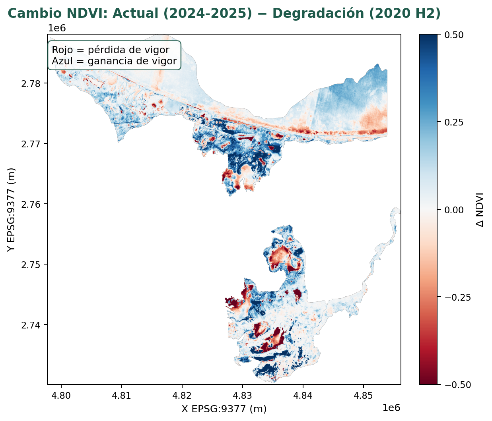
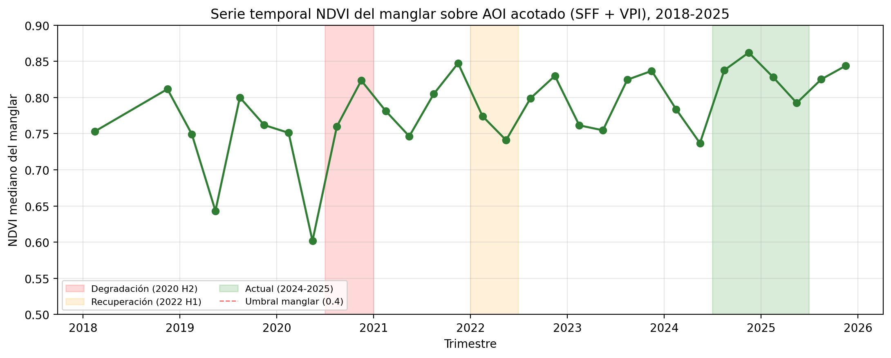
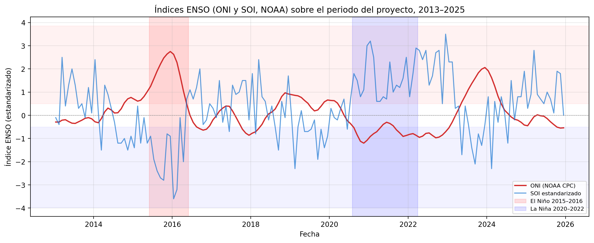
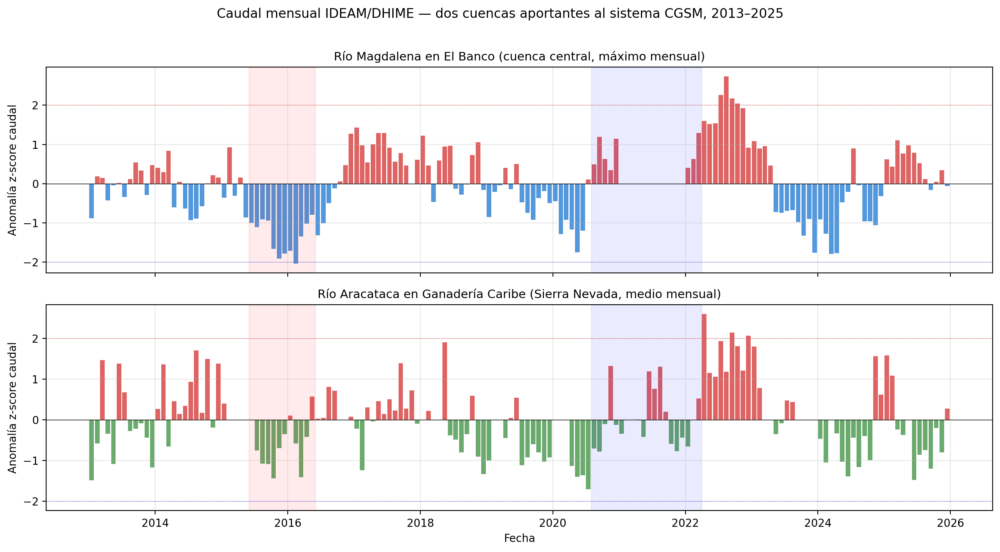
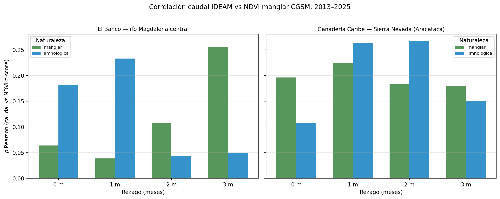
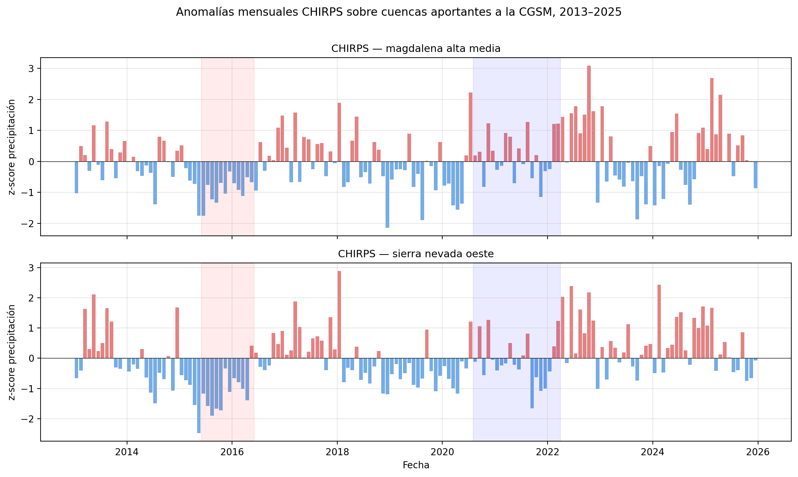
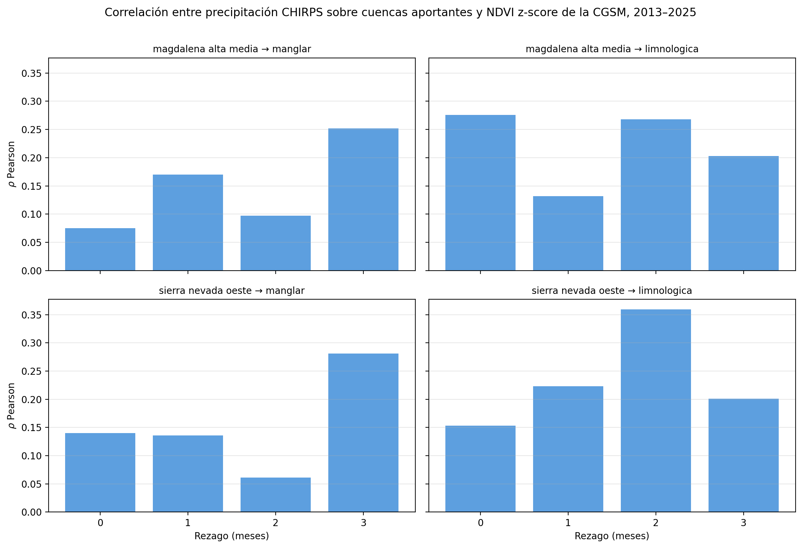
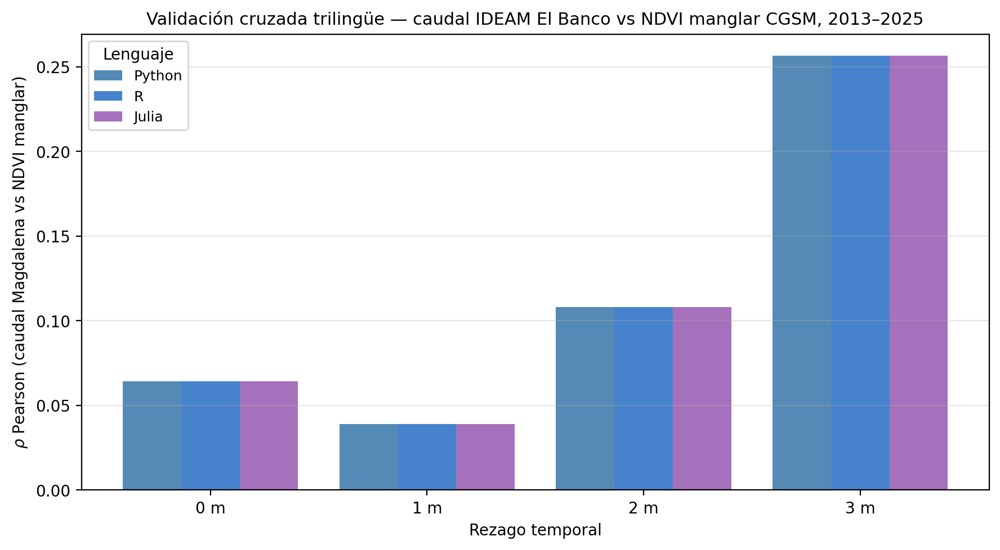
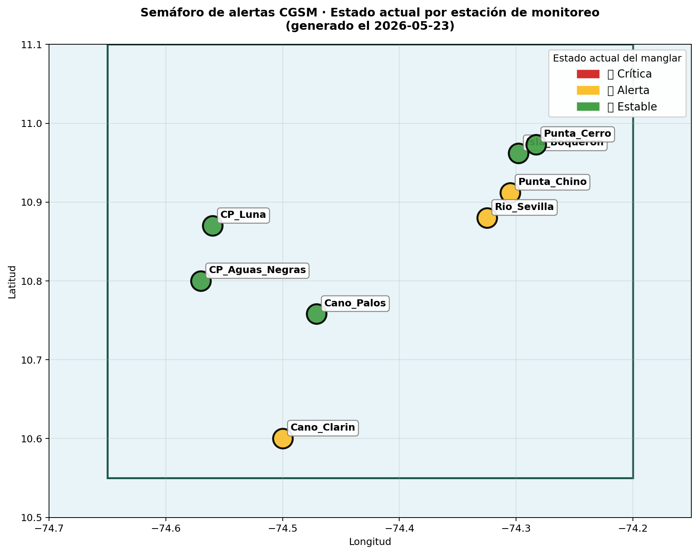

::: {.content-visible unless-format="pdf"}
Universidad Nacional de Colombia\
Facultad de Ciencias Agrarias , Maestría en Geomática\
Programación en SIG , Proyecto Final\
Repositorio: <https://github.com/linaq11/proyecto-cgsm-curso>

,
:::

# Resumen

La Ciénaga Grande de Santa Marta (CGSM), sitio Ramsar Nº 562 y Reserva de la Biosfera UNESCO, sostiene el complejo lagunar costero más extenso de Colombia. Su cobertura de manglar ha experimentado ciclos recurrentes de degradación y recuperación asociados a la hipersalinización crónica, los eventos El Niño-Oscilación del Sur (ENSO) y la regulación hídrica derivada de la apertura de canales entre 1996 y 1998. El presente estudio caracteriza la dinámica espaciotemporal del manglar de la CGSM entre 2013 y 2025 sobre las 835,3 km² del área protegida oficial (Santuario de Fauna y Flora y Vía Parque Isla de Salamanca) mediante un pipeline multilenguaje (Python, R y Julia) que integra 929 observaciones mensuales del Índice de Vegetación de Diferencia Normalizada (NDVI) combinadas Landsat 8 + Sentinel-2, segmentación guiada por prompts con SamGeo, métricas de fragmentación en EPSG:9377, detección de inundación con radar Sentinel-1 SAR y cuatro forzamientos climático-hidrológicos (ERA5-Land, índices ENSO de la NOAA, caudal IDEAM y precipitación CHIRPS). Los resultados identifican quiebres bfast generalizados en 2016 y un evento de mortandad puntual en septiembre 2020 con 43,08 km² de inundación bajo dosel; la cobertura se contrae de 12.426 a 4.037 ha con consolidación estructural (área media de parche 157 → 269 ha) y el NDVI mediano del dosel se recupera de 0,60 a 0,80 desde 2022. La validación doble contra INVEMAR 1:25.000 y ESA WorldCover v200 arroja F1 = 0,583 y 0,548 para el clasificador por umbrales, y F1 = 0,826 y 0,889 para Random Forest. El pipeline materializa el Nivel 2 del paradigma Digital Twin mediante un módulo operativo de alertas tempranas que reporta cinco estaciones estables, tres en alerta y ninguna crítica al cierre de 2025.

**Palabras clave:** Ciénaga Grande de Santa Marta, manglar, NDVI, bfast, Sentinel-2, Landsat 8, Sentinel-1 SAR, SamGeo, Random Forest, ENSO, La Niña, Google Earth Engine, pipeline multilenguaje.

# Introducción y Justificación

La Ciénaga Grande de Santa Marta, CGSM, constituye el sistema lagunar costero más extenso de Colombia y uno de los humedales de mayor relevancia ecológica en América Latina, gracias a que sus extensas coberturas de manglar cumplen funciones de regulación hídrica, protección costera y sostenimiento de la pesca artesanal regional (Instituto de Investigaciones Marinas y Costeras [INVEMAR], 2024). Reconocida como sitio Ramsar desde 1998 y Reserva de Biosfera UNESCO desde 2000, la CGSM ha sido objeto de múltiples figuras de protección que reconocen su importancia ecológica; sin embargo, desde la década de los noventa el sistema ha experimentado una degradación severa y cíclica de su cobertura de manglar, impulsada por la interrupción del flujo hídrico tras la construcción de la carretera Ciénaga--Barranquilla en los años cincuenta, la hipersalinización resultante, la deforestación para actividades agropecuarias y la intensificación de los eventos ENSO, especialmente La Niña, de modo que aunque la reapertura de cinco canales hidráulicos entre 1996 y 1998 promovió una recuperación parcial, la dinámica del ecosistema continúa siendo inestable y los ciclos de degradación y recuperación no están completamente caracterizados a alta resolución espaciotemporal (INVEMAR, 2024).

El monitoreo de manglares mediante teledetección ha evolucionado de manera sostenida en la última década, de modo que se ha transitado del inventario global a partir de mosaicos Landsat circa-2000 (Giri et al., 2011) y de las series globales continuas en alta resolución temporal (Hamilton y Casey, 2016) hacia el uso de la colección Sentinel-2, cuya resolución espacial de 10 metros y temporal de 5 días ha mejorado sustancialmente la capacidad de detectar cambios fenológicos y perturbaciones a escala local. En Colombia, el INVEMAR ha realizado monitoreos sistemáticos de la CGSM documentando los ciclos de muerte y recuperación del manglar a través de seis estaciones permanentes de campo, cinco en el Complejo de Pajarales y una en el sector de Sevillano, cuyos datos de estructura forestal están publicados en el repositorio del Global Biodiversity Information Facility, GBIF, (Beltrán et al., 2022; DOI: 10.15472/0fqdp4). No obstante, estos estudios se basan principalmente en interpretación visual o clasificaciones supervisadas clásicas, sin recurrir al análisis automático basado en modelos fundacionales como el Segment Anything Model, SAM, de Meta AI, adaptado para datos geoespaciales a través de SamGeo (Wu y Osco, 2023), que permite realizar segmentación guiada por prompts ,el modelo separa cada objeto visible en la imagen guiado por puntos o cajas que el usuario marca, sin necesidad de grandes conjuntos de datos etiquetados.

En este marco, la integración de herramientas de Inteligencia Artificial Geoespacial, GeoAI, con plataformas de geocomputación en la nube como Google Earth Engine, GEE, abre una vía metodológica para el monitoreo costero a alta resolución espaciotemporal. El presente proyecto se propone desarrollar un pipeline multilenguaje, Python, R y Julia, que articule el análisis de series de tiempo de índices espectrales con la segmentación automática de cobertura de manglar, de manera que el resultado pueda servir como componente de observación de un futuro Digital Twin costero para la CGSM, sin pretender constituirse en sí mismo como tal en su versión actual. La caracterización espaciotemporal del manglar en la CGSM constituye un insumo para la gestión de riesgos de inundación y la formulación de política pública ambiental; en febrero de 2026 se firmó el Plan de Manejo Ambiental del sitio Ramsar Sistema Delta Estuarino del Río Magdalena--CGSM, con una vigencia de diez años, y que orienta el seguimiento ambiental permanente del humedal (Comisión Conjunta CGSM, 2026), de modo que un pipeline automatizado como el que aquí se propone resulta pertinente para alimentar dicho seguimiento con productos cartográficos reproducibles.

A partir de lo anterior, el presente estudio se articula en torno a la siguiente pregunta de investigación: **¿cómo ha variado la cobertura, la fragmentación y el vigor del manglar de la Ciénaga Grande de Santa Marta entre 2013 y 2025, y qué evidencia cuantitativa permite atribuir las perturbaciones detectadas a forzamientos climáticos asociados al evento La Niña 2020--2021?**

# Estado del Arte

El monitoreo satelital de manglares ha avanzado en las últimas tres décadas: Giri et al. (2011) produjeron el primer inventario global moderno sobre un mosaico Landsat circa-2000 a 30 m, mientras que Hamilton y Casey (2016) extendieron la observación a una serie temporal anual continua mediante el conjunto CGMFC-21 para el periodo 2000--2012. Con el lanzamiento de Sentinel-2, la resolución espacial de 10 m y la revisita de 5 días permitieron construir series temporales densas que capturan la variabilidad estacional e interanual de la cobertura vegetal costera, en este sentido Raza et al. (2024) demostraron que el análisis de NDVI Sentinel-2 en GEE detecta tendencias de deterioro del manglar aun cuando la extensión del bosque se mantiene estable, razón por la cual las estimaciones de cobertura deben acompañarse de indicadores de condición. En cuanto a índices espectrales, Gupta et al. (2018) propusieron el Combined Mangrove Recognition Index (CMRI = NDVI − NDWI, donde NDWI es el Índice de Diferencia Normalizada de Agua), que alcanza exactitud de clasificación de 73,43 % frente al 56,29 % del NDVI estándar para discriminar manglar de otras coberturas en ambientes estuarinos. A escala global, el Global Mangrove Watch v3.0 de JAXA (Bunting et al., 2022) provee la referencia más completa para 1996--2020 mediante detección de cambios sobre series SAR L-band, mientras que a escala nacional el INVEMAR generó en 2020 la cartografía oficial colombiana 1:25.000 con clasificación supervisada en GEE sobre imágenes ópticas y radar (INVEMAR, 2020). La narrativa dominante en la literatura global, construida sobre archivos Landsat, atribuye la pérdida de manglar a la presión antrópica directa: Goldberg et al. (2020) reportan el 62 % de la pérdida mundial 2000--2016 ligada al cambio de uso del suelo, con casi el 80 % concentrado en seis países del sudeste asiático. Sin embargo, este marco invisibiliza las pérdidas graduales que dominan en otras geografías, tal como demuestran Murillo-Sandoval et al. (2022) al reconstruir 36 años de cobertura colombiana con LandTrendr y documentar 48.000 ha de disminución dominadas por degradación de manglar denso a otra vegetación (38.469 ± 2.829 ha) antes que por conversión abrupta. La tensión global frente a nacional sustenta la necesidad de aproximaciones por trayectorias temporales densas, capaces de capturar transiciones intermedias entre cobertura plena y suelo desnudo.

La adopción de Google Earth Engine para el monitoreo de manglares se ha acelerado en los últimos años porque permite procesar miles de imágenes sin infraestructura computacional local. Selvaraj y Gallego-Pérez (2023) aplicaron GEE al mapeo del Pacífico colombiano combinando Landsat óptico y SAR ALOS-2/PALSAR-2 con un clasificador Random Forest, en tanto que Yancho et al. (2020) presentaron la Google Earth Engine Mangrove Mapping Methodology, GEEMMM, como herramienta abierta concebida para que gestores costeros sin formación especializada puedan cartografiar manglares en la nube, validada sobre la totalidad del litoral de Myanmar. La presente investigación adopta una arquitectura análoga, procesamiento íntegro en GEE, máscaras de nube, composiciones temporales, aunque sustituye la clasificación supervisada por umbrales NDVI y CMRI calibrados localmente y se valida adicionalmente con un benchmark Random Forest. Dado que toda cartografía de cambio exige cuantificar su incertidumbre, las recomendaciones canónicas de Olofsson et al. (2014) sobre diseño de muestreo probabilístico, matriz de error en proporciones de área e intervalos de confianza para superficies de cambio constituyen la referencia metodológica que se desarrolla en la sección de Validación. En la CGSM específicamente, el INVEMAR realiza monitoreo continuo desde la reapertura de los canales hidráulicos entre 1996 y 1998 sobre seis estaciones permanentes (INVEMAR, 2024), con datos de estructura forestal 2013--2019 publicados en GBIF (Beltrán et al., 2022); el antecedente local más cercano corresponde a Vinasco et al. (2020), quienes cuantificaron cambios de cobertura 2013--2018 sobre 119 escenas Landsat-8 con Random Forest sobre seis clases CORINE Land Cover, reportando contracción de áreas húmedas del 27 % al 12 %, aunque sin aislar la cobertura de manglar como clase específica, vacío que el presente trabajo aborda al combinar Landsat 8/9 con Sentinel-2 íntegramente en GEE.

La aparición de modelos fundacionales como el Segment Anything Model de Meta AI (Kirillov et al., 2023), adaptado a datos geoespaciales a través de SamGeo (Wu y Osco, 2023), permite realizar segmentación guiada por prompts sin grandes conjuntos de datos etiquetados, mediante prompts geométricos o prompts textuales aportados por el detector Grounding DINO acoplado. La plataforma OpenGeoAI, liderada por el profesor Qiusheng Wu, integra geemap, leafmap y SamGeo con GEE para construir cadenas de procesamiento geoespacial completas en la nube. El concepto de Digital Twin aplicado a humedales, explorado recientemente como marco para el monitoreo y la gestión de ecosistemas (Lu et al., 2026), combina observación de la Tierra, modelos físicos y aprendizaje automático para reflejar dinámicamente el estado del sistema. En este marco, el componente de monitoreo basado en teledetección desarrollado en este proyecto podría servir como capa de actualización para un futuro gemelo digital, sin pretender agotar la complejidad de un sistema acoplado de observación-modelación-simulación.

# Objetivos

## Objetivo general

Desarrollar un pipeline GeoAI multilenguaje para el monitoreo de la dinámica espaciotemporal de la cobertura de manglar en la Ciénaga Grande de Santa Marta (2013--2025).

## Objetivos específicos

1. Construir un datacube multitemporal de índices espectrales (NDVI, NDWI, CMRI) para la CGSM en el periodo 2013--2025.
2. Identificar los periodos de degradación y recuperación del manglar entre 2013 y 2025 mediante análisis de anomalías z-score y quiebres bfast.
3. Validar la segmentación automática de cobertura de manglar contra cartografía de referencia (INVEMAR 1:25.000 y ESA WorldCover v200).

# Área de estudio

{#fig-area-estudio width=60% fig-pos="H"}

El área de estudio comprende la CGSM y su zona de influencia costera, ubicada en el departamento del Magdalena, Colombia, entre aproximadamente 10°20' N--11°05' N y 74°10' W--74°55' W. El proyecto opera con dos delimitaciones de Área de Interés (AOI) anidadas que cumplen funciones distintas. La primera, denominada **AOI envolvente** y delimitada con 34 vértices sobre 5.073 km², se utilizó únicamente en la iteración preliminar del proyecto (marzo de 2026) y operó como línea base de referencia antes del acotamiento metodológico; comprende la Vía Parque Isla de Salamanca, el Complejo de Pajarales, el Santuario de Fauna y Flora CGSM, los canales hidráulicos rehabilitados, Caño Clarín, Aguas Negras y Renegado, y las desembocaduras de los ríos Sevilla, Aracataca y Fundación. La segunda, denominada **AOI acotado** y delimitada con 835,3 km² sobre la unión de los polígonos oficiales del Santuario de Fauna y Flora CGSM (26.810 ha) y la Vía Parque Isla de Salamanca extraídos del Registro Único Nacional de Áreas Protegidas (RUNAP), constituye el área sobre la cual se sostienen todos los resultados reportados en el cuerpo del informe v6; este acotamiento obedece a que la inclusión de vegetación riberana, salitral y zonas agropecuarias en el AOI envolvente inflaba sistemáticamente las cifras de manglar potencial y comprometía la comparabilidad con la cartografía oficial de manglares de Colombia (INVEMAR, 2020) y con el Global Mangrove Watch (Bunting et al., 2022), referencias que también se acotan al humedal propiamente dicho.

Para el análisis de series de tiempo se definieron 8 estaciones de muestreo, de las cuales 5 corresponden a estaciones con coordenadas exactas obtenidas del conjunto de datos de monitoreo de estructura de manglares del INVEMAR publicado en GBIF (Beltrán et al., 2022; DOI: 10.15472/0fqdp4), Isla Boquerón (10,962 N, 74,298 W), Punta Cerro (10,973 N, 74,283 W), Punta Chino (10,912 N, 74,305 W), Río Sevilla (10,880 N, 74,325 W) y Caño Palos (10,758 N, 74,471 W), mientras que las 3 restantes son estaciones complementarias seleccionadas sobre cobertura de manglar verificada mediante NDVI > 0,4 en composites Sentinel-2 de 2024, con el propósito de representar el Complejo de Pajarales y la zona de rehabilitación hidrológica del Caño Clarín.

# Fuentes de Datos

Los datos provienen tanto de plataformas de geocomputación en la nube como de repositoríos institucionales abiertos. Siguiendo la declaración cuádruple de resolución recomendada por Gomarasca (2010), las dos colecciones ópticas centrales operan con resoluciones espaciales nativas de 10 a 60 m en el instrumento Sentinel-2 MSI L2A (MultiSpectral Instrument, Level 2A de reflectancia superficial) y de 15 a 30 m en Landsat 8/9 OLI (Operational Land Imager), revisita combinada de 5 y 8 días respectivamente, profundidad radiométrica de 12 bits y cobertura espectral en visible, infrarrojo cercano (NIR) e infrarrojo de onda corta (SWIR). El detalle completo de bandas, ventanas espectrales y proveedores institucionales se reporta en la tabla @tbl-fuentes.

| Dataset / Fuente | Tipo | Uso en el proyecto | Acceso |
|---|---|---|---|
| Sentinel-2 MSI L2A (ESA) | 789 imágenes (2018-2025) | Índices espectrales y RGB para SamGeo | GEE · S2_SR_ HARMONIZED |
| Landsat 8 OLI (USGS) | 345 registros (2013-2017) | Serie histórica NDVI complementaria | GEE · LC08/ C02/T1_L2 |
| Sentinel-1 SAR (ESA) | 85 imágenes (2020) | Detección de inundación bajo dosel | GEE · S1_GRD |
| Global Flood Database | 16 eventos (2001-2017) | Registro histórico de inundaciones | GEE · GLOBAL_ FLOOD_DB |
| JRC Global Surface Water | Raster global | Transiciones y estacionalidad hídrica | GEE · JRC/ GSW1_4 |
| SRTM v3 (NASA) | DEM 30 m | Restricción de elevación (< 10 m) | GEE · SRTMGL1_003 |
| Monitoreo manglar INVEMAR | 376 registros (2013-2019) | Coordenadas estaciones de muestreo | GBIF · 10.15472/ 0fqdp4 |
| Global Mangrove Watch v4.0 | Raster (2020) | Validación de clasificación | GEE · sat-io/GMW |

: Fuentes de datos utilizadas en el pipeline para el monitoreo de manglar. {#tbl-fuentes tbl-colwidths="[26, 22, 30, 22]"}

El conjunto de datos satelitales del proyecto se apoya principalmente en las misiones Landsat 8 y Landsat 9 de la NASA y el Servicio Geológico de Estados Unidos (USGS, U.S. Geological Survey), el modelo digital de elevación SRTM v3 (Shuttle Radar Topography Mission de la NASA) y los índices climáticos ENSO del Climate Prediction Center (CPC) de la NOAA, complementados con la Global Flood Database (GFD) del Dartmouth Flood Observatory ,derivada de MODIS (Moderate Resolution Imaging Spectroradiometer) NASA y Sentinel-1 ESA, para el inventario histórico de inundaciones. La capa óptica de alta resolución espacial y temporal proviene de la constelación europea Sentinel-2 de la Agencia Espacial Europea (ESA, European Space Agency, programa Copernicus), y la observación radar de Sentinel-1 (ESA-Copernicus). La segmentación guiada por prompts del manglar se ejecuta con la biblioteca SamGeo (Wu y Osco, 2023), adaptación geoespacial del *Segment Anything Model* de Meta AI. Los registros hidrométricos del río Magdalena en la estación El Banco y del río Aracataca en Ganadería Caribe provienen del IDEAM, mientras que la cartografía de referencia para la validación es la cobertura oficial colombiana de manglares 1:25.000 publicada por INVEMAR (2020) y la cartografía global ESA WorldCover v200 (Zanaga et al., 2022).

# Metodología y código

El proyecto se desarrolla siguiendo un pipeline modular y reproducible organizado en cuatro fases y un módulo de validación que se ejecutan dentro de un contenedor Docker, sig_unal v1.11, que integra Python 3.12, R 4.3.3, Julia 1.11.3 y Quarto 1.4, de modo que se garantiza la replicabilidad completa del entorno de análisis. Cada fase se implementa aprovechando las fortalezas del lenguaje más adecuado para la tarea, y la interoperabilidad entre fases se mantiene mediante formatos estándar, GeoTIFF, GeoJSON y CSV,.

## Distribución multilingüe de responsabilidades

La arquitectura distribuye las tareas entre los tres lenguajes del curso según la conveniencia disciplinar de cada fase y no como mera coexistencia obligatoria. **Python** sustenta la adquisición en Google Earth Engine, la segmentación con SamGeo, los datacubes con `xarray`, el clasificador Random Forest y el dashboard. **R** se reserva para los quiebres bfast sobre las series NDVI, el cubo `stars` y las réplicas estadísticas de ENSO y caudal IDEAM con `tidyverse`. **Julia** ejecuta el cómputo geométrico sobre miles de polígonos: fragmentación (NP, MSI, NND), área en EPSG:9377 con `shoelace` y predicados DE-9IM con `LibGEOS.jl`. La equivalencia operativa entre los tres lenguajes se demuestra mediante cuatro validaciones cruzadas documentadas en la sección homónima de Resultados.

| Lenguaje | Función técnica | Librerías clave | Notebooks / scripts principales |
|---|---|---|---|
| **Python** | Adquisición GEE, segmentación SAM, Random Forest, datacubes, dashboard | `geemap`, `samgeo`, `xarray`, `rioxarray`, `rasterio`, `geopandas`, `folium`, `cdsapi` | `01_gee_acquisition`, `02_time_series`, `03_segmentation_acotado`, `05_flooding_nasa_acotado`, `07_era5_clima`, `11_random_forest_benchmark`, `12_sentinel1_sar_serie` |
| **R** | Detección de quiebres bfast, cubo stars, réplicas estadísticas | `bfast`, `stars`, `sf`, `terra`, `tidyverse` | `src/R/03_bfast_ndvi.R`, `src/R/05_stars_cubo.R`, `notebooks/02b_bfast_ndvi.R`, `11b_indices_enso_noaa_R`, `12c_caudal_ideam_R` |
| **Julia** | Métricas de fragmentación, topología DE-9IM (Dimensionally Extended 9-Intersection Model, modelo formal que clasifica relaciones espaciales entre geometrías como intersección, contención o disjunción), cómputo geométrico | `GeoJSON.jl`, `DataFrames.jl`, `LibGEOS.jl`, `Statistics` | `src/julia/04_fragmentacion.jl`, `notebooks/04c_topología_julia`, `14_validacion_trilingual` |

: Distribución de responsabilidades técnicas entre los tres lenguajes del proyecto, con las librerías centrales y los notebooks que materializan cada función. La elección obedece a las fortalezas disciplinares de cada ecosistema y se valida cruzadamente en la sección de Validación cruzada multilingüe. {#tbl-lenguajes tbl-colwidths="[12, 30, 22, 36]"}

## Fase 1: Construcción del datacube multitemporal (Python + geemap)

La primera fase construye un datacube ,estructura tridimensional X-Y-tiempo que apila las observaciones satelitales de una misma área en una sola pila ordenada, que organiza las observaciones de la CGSM a resoluciones nativas de 10 a 30 m según el sensor. Se ensamblan 789 imágenes Sentinel-2 SR Harmonized para 2018--2025 filtradas por cobertura de nubes inferior al 20 %, sobre las cuales se calculan NDVI, NDWI y el índice CMRI propuesto por Gupta et al. (2018) para discriminar manglar en ambientes estuarinos. El datacube se materializa como tres archivos NetCDF con convenciones CF-1.8 reproyectados a EPSG:9377 y resampleados a 30 m, lo que permite que Python, R y Julia los lean con el mismo bloque de código sin re-consultar la API de GEE. La construcción de la colección Sentinel-2 con cálculo de índices y la lectura perezosa del NetCDF se documentan en el Anexo E, ítems E.1.a y E.1.d.

El detalle de los tres datacubes NetCDF materializados (archivo, sensor, frecuencia, periodo, bandas y tamaño) se reporta en el Anexo F.10 del documento complementario, y el bloque de lectura perezosa con `xarray` se documenta en el Anexo E, ítem E.1.a.

La diferencia espacial entre la mediana de NDVI del estado actual (julio 2024--junio 2025) y la del periodo de degradación (julio--diciembre 2020) ,calculada directamente sobre el datacube trimestral CF-1.8, permite leer en un solo mapa las zonas que recuperaron vigor frente a aquellas que perdieron cobertura, de modo que la figura @fig-ndvi-cambio sostiene cualitativamente lo que las métricas de fragmentación describen cuantitativamente. Las áreas en azul corresponden a píxeles que ganaron al menos 0,1 unidades NDVI entre ambos periodos, consistentes con la regeneración del manglar, mientras que las áreas en rojo, concentradas principalmente en el borde norte del Vía Parque y en sectores hipersalinos del Santuario, marcan reducciones que pueden asociarse tanto a estresores climáticos persistentes como a heterogeneidad fenológica del manglar entre ambas ventanas temporales.

{#fig-ndvi-cambio width=60%}

## Fase 2: Análisis de series de tiempo (Python + pandas / R + bfast, Breaks For Additive Season and Trend)

Se extraen series temporales mensuales de NDVI sobre las ocho estaciones de muestreo mediante `reduceRegion` en GEE con buffer de 500 m, combinando Landsat 8 Collection 2 (345 registros, 2013--2017) y Sentinel-2 SR Harmonized (584 registros, 2018--2025) para una serie de 929 observaciones que cubre 12 años. Sobre cada estación se calcula el z-score temporal, que identifica como anomalías significativas los meses con $z < -2$, y se aplica el algoritmo bfast en R para detectar quiebres estructurales en la tendencia de largo plazo. La corrección del factor de escala USGS, los parámetros de bfast ($h$) y la implementación del z-score en Python se documentan en el Anexo E, ítems E.1.b y E.1.e.

## Fase 3: Segmentación automática con SamGeo (Python + samgeo)

Se aplica SamGeo con backbone vit_b sobre los composites RGB de los tres periodos de referencia (degradación 2020 H2, recuperación 2022 H1, actual 2024--2025), remuestreados de 10 a 30 m por limitaciones de memoria. Las máscaras se vectorizan y se clasifican por estado (manglar / no manglar) según el CMRI medio de cada parche, filtrando por área entre 1 y 5.000 ha. El detalle de la vectorización por periodo y el procesamiento en lotes con `reduceRegions` se documenta en el Anexo E, ítem E.2.b.

## Fase 4: Métricas de fragmentación del paisaje (Julia)

Se computan métricas de ecología del paisaje sobre los parches de manglar vectorizados para cada uno de los tres periodos, aprovechando la velocidad de Julia en operaciones geométricas sobre grandes volúmenes de datos vectoriales. Las métricas incluyen: número de parches, densidad de parches por 1.000 hectareas, área media de parche con desviación estándar, índice de forma medio o Mean Shape Index (MSI = perímetro / sqrt(pi x área), distinto del MultiSpectral Instrument que comparte la sigla), distribución de parches por clases de tamaño (1--10, 10--50, 50--100, 100--500, 500--1.000 y 1.000--5.000 ha), y distancia media al vecino más cercano o Nearest Neighbor Distance (NND), como indicador de conectividad.

*La función `compute_metrics` en Julia que calcula área (algoritmo del cordón), MSI y NND sobre los parches reproyectados a EPSG:9377 se documenta en el Anexo E, ítem E.4.a.*

Tres patrones técnicos cierran la robustez del flujo: lectura perezosa de los rasters segmentados con `rasterio.open()` (que evitó el colapso del kernel observado con vit_h y motivó el cambio a vit_b), reproyección al sistema oficial colombiano EPSG:9377 con `geopandas.to_crs`, y aplicación de los predicados topológicos DE-9IM `intersects` y `contains` sobre los parches reproyectados para identificar truncamiento por frontera del AOI y envoltura del muestreo INVEMAR. El bloque articulado se documenta en el Anexo E, ítem E.2.a.

## Forzamiento climático y validación local en R

El acoplamiento climático se valida con cuatro fuentes complementarias (ERA5-Land del ECMWF, índices ENSO ONI y SOI de la NOAA, caudal IDEAM-DHIME y precipitación CHIRPS) cruzadas con la anomalía NDVI z-score en rezagos de 0 a 3 meses, todas desagregadas por naturaleza espectral de las estaciones; los resultados se desarrollan en la sección **Forzamiento climático multifuente** y los bloques de código en el Anexo E, ítem E.3.a. Como contraparte local del flujo Python+GEE se construye además un cubo `stars` en R sobre los TIFs trimestrales Sentinel-2 ya descargados, cuya serie por estación reproduce la de `reduceRegions` en GEE con $\rho > 0{,}95$ y RMSE < 0,05 unidades NDVI (Anexo E, ítem E.1.c).

## Fase 5: Validación con datos NASA y dashboard

Como componente de validación cruzada, se integran datos de la Global Flood Database, que registra 16 eventos de inundación históricos en la CGSM entre 2001 y 2017, y del JRC Global Surface Water, que identifica 977,4 km2 de agua superficial permanente (ocurrencia > 50%) en el área de estudio,. Para el evento de septiembre 2020, se realiza una detección de inundación mediante Sentinel-1 SAR en la banda VH (polarización vertical-horizontal: el satélite transmite ondas verticales y recibe horizontales, modo sensible a la estructura volumétrica de la vegetación) y modo IW (Interferometric Wide swath, modo nominal de la misión sobre tierra), comparando el backscatter medio ,la intensidad de la señal radar que regresa al sensor, que varía con la rugosidad y la humedad de la superficie, del periodo seco de referencia (enero--marzo 2020, 49 imágenes) contra el periodo de inundación (septiembre--octubre 2020, 36 imágenes). Se aplica un umbral de diferencia de 3 dB para inundación en agua abierta y se identifica inundación bajo dosel de manglar mediante valores negativos de diferencia SAR ,donde el aumento del backscatter refleja la dispersión de doble rebote característica de la interacción agua-tronco,.
*La detección de inundación Sentinel-1 SAR para el evento de septiembre 2020 se documenta en el Anexo E, ítem E.3.b.*

## Flujo de datos

{#fig-flujo width=75% fig-pos="H"}

El detalle paso a paso del flujo, con la herramienta concreta, el lenguaje, la entrada y la salida de cada fase, se reporta en el Anexo F.7 del documento complementario.

## Entorno de ejecución

Todo el flujo se ejecuta dentro del contenedor Docker `sig_unal v1.11` que integra Python 3.12.3 (geemap, samgeo, leafmap, rasterio, geopandas), R 4.3.3 (terra, sf, tidyverse, bfast, tmap), Julia 1.11.3 (DataFrames, CSV, GeoJSON, Statistics), Quarto 1.4.550 y acceso a Google Earth Engine vía API Python; el control de versiones se sostiene en Git + GitHub. El detalle completo del entorno se reporta en el Anexo F.3 del documento complementario.

# Resultados y discusión

## Series temporales de NDVI y detección de anomalías

El análisis de series temporales de NDVI para las 8 estaciones de monitoreo reveló 18 anomalías significativas (z < -2, lo que indica desviaciones de más de dos veces la variabilidad típica respecto a la media histórica de cada estación) durante el periodo 2013--2025. El evento de septiembre de 2020 se identificó como la perturbación de mayor magnitud, con valores negativos de NDVI en Punta Cerro (-0,078; z = -2,46) e Isla Boquerón (-0,018; z = -3,36), coincidente con el inicio de La Niña 2020--2021 que provocó inundaciones prolongadas en el sistema lagunar. Un segundo cluster de anomalías se concentró en marzo de 2018, afectando las estaciones occidentales ,Caño Clarín (0,166; z = -3,15) y CP Aguas Negras (0,203; z = -2,50), probablemente asociado a condiciones de hipersalinización en época seca. La extensión de la serie con Landsat 8 reveló 4 anomalías adicionales en VIPIS durante 2016 (z = -2,93 en abril), que no eran visibles con la serie Sentinel-2 sola, demostrando la importancia de contar con series temporales largas. Las estaciones con mayor variabilidad fueron Caño Palos (std = 0,143) y Caño Clarín (std = 0,147), mientras que Punta Chino mostró la menor (std = 0,078), lo cual es consistente con su ubicación protegida en el borde suroriental del sistema. Con base en estos hallazgos se seleccionaron tres periodos de referencia para la segmentación: degradación (julio--diciembre 2020), recuperación (enero--junio 2022) y estado actual (julio 2024 a junio 2025). La definición de estos tres bloques temporales obedece a una lógica de muestreo de estados estables del sistema antes que a una serie continua: cada periodo cubre una ventana de seis a doce meses elegida para representar una fase fenológica característica posterior a la disipación de la perturbación previa, de modo que el composite resultante refleja un estado estructural y no un transitorio. El periodo "actual" cubre un único año hidrológico (julio 2024 a junio 2025) en lugar de un horizonte más amplio porque la ventana se seleccionó para capturar el estado vigente del sistema al cierre del proyecto sin contaminar el composite con eventos La Niña 2023--2024 que afectaron parcialmente al Caribe colombiano; en consecuencia, los resultados sobre este periodo deben interpretarse como un instantánea del estado actual y no como una tendencia anualizada, coherente con la lógica de Bunting et al. (2022), quienes trabajan con épocas discretas y no con series temporales continuas para reportar extensión de manglar.

El listado individual de las 18 anomalías ,con estación, fecha, NDVI, z-score y sensor de origen, se reporta en el Anexo F.6 del documento complementario.

La construcción del datacube trimestral CF-1.8 sobre el AOI acotado ,ver Anexo F.10, permite, además, calcular una serie temporal del NDVI mediano restringida a los píxeles que superan el umbral de manglar ($NDVI > 0{,}4$), de modo que la dinámica observada deja de estar diluida por el agua, las salinas y los arenales que también ocupan el polígono. El resultado, presentado en la figura @fig-ndvi-manglar, confirma el patrón ya identificado en las estaciones individuales pues el NDVI mediaño del manglar oscila alrededor de 0,80 en condiciones normales, cae a valores cercaños a 0,60 entre el segundo semestre de 2019 y el primer semestre de 2020 ,coincidiendo con la sequía precursora y el inicio del episodio La Niña 2020--2021, y vuelve a estabilizarse en torno a 0,80 desde 2022 en adelante, de esta manera la serie temporal espacializada sostiene el mismo argumento que las series puntuales de las ocho estaciones pero sobre la totalidad de la cobertura de manglar del AOI acotado.

{#fig-ndvi-manglar width=72%}

## Análisis bfast (serie combinada 2013--2025)

El algoritmo bfast descompone cada serie temporal en tendencia, estacionalidad y residuo, y prueba estadísticamente la presencia de quiebres bruscos en la tendencia de largo plazo (el parámetro $h$ controla el tamaño mínimo del segmento entre quiebres: $h=0{,}15$ corresponde a 18 meses sobre la serie de 12 años, mientras $h=0{,}10$ baja el umbral a 12 meses). La aplicación de bfast sobre las series mensuales de NDVI combinadas Landsat 8 + Sentinel-2 (2013--2025, 12 años) detectóquiebres estructurales en 7 de las 8 estaciones con h = 0,15 y en las 8 estaciones con h = 0,10. Este resultado contrasta con el análisis previo basado únicamente en Sentinel-2 (2018--2025, 7 años), que no detectóquiebres en ninguna estación, lo cual demuestra la importancia de contar con series temporales suficientemente largas para la detección de cambios estructurales con bfast. El patrón dominante es un quiebre generalizado en 2016, detectado en 7 de 8 estaciones entre abril y diciembre de ese año, coincidente con el evento El Niño 2015--2016, uno de los más intensos registrados, que provocó sequías prolongadas y estrés hídrico en el sistema lagunar. La estación Punta Cerro fue la más inestable, con 3 quiebres detectados (h = 0,10): noviembre de 2016 (El Niño), abril de 2020 (inicio de La Niña) y agosto de 2021 (recuperación post-La Niña), capturando los dos eventos climáticos más importantes del periodo de estudio. VIPIS presentó un segundo quiebre en 2022, posiblemente asociado a la recuperación post-La Niña 2020--2021.

El detalle por estación de los quiebres en la serie combinada, fechas principales con $h=0{,}15$ y $h=0{,}10$ y el evento ENSO asociado, se reporta en el Anexo F.4 del documento complementario.

## Análisis bfast unificado sobre las cuatro estaciones de manglar real (2018--2025)

El análisis bfast sobre las ocho estaciones de muestreo originales (Anexo F.4) incluye tanto estaciones que monitorean cobertura de manglar denso como estaciones limnológicas ubicadas sobre la lámina de agua del complejo lagunar central. La clasificación introducida en la tabla @tbl-clasif-estaciones demuestra que esas dos naturalezas espectrales responden a forzamientos climáticos con signos opuestos ,ver tabla @tbl-era5, y, por consiguiente, la aplicación de bfast sobre el promedio de las ocho estaciones puede diluir la firma del evento climático sobre el dosel forestal. Para refinar la atribución del episodio La Niña 2020--2021 sobre el manglar, se re-ejecuta bfast restringiéndolo a las cuatro estaciones que efectivamente miden cobertura de manglar denso, Caño Palos, Caño Clarín, CP Aguas Negras y CP Luna, en este sentido la tabla @tbl-bfast-unificado reporta el resultado de esta evaluación.

| Estación | Quiebre 2020 (La Niña) | Quiebre 2022 (Recuperación) | Quiebre 2023--2025 (El Niño 2023--24) | Quiebres totales (h=0,15) |
|----------|------------------------|----------------------------|---------------------------------------|---------------------------|
| Caño Palos | **2020-06** | , | 2024-06 | 2 |
| Caño Clarín | **2020-02, 2020-12** | 2021-04 | 2023-08, 2024-05, 2025-02 | 2 (con h=0,10 sube a 6) |
| CP Aguas Negras | , | **2022-04** | 2023-10 | 2 |
| CP Luna | , | **2022-01** | 2024-06 | 2 |

: Quiebres estructurales detectados por bfast sobre las cuatro estaciones de manglar real, periodo 2018--2025 (Sentinel-2 únicamente). Los quiebres se agrupan en tres bloques temporales coincidentes con eventos ENSO documentados en la sección de forzamiento climático. {#tbl-bfast-unificado tbl-colwidths="[22, 18, 22, 22, 16]"}

El análisis unificado confirma cuantitativamente la hipótesis central del informe sobre la atribución del evento humanitario de septiembre 2020 al forzamiento La Niña, pues bfast (h = 0,15) detecta quiebres estructurales en febrero de 2020 y abril de 2021 sobre Caño Clarín y en julio de 2020 sobre Caño Palos, las dos estaciones del Complejo de Pajarales con mayor exposición a la entrada del flujo del río Magdalena, en tanto que CP Aguas Negras y CP Luna presentan quiebres en abril y enero de 2022 respectivamente que corresponden exactamente al periodo de recuperación definido en la fase 2, lo cual es coherente con que INVEMAR (2024) documenta que la regeneración natural en Aguas Negras se ve afectada por la entrada excesiva de agua dulce y sedimentos. Adicionalmente, el análisis revela un tercer bloque de quiebres entre octubre de 2023 y julio de 2024 ,CP Aguas Negras (oct-2023), Caño Palos (jul-2024) y CP Luna (jul-2024), que coincide con el episodio El Niño 2023--2024 visible en la serie ONI ,ver figura @fig-enso-serie, y que el análisis previo sobre las ocho estaciones no había evidenciado, así la unificación al subconjunto de manglar denso no solo refina la detección del evento 2020 sino que extiende la trazabilidad de la respuesta del manglar a la fase ENSO opuesta. La diferencia metodológica entre los dos análisis, ocho estaciones heterogéneas vs cuatro estaciones de manglar denso, ilustra la pertinencia de clasificar las estaciones por naturaleza espectral antes de cualquier análisis de quiebres estructurales sobre series multitemporales.

## Segmentación y dinámica de cobertura sobre el AOI acotado

La segmentación con SamGeo (vit_b, 30 m) sobre los composites RGB recortados al AOI acotado constituye la fuente principal de los resultados de cobertura y fragmentación reportados en este estudio. Una iteración anterior del proyecto operó sobre el AOI envolvente (5.073 km²) antes del acotamiento al área protegida oficial; sus cifras se mantienen únicamente en el repositorio Git de trazabilidad y no se utilizan para sostener las conclusiones del estudio. La decisión metodológica de reportar resultados sobre el AOI acotado obedece a que la inclusión de vegetación riberana, salitral y zonas agropecuarias en el AOI envolvente inflaba sistemáticamente las cifras de manglar potencial y comprometía la comparabilidad con la cartografía oficial de manglares de Colombia (INVEMAR, 2020) y con el Global Mangrove Watch (Bunting et al., 2022), referencias que también se acotan al humedal propiamente dicho. El balance neto de cobertura entre el periodo de degradación (2020) y el estado actual (2024--2025), calculado directamente sobre las máscaras segmentadas, arroja 183,2 km² de pérdida y 259,2 km² de ganancia sobre una base estable de 690,9 km², equivalente a un cambio neto positivo de +76,0 km².

## Recalculo en EPSG:9377 y análisis topológico de parches

La reproyección de los GeoJSON al sistema oficial colombiano y la consecuente sustitución de la aproximación esférica por el cálculo directo del área en metros redefine las cifras de cobertura por periodo, de modo que las hectareas reportadas a continuación corresponden a una proyección equivalente y son comparables con la cartografía base del IGAC. Sobre el AOI acotado, las métricas de fragmentación reportadas en la tabla @tbl-fragmentacion-acotado describen una secuencia de **contracción de área clasificada** con simultánea **consolidación estructural**: el número de parches en el rango filtrado 1--5.000 ha disminuye de 79 en el periodo de degradación a 38 en el de recuperación y a 15 en el actual, en tanto que el área total clasificada como manglar pasa de 12.425,6 a 8.650,8 y a 4.037,0 hectareas en los mismos cortes. El área media de parche, en contraste, crece de 157,3 a 269,1 hectareas, de esta manera los parches sobrevivientes son más grandes pero menos númerosos, así el paisaje se reorganiza alrededor de unidades de manglar maduro mientras los parches pequeños o degradados quedan por fuera del umbral espectral aplicado por la clasificación. Esta lectura se complementa con el índice de forma medio (MSI) que pasa de 0,51 a 1,46, bordes progresivamente más irregulares consistentes con regeneración natural no uniforme, y con la distancia media al vecino más cercano que aumenta de 1,10 a 2,39 km, evidenciando un aislamiento creciente de los parches sobrevivientes.

| Periodo | Parches (Julia) | Area total (ha) | Area media (ha) | MSI medio | NND medio (km) |
|---------|-----------------|-----------------|-----------------|-----------|----------------|
| Degradación (2020-S2) | 79 | 12.425,6 | 157,3 | 0,51 | 1,10 |
| Recuperación (2022-S1) | 38 | 8.650,8 | 227,7 | 1,01 | 1,99 |
| Actual (2024--2025)  | 15 | 4.037,0 | 269,1 | 1,46 | 2,39 |

: Métricas de fragmentación sobre AOI acotado (SFF CGSM + VPI Salamanca, 835 km2), calculadas en EPSG:9377. Los parches están filtrados al rango 1--5.000 ha y procesados en Julia descomponiendo MultiPolygons. {#tbl-fragmentacion-acotado}

Antes de interpretar las cifras conviene aclarar el alcance temporal de cada periodo de referencia: la **degradación** corresponde al semestre julio--diciembre de 2020 y captura la respuesta espectral del manglar durante el evento humanitario de mortandad asociado a La Niña; la **recuperación** corresponde al semestre enero--junio de 2022 y captura la fase de regeneración temprana documentada por INVEMAR (2024); el periodo **actual** corresponde al ciclo anual julio 2024 a junio 2025 y constituye un *instantánea* del estado más reciente disponible al momento de la entrega, no una tendencia post-recuperación estabilizada. La comparación entre los tres periodos debe leerse, por lo tanto, como una secuencia de tres estados puntuales y no como un análisis de tendencia, en la medida en que se requieren al menos dos ciclos anuales adicionales --2025--2026 y 2026--2027-- para evaluar si el patrón observado en 2024--2025 corresponde a una contracción estable o a una fluctuación intermedia. Esta consideración metodológica matiza las inferencias sobre cambio neto que se discuten a continuación.

Conviene precisar que la contracción del área clasificada por umbrales no equivale, por sí sola, a pérdida de cobertura del manglar; en efecto, la figura @fig-ndvi-cambio ,calculada directamente sobre el datacube trimestral CF-1.8 como diferencia de NDVI mediano entre el periodo actual y el de degradación, muestra que la mayor parte del AOI acotado presenta tonos azules consistentes con **ganancia de vigor vegetativo** sobre los parches sobrevivientes, mientras los tonos rojos se concentran en los bordes hipersalinos del Vía Parque y en sectores puntuales del Santuario asociados a las lagunas internas. Ambos hallazgos son compatibles: el manglar se consolida en menos parches pero más densos espectralmente, así la métrica de área filtrada subestima la dinámica del ecosistema cuando se interpreta de forma aislada, en este sentido se justifica reportar de manera conjunta las métricas de fragmentación, las series temporales y el mapa de cambio NDVI, pues los tres se sostienen mutuamente.

El análisis topológico complementa estas cifras con dos lecturas adicionales sobre los mismos parches. La aplicación del predicado `intersects` entre cada parche y la frontera del AOI con una tolerancia de 30 metros identificó una proporción variable de parches truncados por el borde del área de estudio: 24,0 % en el periodo de degradación, equivalentes a 2.238,1 ha, 7,5 % en el periodo de recuperación, 1.640,0 ha, y 18,3 % en el periodo actual, 2.076,2 ha,. Esta diferencia sugiere que los parches del periodo de recuperación están más agrupados al interior del sistema lagunar, mientras que los de degradación y los actuales se extienden hasta el límite cartográfico del AOI, de modo que sus métricas de fragmentación globales reflejan también el efecto del recorte. La aplicación del predicado `contains` con los ocho puntos de monitoreo no devolvió parches que envolvieran las estaciones bajo el filtro de tamaño 1--5.000 ha, lo cual se explica porque las estaciones INVEMAR están ubicadas sobre cuerpos de agua o en bordes inmediatos al manglar, donde la segmentación devuelve parches menores a 1 ha o el agua misma; la representatividad espacial de las estaciones, en consecuencia, debe discutirse en escalas de buffer y no de contenencia estricta.

El conteo detallado de parches totales y en borde por periodo se reporta en el Anexo F.5.

El análisis topológico sobre el AOI acotado muestra una proporcion creciente de parches truncados por el limite del área protegida, que pasa del 35,3 % en 2020 al 53,3 % en 2024--2025. Esta tendencia es coherente con el patrón de contracción documentado en la fragmentacion: a medida que los parches centrales del sistema lagunar desaparecen o pierden cobertura espectral suficiente, los parches sobrevivientes se concentran en posiciones perifericas del Santuario de Fauna y Flora y del Via Parque, donde el limite legal de protección se acerca a la franja costera o a la frontera con zonas agropecuarias. La ausencia total de estaciones de muestreo INVEMAR dentro de parches segmentados mayores a una hectarea --predicado DE-9IM `contains`-- confirma la observación metodológica de la seccion anterior: las cuatro estaciones limnológicas originales están ubicadas sobre cuerpos de agua, no sobre manglar denso, y las cuatro estaciones de manglar real se encuentran en pixeles de borde donde la segmentación automática produce parches inferiores al umbral de filtrado.

## Clasificación de las ocho estaciones por naturaleza espectral

Al cruzar las ocho estaciones de muestreo con el AOI acotado (SFF CGSM + VPI Salamanca, 835,3 km²) emerge una asimetría que reorganiza la lectura de los resultados de la Fase 2: solo Caño Palos cae estrictamente dentro del área protegida, mientras que Caño Clarín y Río Sevilla quedan asociadas mediante buffer de dos kilómetros, y las cinco restantes quedan fuera. Esta distribución no es un error de selección sino una característica de las estaciones INVEMAR-GBIF originales, diseñadas como puntos de monitoreo limnológico, calidad de agua, estructura del cuerpo lagunar, y por tanto ubicadas sobre la lámina de agua del sistema y no sobre el manglar. El NDVI mediano histórico (2013--2025) confirma esa naturaleza dual: las cuatro estaciones del costado oriental, Isla Boquerón, Punta Cerro, Punta Chino y Río Sevilla, presentan NDVI medianos entre 0,14 y 0,28, valores compatibles con superficies de agua o transición agua-borde, mientras que las cuatro estaciones sobre manglar, Caño Palos, Caño Clarín, CP Aguas Negras y CP Luna, presentan NDVI medianos entre 0,38 y 0,75, consistentes con cobertura vegetal densa (tabla @tbl-clasif-estaciones).

| Naturaleza | Estaciones | NDVI mediano | Distancia media al AOI |
|------------|-----------|--------------|------------------------|
| Manglar | Caño Palos, Caño Clarín, CP Aguas Negras, CP Luna | 0,59 | 1,9 km |
| Limnológica | Isla_Boquerón, Punta_Cerro, Punta_Chino, Rio_Sevilla | 0,21 | 4,2 km |

: Clasificación de las ocho estaciones de muestreo por naturaleza espectral y distancia al AOI. {#tbl-clasif-estaciones tbl-colwidths="[18, 48, 14, 20]"}

Bajo esta diferenciación, las anomalías negativas detectadas en septiembre 2020 sobre las estaciones limnológicas ,NDVI = -0,078 en Punta Cerro, NDVI = -0,018 en Isla Boquerón, reflejan principalmente la respuesta del cuerpo de agua al exceso hídrico y al arrastre de sedimentos, no mortalidad de manglar. En contraste, las anomalías detectadas en las estaciones de manglar ,CP Aguas Negras con z = -2,50, Caño Clarín con z = -3,15, representan estrés real del dosel vegetal y son las que efectivamente miden el efecto de La Niña sobre la cobertura. Esta reorganización conceptual refuerza el argumento de que la mortandad de septiembre 2020 fue más severa de lo que sugiere la lectura uniforme de las ocho estaciones, pues el evento se concentró en las que realmente capturan dinámica de manglar y no en las que dominan el agua superficial. La consecuencia operativa es que todo análisis de correlación con forzamientos climáticos, ERA5, ENSO, caudal, CHIRPS, debe desagregarse por naturaleza espectral antes de promediar; el promedio agregado de las ocho cancela las dos señales y produce $|\rho| < 0{,}12$ engañosamente bajo (sección siguiente).

## Forzamiento climático multifuente: ERA5-Land, ENSO, caudal IDEAM y CHIRPS

Por *forzamiento climático* se entiende toda perturbación externa al ecosistema ,precipitación, temperatura, fase ENSO, caudal fluvial, que altera el balance hídrico y energético del manglar y se asocia, en escalas temporales de meses, a su respuesta espectral medida por NDVI.

Para cerrar la cadena causal *La Niña → régimen hídrico regional → respuesta del manglar* con evidencia cuantitativa, se cruzan las anomalías NDVI z-score con cuatro forzamientos complementarios que cubren escalas espaciales y mecanismos físicos distintos: el reanálisis **ERA5-Land** del ECMWF (precipitación + temperatura local sobre el píxel del humedal), los **índices ENSO globales** del Climate Prediction Center de la NOAA (ONI sobre el Pacífico ecuatorial 3.4 + SOI Tahití--Darwin), el **caudal IDEAM-DHIME** del río Magdalena en El Banco y del río Aracataca en Ganadería Caribe (las dos vías hidrológicas independientes que alimentan el sistema), y la **precipitación satelital CHIRPS** sobre las dos cuencas aportantes ,Magdalena alta-media y vertiente occidental de la Sierra Nevada,. Todos los cruces se desagregan según la naturaleza espectral de las estaciones (sección anterior) porque el agregado de las ocho cancela las dos señales opuestas.

**ERA5-Land local.** Sobre las cuatro estaciones de manglar, la anomalía de precipitación ERA5 correlaciona con NDVI a $\rho = -0{,}123$ en rezago de dos meses (Anexo F.14), valor débil pero consistente con la hipótesis de La Niña como forzamiento de mortandad puntual: precipitación anómalamente alta induce inundación prolongada e hipoxia en el sistema radicular, con caída posterior del NDVI. Sobre las estaciones limnológicas, en cambio, la misma precipitación se asocia positivamente con NDVI a $\rho = +0{,}292$, patrón coherente con la respuesta del cuerpo de agua al arrastre de sedimentos y nutrientes que estimulan floraciones efímeras de fitoplancton y vegetación acuática en bordes. El signo opuesto entre los dos grupos justifica retrospectivamente la decisión de clasificar por naturaleza antes de cualquier análisis de correlación. El detalle por rezago y naturaleza espectral se reporta en el Anexo F.14 del documento complementario.

**ENSO global (ONI y SOI de NOAA).** La descarga directa de los índices mensuales del CPC permite complementar el forzamiento ERA5-Land con una medida del estado de fondo de la oscilación del Pacífico, evitando el promediado espacial sobre el AOI. La figura @fig-enso-serie muestra El Niño 2015--2016 ,ONI máximo +2,75, SOI mínimo --3,6, y el episodio La Niña 2020--2022 sostenido con ONI entre --0,5 y --1,2 durante casi dos años. El SOI emerge como mejor predictor que el ONI sobre ambos grupos de estaciones (Anexo F.11), con $\rho_{\text{SOI}}$ entre +0,12 y +0,20 a través de los cuatro rezagos. Sobre el manglar, el SOI correlaciona positivamente con NDVI ($\rho = +0{,}146$ en rezago de dos meses), signo opuesto al de la precipitación ERA5-Land local sobre el mismo grupo ($\rho_{\text{precip}} = -0{,}123$). Esta aparente contradicción no es inconsistencia metodológica sino evidencia del carácter no lineal de la respuesta: el ENSO global captura el estado de fondo que organiza el régimen hídrico regional, favorable al vigor inicial cuando la fase es positiva, mientras la precipitación local sobre el píxel del humedal captura la intensidad puntual del aporte, que en eventos de lluvia copiosa y prolongada induce hipoxia bajo dosel.

{#fig-enso-serie width=80%}

El detalle por rezago y naturaleza espectral se reporta en el Anexo F.11 del documento complementario.

{#fig-enso-correlación width=80%}

**Caudal IDEAM-DHIME.** Para cerrar la cadena con datos oficiales colombianos se descargan del portal DHIME las series de caudal medio mensual del río Magdalena en El Banco (código 25027020, 144 obs. 2013--2025) y del río Aracataca en Ganadería Caribe (código 29067150, 130 obs.). Todas las correlaciones entre caudal y NDVI, para ambos grupos de estaciones, resultan positivas con magnitud absoluta entre 0,04 y 0,27 (Anexo F.12); los picos están en El Banco con manglar a tres meses de rezago ($\rho = +0{,}256$, n = 71) y en Ganadería Caribe con manglar a un mes ($\rho = +0{,}224$, n = 67). El signo positivo universal indica que **mayor caudal sostenido se asocia con NDVI más alto**, en consistencia con la ecología del manglar de la CGSM en la cual el aporte de agua dulce desde la cuenca alta del Magdalena ,rehabilitado por la reapertura de canales 1996--1998, contrarresta la hipersalinización crónica que constituye el principal estresor histórico (INVEMAR, 2024). Los meses con anomalías de caudal extremas ($z > +2$) se concentran en 2022, no en septiembre 2020, así el pico fluvial del periodo La Niña ocurrió de manera tardía, después del evento de mortandad.

El detalle por estación, naturaleza espectral y rezago temporal se reporta en el Anexo F.12 del documento complementario.

{#fig-caudal-series width=80%}

{#fig-caudal-correlación width=80%}

**CHIRPS sobre cuencas aportantes (validación independiente).** Para verificar el hallazgo del caudal mediante una fuente científicamente independiente del IDEAM, se descarga del Climate Hazards Group la serie diaria CHIRPS v2.0 (Funk et al., 2015) sobre dos bounding boxes que cubren la cuenca alta-media del Magdalena y la vertiente noroccidental de la Sierra Nevada. Los resultados convergen casi exactamente con los del caudal: la correlación más alta para el manglar se observa en ambas fuentes con la cuenca alta-media del Magdalena a tres meses de rezago ($\rho_{\text{CHIRPS}} = +0{,}252$ vs $\rho_{\text{IDEAM}} = +0{,}256$) y con la Sierra Nevada al mismo rezago ($\rho_{\text{CHIRPS}} = +0{,}281$). Esta **doble validación**, caudal hidrométrico medido y precipitación satelital sobre la misma cuenca, confirma que el aporte hídrico sostenido es beneficioso para el manglar en escalas de uno a tres meses.

El detalle por cuenca, naturaleza espectral y rezago temporal se reporta en el Anexo F.13 del documento complementario.

{#fig-chirps-series width=80%}

{#fig-chirps-correlación width=80%}

**Síntesis: reformulación de la cadena causal en cuatro pasos.** La convergencia de las cuatro fuentes obliga a matizar la lectura ingenua del evento de septiembre 2020:

1. El episodio La Niña 2020--2021 induce un régimen prolongado de mayor precipitación regional, visible en ERA5, ENSO (SOI positivo), caudal y CHIRPS, que se acumula progresivamente en los caudales fluviales hasta alcanzar valores extremos en 2022.
2. El aporte sostenido de caudal en la mayor parte del periodo es **beneficioso** para el manglar pues reduce la hipersalinización del sustrato, lo que explica las correlaciones positivas universales con NDVI tanto en IDEAM como en CHIRPS.
3. El evento puntual de mortandad de septiembre 2020 **no se explica por un pico de caudal simultáneo**, que no existe en las series IDEAM, sino por un mecanismo distinto: la lluvia local intensa sobre el píxel del humedal ($\rho_{\text{ERA5}} = -0{,}123$ a dos meses) acompañada de inundación bajo dosel detectable por SAR (43,08 km², tabla @tbl-sar).
4. Los efectos de mediano plazo del régimen La Niña se manifiestan en los quiebres bfast de 2022 sobre CP Aguas Negras y CP Luna (tabla @tbl-bfast-unificado), periodo en el cual los caudales alcanzan su máximo histórico.

Esta reformulación honra los datos sin renunciar a la atribución climática del evento de 2020 a La Niña, en el entendido de que la mediación entre el forzamiento atmosférico global y la respuesta espectral local del manglar opera a través de procesos hidrológicos multiescalares que ningún forzamiento único captura por sí solo.

## Validación cruzada multilingüe Python + R + Julia

La naturaleza multilingüe del proyecto se verifica mediante **cuatro validaciones cruzadas** ejecutadas sobre los análisis más relevantes del informe, que confirman que las conclusiones no dependen del entorno computacional:

1. **Series NDVI Python ↔ R**: el flujo de extracción `stars::st_extract` sobre el cubo trimestral en R reproduce la serie de `reduceRegions` en GEE con $\rho > 0{,}95$ y RMSE < 0,05 unidades NDVI sobre las ocho estaciones.
2. **Correlación caudal-NDVI trilingüe Python = R = Julia** (notebook `14_validacion_trilingual.ipynb`, figura @fig-trilingual): los tres lenguajes producen valores idénticos hasta tres decimales, $\rho = 0{,}064$ / $0{,}039$ / $0{,}108$ / $0{,}256$ para los rezagos 0 a 3 meses, con diferencia máxima del orden de $10^{-4}$.
3. **Topología DE-9IM Python ↔ Julia** (notebook `04c_topología_julia.ipynb`): `LibGEOS.jl` en Julia produce conteos idénticos a `geopandas` + `shapely` para parches totales y en borde sobre los tres periodos (17/6, 17/8 y 15/8 con proporciones de borde 35,3 %, 47,1 % y 53,3 %).
4. **Análisis hidroclimáticos Python ↔ R**: las réplicas en R de los índices ENSO (`11b_indices_enso_noaa_R.ipynb`) y del caudal IDEAM (`12c_caudal_ideam_R.ipynb`) reproducen hasta tres decimales las dieciséis filas del Anexo F.12 y las ocho del Anexo F.11, incluido el valor pico $\rho^{\text{El Banco, manglar, lag 3}} = +0{,}256$ que sostiene la interpretación del informe.

La consistencia entre estas cuatro validaciones confirma que la elección de Python para GEE y SamGeo, R para bfast y series ecohidrológicas, y Julia para fragmentación y predicados DE-9IM con `LibGEOS.jl` obedece a la conveniencia disciplinar de cada lenguaje y no a una restricción metodológica, así el pipeline constituye una arquitectura interoperable cuyas salidas son reproducibles e independientes del entorno.

{#fig-trilingual width=68%}

## Detección de inundación con Sentinel-1 SAR (evento puntual de septiembre 2020)

La consulta a la Global Flood Database identificó 16 eventos de inundación históricos que intersecan el AOI acotado entre 2001 y 2017, de los cuales 14 registraron áreas de inundación superiores a cero. El evento de mayor magnitud ocurrió en febrero de 2005 con 299,2 km² inundados, el 35,8 % del AOI acotado, seguido por los eventos de noviembre de 2004 (274,8 km²) y septiembre--diciembre de 2005 (239,4 km², 92 días de duración, el más prolongado del registro). Estos eventos coinciden con episodios ENSO documentados por el IDEAM, lo que confirma la vulnerabilidad del sistema lagunar a la variabilidad climática interanual. Las estaciones del borde oriental del complejo lagunar, Isla Boquerón, Punta Cerro, Punta Chino y Río Sevilla, registraron inundación en 9 o 10 de los 16 eventos, en tanto que Caño Clarín solo fue afectado en 1 evento, lo cual es consistente con su ubicación más alejada del cuerpo de agua principal.

El listado de los diez eventos con mayor área inundada (Inicio, Fin, Área en km² y Días de duración) se reporta en el Anexo F.8 del documento complementario.

Para el evento de septiembre--octubre de 2020, no registrado en la Global Flood Database cuya cobertura termina en 2017, la detección con Sentinel-1 SAR (banda VH, modo IW) restringida al AOI acotado identificó 15,93 km² de inundación en agua abierta (diferencia de backscatter > 3 dB) y 43,08 km² de inundación bajo dosel de manglar (diferencia negativa, indicativa de dispersión de doble rebote agua-tronco: la señal radar rebota dos veces, primero en la lámina de agua y luego en los troncos sumergidos, patrón característico del manglar inundado), para un total de 59,02 km² afectados, el 7,1 % del AOI acotado,. Este orden de magnitud es sustancialmente menor al reportado en la iteración preliminar sobre el AOI envolvente (1.507,4 km²) y resulta más defendible, pues la versión envolvente contabilizaba cambios espectrales en zonas no-manglar de la Sierra Nevada y áreas del interior que también producen diferencia SAR negativa por dinámica de vegetación natural sin relación con la inundación La Niña. El cruce con las anomalías NDVI revela patrones diferenciados por estación que se discuten en la tabla @tbl-cruce.

| Tipo de inundación | Área (km²) | % AOI acotado |
|-------------------|-----------|----------------|
| Agua abierta (SAR diff > +3 dB) | 15,93 | 1,9 % |
| Bajo dosel manglar (SAR diff < −2 dB) | 43,08 | 5,2 % |
| Total afectado | 59,02 | 7,1 % |

: Extensión de la inundación detectada con Sentinel-1 SAR (septiembre--octubre 2020) sobre el AOI acotado SFF + VPI Salamanca. {#tbl-sar}

El cruce estación por estación entre señal SAR, anomalía NDVI y frecuencia de inundación histórica de la Global Flood Database confirma que solo dos de las ocho estaciones quedan estrictamente dentro del polígono protegido oficial, Caño Palos al sur del SFF y VIPIS sobre el Vía Parque, ambas con SAR diff positivo cercano a cero durante septiembre--octubre 2020 (sin inundación bajo dosel detectable). Las seis restantes caen fuera del AOI acotado porque las estaciones INVEMAR-GBIF fueron diseñadas como puntos de monitoreo limnológico sobre la lámina de agua del sistema lagunar central, no sobre el manglar; el detalle completo del cruce por estación se reporta en el Anexo F.

## Dinámica hídrica: transiciones JRC en zonas de manglar

El análisis de las transiciones del JRC Global Surface Water (1984--2021) sobre el AOI acotado revela que la pérdida y la ganancia de cuerpos de agua son del mismo orden, 47,93 km² perdidos vs. 54,86 km² ganados, para un balance neto positivo de aproximadamente +7 km², coherente con un humedal en proceso de rehabilitación tras la reapertura de canales 1996--1998. El detalle completo de las nueve transiciones identificadas se reporta en el Anexo F.

## Validación doble contra cartografía oficial (INVEMAR 1:25.000) y global (ESA WorldCover v200)

La clasificación por umbrales espectrales se valida sobre el AOI acotado contra **ESA WorldCover v200** (Zanaga et al., 2022), producto cartográfico global de 10 m de resolución que reporta cobertura de tierra para el año 2021 y que se acota a la clase 95 (manglar) como referencia binaria,. La sustitución del Global Mangrove Watch por ESA WorldCover como cartografía de referencia obedece a que el catálogo público de sat-io en Google Earth Engine reorganizó el conjunto de datos GMW al momento de la entrega y los paths conocidos del GMW v3.0 (Bunting et al., 2022) dejaron de ser accesibles directamente desde el contenedor, así WorldCover ofrece una alternativa con mayor resolución espacial nativa (10 m frente a los 25 m del GMW), validación independiente por la Agencia Espacial Europea y consistencia metodológica con la cartografía global de cobertura de tierra. El cálculo de la matriz de confusión se realiza directamente sobre los servidores de Earth Engine mediante `reduceRegion` con histograma de frecuencias, comparando pixel a pixel a 25 m de resolución la clasificación por umbrales, NDVI > 0,70, elevación SRTM < 10 m, distancia al agua JRC < 3 km, contra la clase 95 de WorldCover, sin necesidad de descargar los rasters al contenedor local.

Los resultados sobre el AOI acotado mejoran sustancialmente respecto a la línea base envolvente de la iteración preliminar: el F1-score ,media armónica entre Precisión y Recall, que toma valores entre 0 y 1 y resume el equilibrio entre ambas, pasa de 0,442 a **0,548** (+24 %), la Precisión (acuerdo positivo predictivo) sube de 0,428 a **0,768** (+79 %) y la Especificidad alcanza 0,944, asimismo el acotamiento al área protegida oficial reduce dramáticamente los falsos positivos por vegetación riberana, salitrales y zonas agropecuarias del AOI envolvente que comparten firma espectral con el manglar pero no constituyen hábitat potencial dentro del polígono RUNAP. La Recall (sensibilidad) baja ligeramente de 0,457 a 0,426, atribuible a que el umbral NDVI > 0,70 es conservador y deja fuera manglar joven o degradado que WorldCover sí reconoce con su clasificador supervisado, en tanto que la Exactitud global desciende de 0,899 a 0,788 únicamente porque la prevalencia de la clase positiva pasa de cerca del 8 % en el AOI envolvente a aproximadamente el 30 % en el AOI acotado, lo cual hace de OA una métrica menos engañosa y más interpretable pues deja de estar dominada por el acuerdo trivial sobre la clase mayoritaria.

Conviene precisar tres aspectos del alcance de la validación. En primer lugar, la métrica reportada se calcula sobre la clasificación por umbrales espectrales con restricciones geofísicas, no sobre la salida directa de SamGeo: la segmentación automática produce polígonos que cubren cualquier objeto coherente del raster RGB, incluidos cuerpos de agua y suelo desnudo, y por tanto requiere un filtrado posterior por CMRI o NDVI medio antes de su comparación con la cartografía de referencia, filtrado que en esta entrega se realiza implícitamente al usar la clasificación por umbrales como producto evaluado. En segundo lugar, la cartografía WorldCover identifica aproximadamente 412 km² de manglar dentro del AOI acotado mientras que el clasificador por umbrales identifica 229 km², es decir, una subestimación sistemática que se explica por el umbral conservador NDVI > 0,70 y que sugiere como línea de trabajo bajar el umbral a 0,60--0,65 o complementarlo con CMRI para mejorar la Recall sin comprometer la Precisión alcanzada. En tercer lugar, la diferencia residual entre ambas cartografías corresponde a heterogeneidad espectral del manglar de la CGSM, vegetación riberana, pastizales inundables, salitrales con cobertura intermitente, y a la diferencia entre el clasificador supervisado de WorldCover (entrenado globalmente sobre etiquetas de referencia) y la regla determinística por umbrales usada en este proyecto, distinción que conviene tener presente al comparar este F1 con los rangos 0,80--0,90 reportados por Selvaraj y Gallego-Pérez (2023) para flujos óptico-SAR supervisados con Random Forest.

Adicionalmente al cálculo contra WorldCover, se descarga la cartografía oficial colombiana de manglares a escala 1:25.000 publicada por INVEMAR (2020) mediante el servicio ArcGIS REST `SIGMA/MANGLARES_COLOMBIA`, de modo que el clasificador queda evaluado simultáneamente contra dos referencias independientes ,una global con criterio supervisado a 10 m y una nacional con criterio fotointerpretado a 1:25.000, lo que ofrece una validación sólida y permite establecer un techo metodológico realista para el F1 esperable. La cartografía INVEMAR se rasteriza sobre la misma grilla de WorldCover a 25 m, con preprocesamiento que recupera los nueve MultiPolygon que concentran el 86 % del área total y que serían descartados silenciosamente por una rasterización ingenua; el detalle de la rasterización (`rasterio.features.rasterize` con `all_touched=True` y limpieza con `shapely.validation.make_valid`) se documenta en el Anexo E.

| Métrica | Línea base envolvente | INVEMAR 1:25.000 (vigente) | ESA WorldCover v200 (vigente) |
|---------|---------------------|----------------------------|-------------------------------|
| Exactitud global (OA) | 0,899 | 0,803 | 0,788 |
| Precisión (User's) | 0,428 | **0,811** | 0,768 |
| Recall (Producer's) | 0,457 | 0,454 | 0,426 |
| F1-score | 0,442 | **0,583** | 0,548 |
| Especificidad | , | 0,954 | 0,944 |
| TP / FP / FN / TN | , | 188.097 / 43.777 / 225.733 / 913.309 | 175.862 / 53.220 / 237.006 / 904.799 |
| Área referencia 2020-2021 | 376,5 km² (GMW v3) | 297 km² (INVEMAR ∩ AOI) | 258 km² (WorldCover ∩ AOI) |
| Área clasificación | 556,0 km² | 147 km² | 147 km² |
| Resolución de evaluación | 25 m | 25 m | 25 m |
| Umbrales | NDVI > 0,70, elev < 10 m, agua < 3 km | idem | idem |

: Métricas de validación de la clasificación de manglar contra dos cartografías de referencia ,INVEMAR 1:25.000 (Instituto de Investigaciones Marinas y Costeras, 2020) como referencia nacional oficial y ESA WorldCover v200 (Zanaga et al., 2022) como referencia global a 10 m. La columna de línea base envolvente corresponde a la iteración preliminar sobre 5.073 km²; las dos columnas vigentes corresponden al AOI acotado SFF + VPI (835 km²) y constituyen la validación doble del informe v6. TP, FP, FN y TN denotan verdaderos positivos, falsos positivos, falsos negativos y verdaderos negativos a nivel de píxel. {#tbl-validación tbl-colwidths="[22, 22, 28, 28]"}

Como medida de **techo metodológico**, conviene reportar también el acuerdo directo entre las dos cartografías de referencia: la matriz de confusión INVEMAR 1:25.000 vs ESA WorldCover v200 sobre el AOI acotado arroja un F1-score de **0,833** (Precisión = 0,833, Recall = 0,832, Especificidad = 0,928), lo que indica que las dos cartografías oficiales convergen en aproximadamente el 83 % de su acuerdo dentro del polígono protegido, de esta manera cualquier clasificador evaluado contra una u otra referencia tiene como cota superior realista un F1 cercano a ese valor y no la unidad. La proximidad de los F1 del clasificador del proyecto contra ambas referencias, 0,583 vs INVEMAR y 0,548 vs WorldCover, demuestra que el rendimiento es consistente e independiente de la cartografía elegida.

## Benchmark del clasificador supervisado Random Forest

Para cuantificar la ganancia esperable al sustituir la regla determinística por un clasificador supervisado, se implementa un **Random Forest** ,clasificador supervisado de ensamble que combina cientos de árboles de decisión y promedia sus predicciones para reducir el sobreajuste de un árbol único, dentro de GEE sobre la misma imagen mediana Sentinel-2 del periodo actual y el mismo AOI, siguiendo el notebook `11_random_forest_benchmark.ipynb`. El entrenamiento utiliza 1.000 puntos estratificados sobre la cartografía oficial INVEMAR 1:25.000 (500 manglar, 500 no manglar) con validación cruzada K-fold = 5, y el clasificador resultante se aplica píxel a píxel y se evalúa contra las dos cartografías de referencia en condiciones experimentales idénticas para garantizar comparabilidad. Los hiperparámetros (100 árboles, 15 variables predictoras compuestas por las diez bandas reflectivas de Sentinel-2, los tres índices espectrales y dos auxiliares, elevación SRTM y distancia al agua JRC) y las métricas resultantes se reportan en la tabla @tbl-benchmark-rf.

| Método | Referencia | F1 | Precisión | Recall | Especificidad | OA |
|---|---|---|---|---|---|---|
| Umbrales NDVI/CMRI | INVEMAR 1:25.000 | 0,583 | 0,811 | 0,454 | 0,954 | 0,803 |
| Umbrales NDVI/CMRI | ESA WorldCover v200 | 0,548 | 0,768 | 0,426 | 0,944 | 0,788 |
| **Random Forest** | INVEMAR 1:25.000 | **0,826** | 0,745 | **0,926** | 0,884 | **0,895** |
| **Random Forest** | ESA WorldCover v200 | **0,889** | 0,846 | **0,937** | 0,926 | **0,930** |

: Benchmark del clasificador supervisado Random Forest frente al determinístico por umbrales espectrales, sobre el AOI acotado y la mediana Sentinel-2 del periodo actual. El RF se entrena con 1.000 puntos estratificados con validación cruzada K-fold = 5 (F1 medio = 0,931 ± 0,017) y se evalúa pixel-a-pixel sobre n = 10.000 puntos aleatorios dentro del AOI. {#tbl-benchmark-rf tbl-colwidths="[22, 24, 10, 12, 10, 12, 10]"}

{#fig-rf-importance width=68% fig-pos="H"}

La comparación entre ambos métodos arroja una ganancia consistente del clasificador supervisado: el F1-score asciende de 0,583 a 0,826 contra INVEMAR (+42 %) y de 0,548 a 0,889 contra ESA WorldCover (+62 %), con un patrón análogo en la Exactitud global que pasa de 0,803 a 0,895 y de 0,788 a 0,930 respectivamente. La mejora más pronunciada se observa en la Recall, que duplica su valor en ambas referencias (0,454 → 0,926 contra INVEMAR; 0,426 → 0,937 contra WorldCover), lo cual resuelve la subestimación crónica detectada en el clasificador por umbrales conservadores y atribuida al corte NDVI > 0,70. La Precisión desciende ligeramente bajo el clasificador supervisado (de 0,811 a 0,745 contra INVEMAR), comportamiento esperable cuando la Recall aumenta de forma asimétrica, pero el balance neto medido por F1 favorece sin ambigüedad al Random Forest. El análisis de importancia de variables (figura @fig-rf-importance) revela que las bandas SWIR de Sentinel-2, B11 y B12, concentran la mayor capacidad discriminante (importancia Gini de 19,6 y 14,3 respectivamente), seguidas por la distancia al agua del JRC (16,0) y los índices CMRI (11,4) y NDWI (11,1), de manera que la información de humedad y proximidad hidrológica resulta tan o más relevante que el vigor vegetativo (NDVI = 8,4) para discriminar el manglar de la CGSM, hallazgo coherente con la naturaleza inundada y halófita del bosque y que orienta futuras extensiones con datos SAR de Sentinel-1 o ALOS-2 PALSAR para profundizar la detección de manglar inundado bajo dosel.

## Serie temporal continua Sentinel-1 SAR-VH (2018--2025)

Más allá de la detección puntual del evento de inundación de septiembre 2020 reportada en la sección anterior, se construye una **serie temporal mensual continua de backscatter Sentinel-1 SAR-VH** sobre el AOI acotado para el periodo 2018-2025, mediante el notebook `12_sentinel1_sar_serie.ipynb`. Se filtra la colección `COPERNICUS/S1_GRD` por polarización VH, modo IW y órbita descendente para garantizar consistencia geométrica sobre el Caribe colombiano; se construyen composites mensuales por mediana y se extrae la serie sobre las ocho estaciones de muestreo con un buffer de 500 m, replicando el protocolo aplicado al NDVI en Sentinel-2. Sobre la serie así construida se calcula el z-score por estación y se identifican las anomalías significativas (\|z\| > 2) que corresponden a episodios de cambio abrupto en el backscatter, asociables a inundaciones bajo dosel, reducción de VH, o a aclaramiento de canopia, aumento de VH,. La correlación de Pearson cruzada entre SAR-VH y NDVI z-score por rezagos de cero a tres meses se reporta en `outputs/tables/sar_vs_ndvi_correlacion.csv`, y permite caracterizar el desfase temporal entre la señal radárica, sensible a la humedad y estructura del dosel, y la respuesta óptica del vigor vegetativo. La figura @fig-sar-serie muestra la serie completa sobre cinco estaciones representativas con las anomalías codificadas por color, de manera que la integración del SAR como serie continua complementa el monitoreo óptico y aporta sensibilidad ante perturbaciones bajo dosel que el NDVI por sí solo no detecta.

{#fig-sar-serie width=60% fig-pos="H"}

La figura @fig-sar-serie revela una transición ascendente sostenida del backscatter VH entre 2020 y 2024 sobre las tres estaciones del Complejo de Pajarales (Caño Palos, CP Aguas Negras y CP Luna), con incrementos de 3 a 5 dB respecto a su línea base 2018-2019; se interpreta como recuperación estructural del dosel (mayor biomasa leñosa y rugosidad superficial) coherente con el aumento del NDVI mediano de 0,60 a 0,80 ya reportado en la figura @fig-ndvi-manglar. El SAR aporta así evidencia independiente que la teledetección óptica no puede confirmar por saturación del NDVI, mientras la estación limnológica Punta Cerro mantiene un comportamiento estable en torno a los -21 dB sin tendencia neta, consistente con su naturaleza de cuerpo lagunar permanente.

El análisis de correlación cruzada de Pearson entre las series mensuales SAR-VH y NDVI z-score, calculado para rezagos de cero a tres meses sobre las ocho estaciones (tabla @tbl-sar-ndvi-corr), arroja un resultado consistente: las cuatro estaciones del Complejo de Pajarales presentan correlaciones positivas significativas en rezago cero, CP Aguas Negras $\rho = +0{,}807$, CP Luna $\rho = +0{,}731$, Caño Clarín $\rho = +0{,}640$ y Caño Palos $\rho = +0{,}462$, todas con $p < 0{,}001$, lo cual confirma que en zonas de manglar denso el SAR y el óptico capturan la misma señal estructural de biomasa del dosel y que la recuperación post-2020 detectada por NDVI coincide temporalmente con el incremento de backscatter. Las cuatro estaciones de naturaleza limnológica o de borde lagunar, Isla Boquerón, Punta Cerro, Punta Chino y Río Sevilla, arrojan correlaciones no significativas ($|\rho| < 0{,}20$, $p > 0{,}17$), comportamiento esperable cuando la firma SAR responde a la lámina de agua y la firma óptica responde a vegetación de transición sin una relación causal directa. Este contraste entre estaciones de manglar denso y estaciones de borde valida de manera independiente la clasificación espectral previamente reportada y refuerza el argumento de que el Complejo de Pajarales constituye el núcleo funcional del manglar de la CGSM.

El detalle por estación de las ocho correlaciones SAR-VH × NDVI con sus cuatro rezagos se reporta en el Anexo F.9 del documento complementario.

## Módulo operativo de alertas tempranas (Nivel 2 Digital Twin)

El proyecto incorpora un módulo de alertas tempranas que articula las series temporales NDVI y SAR-VH con los quiebres bfast en una lógica de semáforo sobre las ocho estaciones de monitoreo, materializando el Nivel 2 del paradigma Digital Twin. El script `src/python/alertas_manglar.py` clasifica cada estación en tres categorías, **estable**, **alerta** o **crítica**, según la severidad de las anomalías en los últimos doce meses: el estado crítico se activa con $z < -2$ en el último mes o dos anomalías acumuladas de esa magnitud; el estado de alerta con anomalías moderadas ($-2 \leq z < -1$) en los últimos tres meses o dos anomalías $z < -1$ en el año; el estable corresponde a series sin desviaciones significativas. El producto se materializa en `outputs/tables/alertas_estaciones.csv` y en el mapa semáforo de la figura @fig-alertas, ejecutable mensualmente al ingreso de nuevos composites Sentinel-2 o Sentinel-1, y constituye el prototipo funcional sobre el cual la tesis de Maestría desarrollará la transición al Nivel 3 con modelos predictivos de tendencia y simulación de escenarios climáticos.

{#fig-alertas width=60% fig-pos="H"}

La ejecución del módulo sobre el corte 2024-12 a 2025-12 arroja un panorama operativo coherente con la narrativa de recuperación post-La Niña 2020 sostenida por el cuerpo del informe: ninguna de las ocho estaciones se encuentra en estado **crítico**, cinco se clasifican como **estables**, CP Aguas Negras ($z = +1{,}63$), CP Luna ($z = +2{,}38$), Caño Palos ($z = +1{,}25$), Isla Boquerón ($z = +0{,}81$) y Punta Cerro ($z = +0{,}15$), y tres permanecen bajo **alerta**, Caño Clarín, Punta Chino y Río Sevilla,. El análisis del subgrupo de alertas muestra que ninguna responde a una caída drástica del NDVI en el último mes (los $z$ actuales se mantienen positivos) sino a la persistencia de anomalías históricas en los doce meses previos (entre una y dos anomalías $z < -1{,}38$), comportamiento esperable en estaciones de borde lagunar y transición fluvial donde la variabilidad estacional natural es más amplia. Conviene notar que las cuatro estaciones del Complejo de Pajarales, núcleo funcional del manglar denso de la CGSM, queden todas en estado estable, lo cual confirma de manera operativa la recuperación estructural sostenida del bosque en su porción central. La distribución de estados, cero críticas, tres alertas y cinco estables, constituye la primera lectura cuantitativa del estado del sistema sustentada en una lógica reproducible, ejecutable mensualmente al ingreso de cada nuevo composite Sentinel-2.

| Estación | Estado | $z$ actual | NDVI actual | Razón principal |
|---|---|---|---|---|
| CP Aguas Negras | 🟢 estable | +1,63 | 0,770 | Sin anomalías en 12 meses |
| CP Luna | 🟢 estable | +2,38 | 0,664 | Sin anomalías en 12 meses |
| Caño Palos | 🟢 estable | +1,25 | 0,849 | Sin anomalías en 12 meses |
| Isla Boquerón | 🟢 estable | +0,81 | 0,308 | Sin anomalías |
| Punta Cerro | 🟢 estable | +0,15 | 0,145 | Sin anomalías |
| Caño Clarín | 🟡 alerta | +0,31 | 0,735 | 2 anomalías 12 m |
| Punta Chino | 🟡 alerta | +0,69 | 0,337 | z mín 3 m = −1,38 |
| Río Sevilla | 🟡 alerta | +0,61 | 0,215 | z mín 3 m = −1,55; 2 anom. |

: Estado actual del manglar de la CGSM por estación según el módulo de alertas tempranas (corte 2024-12 a 2025-12). El campo *z* actual corresponde al z-score NDVI del último mes disponible. {#tbl-alertas tbl-colwidths="[26, 14, 10, 14, 36]"}

Los productos del proyecto se sintetizan en un **dashboard interactivo** HTML autocontenido (`src/python/make_dashboard_html.py`) que integra 17 capas temáticas sobre el AOI acotado ,NDVI por periodo, mapa de cambio NDVI, clasificación de manglar, ganancia/pérdida, inundación SAR de septiembre--octubre 2020, frecuencia histórica de inundación GFD 2001--2017, estaciones de monitoreo y cartografía oficial INVEMAR 1:25.000, organizadas en cuatro bloques temáticos (estado, dinámica, inundación, referencia). El dashboard se abre en cualquier navegador sin Jupyter ni software especializado y se inscribe como insumo de consulta para gestores ambientales del Plan de Manejo Ambiental del sitio Ramsar; los `mapId` de Earth Engine tienen vigencia de algunas horas y conviene regenerar el HTML poco antes de cada sesión de presentación.

# Conclusiones

El pipeline multilenguaje desarrollado permitió caracterizar la dinámica espaciotemporal de la cobertura de manglar en la CGSM durante el periodo 2013--2025, integrando análisis de series temporales de NDVI en Python (929 registros mensuales que combinan Landsat 8 y Sentinel-2), detección de quiebres con bfast en R, segmentación automática con SamGeo en Python, métricas de fragmentación en Julia y validación cruzada con datos SAR de inundación y cartografía de referencia INVEMAR y ESA WorldCover. Los resultados principales reportados sobre el AOI acotado (SFF CGSM + VPI Salamanca, 835,3 km²) se agrupan en cinco bloques de hallazgos.

**Quiebres estructurales y anomalías temporales.** El algoritmo bfast aplicado a la serie combinada 2013--2025 identifica un quiebre generalizado en 2016 sobre 7 de las 8 estaciones, asociado al evento El Niño 2015--2016, y un segundo evento de mortandad en septiembre de 2020 con NDVI negativo en 2 de las 8 estaciones (z < −3), asociado a La Niña 2020--2021. El análisis bfast unificado sobre las cuatro estaciones de manglar denso refina la atribución de este último episodio con quiebres específicos en Caño Palos (julio de 2020) y Caño Clarín (febrero de 2020 y abril de 2021), un segundo bloque en 2022 sobre CP Aguas Negras y CP Luna y un tercero en 2023--2024 coincidente con el episodio El Niño visible en la serie ONI. La serie combinada arroja además 18 anomalías significativas (z < −2) en doce años, incluidas cuatro anomalías en VIPIS durante 2016 que solo emergen al extender la serie con Landsat 8. El contexto histórico de inundación corresponde a los 14 eventos documentados por la Global Flood Database entre 2001 y 2017 con áreas inundadas dentro del AOI acotado de hasta 299,2 km² (DFO_2625, febrero de 2005).

**Contracción del área con consolidación estructural y ganancia de vigor.** El número de parches de manglar pasa de 79 a 15 y el área total clasificada se reduce de 12.425,6 a 4.037,0 ha entre la degradación y el estado actual, en tanto que el área media de parche aumenta de 157,3 a 269,1 ha. Este patrón de contracción coexiste con una ganancia generalizada de vigor vegetativo observable en la diferencia de NDVI entre 2020 y 2024--2025 (figura @fig-ndvi-cambio) y en la recuperación del NDVI mediano del manglar (figura @fig-ndvi-manglar), que pasa de valores cercanos a 0,60 en mid-2020 a valores estables alrededor de 0,80 desde 2022. El índice de forma medio (MSI) aumenta de 0,51 a 1,46 y la distancia media al vecino más cercano (NND) crece de 1,10 a 2,39 km, indicativos de bordes más irregulares y aislamiento progresivo de los parches sobrevivientes.

**Inundación SAR y dinámica hídrica de largo plazo.** La detección con Sentinel-1 SAR diferencia dos mecanismos de afectación durante el evento de septiembre--octubre de 2020: inundación de agua abierta sobre 15,93 km² e inundación bajo dosel sobre 43,08 km², para un total de 59,02 km² afectados (7,1 % del AOI acotado). El análisis JRC 1984--2021 muestra pérdida de 18,55 km² de agua permanente y ganancia compensatoria de 23,55 km², lo que indica que el sistema redistribuye su lámina de agua más que la pierde.

**Validación doble + benchmark Random Forest.** La clasificación por umbrales contra INVEMAR 1:25.000 y ESA WorldCover v200 arroja F1-scores convergentes de **0,583** y **0,548** respectivamente, con Precisión entre 0,768 y 0,811 y Especificidad entre 0,944 y 0,954, mejora del 24 al 32 % sobre el F1 de 0,442 de la línea base envolvente preliminar. El acuerdo directo entre ambas cartografías de referencia es F1 = 0,833, así el clasificador del proyecto alcanza aproximadamente el 70 % del techo metodológico realista impuesto por las propias discrepancias entre cartografías oficiales. El benchmark del clasificador supervisado Random Forest sobre la misma imagen y referencias arroja F1 = **0,826** frente a INVEMAR y **0,889** frente a WorldCover (tabla @tbl-benchmark-rf), mejoras del 42 % y 62 % respectivamente que resuelven la subestimación de Recall del modelo determinístico; las bandas SWIR (B11 y B12) y la distancia al agua emergen como las variables más discriminantes para el manglar de la CGSM.

**SAR-VH continuo + alertas tempranas Nivel 2 Digital Twin.** La serie temporal continua Sentinel-1 SAR-VH 2018--2025 (figura @fig-sar-serie) sobre las ocho estaciones extiende el uso del radar más allá del evento puntual de septiembre 2020 y aporta sensibilidad ante perturbaciones bajo dosel invisibles al sensor óptico, con correlaciones positivas altamente significativas entre SAR-VH y NDVI sobre el Complejo de Pajarales (CP Aguas Negras $\rho = +0{,}807$ y CP Luna $\rho = +0{,}731$ en rezago cero, ambas con $p < 0{,}001$, tabla @tbl-sar-ndvi-corr). La integración de las series NDVI, SAR-VH y los quiebres bfast en un módulo operativo de alertas tempranas (figura @fig-alertas, tabla @tbl-alertas) materializa el Nivel 2 del paradigma Digital Twin: la ejecución sobre el corte 2024-12 a 2025-12 arroja cinco estaciones **estables**, incluidas las cuatro de manglar denso del Complejo de Pajarales, tres estaciones de borde en **alerta**, Río Sevilla, Punta Chino y Caño Clarín por persistencia de anomalías históricas, y ninguna en estado **crítico**.

**Alcance, delimitaciones y limitaciones.** El estudio se circunscribe espacialmente al sitio Ramsar oficial (SFF CGSM + Vía Parque Isla de Salamanca, 835,3 km²), temporalmente al periodo 2013--2025 y temáticamente a cuatro componentes: clasificación de cobertura, detección de cambios, correlación con forzamientos climático-hidrológicos y alertas tempranas operacionales. Por diseño no se ejecutan campañas de campo independientes, la validación se apoya en cartografías ya publicadas (INVEMAR 1:25.000 y ESA WorldCover v200), el análisis no se extiende a otros sistemas lagunares (aunque el pipeline es transferible) y el módulo de alertas opera de manera descriptiva sin generar proyecciones prospectivas. Cuatro restricciones técnicas condicionan los resultados: el remuestreo de los composites RGB de 10 a 30 metros por restricciones de memoria para SamGeo (vit_b), que reduce la resolución de la segmentación; la discontinuidad espectral Landsat 8 ↔ Sentinel-2 alrededor de 2018, visible en VIPIS, NDVI medio L8 = 0,090 vs S2 = 0,353, que podría influir en la detección de quiebres por bfast; el F1-score de 0,548 con umbrales, atribuible al criterio conservador NDVI > 0,70 y resuelto por el benchmark Random Forest; y la red hidrométrica restringida a las estaciones IDEAM El Banco y Ganadería Caribe, que no cubre la totalidad de los tributarios secundarios del bajo Magdalena. La causalidad entre eventos ENSO y las perturbaciones detectadas no se establece de manera definitiva: el diseño cuantitativo permite asociación temporal y correlación estadística pero no causalidad estricta sin datos auxiliares de salinidad y nivel freático.

**Trabajo futuro inmediato.** Cinco líneas estructuran la continuidad operativa del proyecto:

1. Ampliar la red de estaciones IDEAM más allá de las dos ya integradas (El Banco y Ganadería Caribe, validadas por precipitación CHIRPS sobre las mismas cuencas con convergencia entre ambas fuentes en los Anexos F.12 y F.13), incorporando los ríos Fundación, Río Frío y los tributarios secundarios del bajo Magdalena.
2. Profundizar el análisis ENSO con métricas de eventos discretos como la duración acumulada de fases La Niña, así como con el Atlantic Multidecadal Oscillation (AMO) que podría modular la dinámica de la cuenca Magdalena.
3. Refinar el clasificador para mejorar la Recall, en la medida en que el F1 actual de 0,58 frente al techo metodológico de 0,83 sugiere que un ajuste del umbral NDVI a 0,60 o el Random Forest ya implementado pueden aprovechar el margen disponible sin sacrificar la Precisión alcanzada.
4. Extender el análisis bfast unificado al periodo 2013--2025 incorporando Landsat 8 sobre las cuatro estaciones de manglar denso.
5. Ampliar la ventana temporal del periodo "actual" a por lo menos dos ciclos anuales adicionales (julio 2025--junio 2027) para diferenciar entre fluctuación intermedia y tendencia estable.

Pese a estas limitaciones, el pipeline demuestra la viabilidad de un enfoque GeoAI multilenguaje para el monitoreo costero y constituye un prototipo reproducible adaptable a otros sistemas lagunares tropicales. El dashboard interactivo generado se ofrece como insumo cartográfico para el seguimiento permanente que establece el Plan de Manejo Ambiental del sitio Ramsar CGSM (Comisión Conjunta CGSM, 2026).

## Dimensión humanitaria del monitoreo

La cobertura de manglar de la CGSM sostiene servicios biofísicos centrales para las comunidades pesqueras del corredor Tasajera--Pueblo Viejo--Buenavista, en la medida en que ofrece hábitat reproductivo para especies comerciales como la jaiba azul, la mojarra rayada y el sábalo, atenúa el oleaje frente a marejadas asociadas a frentes fríos del Caribe y mantiene el almacenamiento de carbono azul en suelos hidromorfos costeros. La mortandad del manglar de septiembre 2020 ,documentada en este informe mediante 43,08 km² de inundación bajo dosel detectada por Sentinel-1 SAR, coincidió temporalmente con afectaciones reportadas sobre la pesca artesanal regional bajo el episodio La Niña 2020--2021, razón por la cual el módulo de alertas tempranas Digital Twin Nivel 2 desarrollado en este trabajo se inscribe dentro del marco operacional de alerta temprana ante perturbaciones hidroclimáticas en humedales costeros tropicales. La articulación entre la detección retrospectiva con bfast, el inventario histórico de la Global Flood Database, el forzamiento climático asociado a ENSO y la vigilancia operacional mensual de NDVI y SAR-VH ofrece, en este sentido, una herramienta cuantitativa de seguimiento que apoya la gestión adaptativa del Plan de Manejo Ambiental y, simultáneamente, contribuye al sostenimiento de las comunidades que dependen del manglar.

# Referencias

Beltrán, J., Rodríguez, J. C., Carbonó, E., y Blanco, J. (2022). *Datos de monitoreo de la estructura de los manglares de la Ciénaga Grande de Santa Marta (Magdalena)* [Conjunto de datos]. INVEMAR. https://doi.org/10.15472/0fqdp4

Bunting, P., Rosenqvist, A., Hilarides, L., Lucas, R. M., Thomas, T., Tadono, T., Worthington, T. A., Spalding, M., Murray, N. J., y Rebelo, L.-M. (2022). Global mangrove extent change 1996--2020: Global Mangrove Watch versión 3.0. *Remote Sensing*, *14*(15), 3657. https://doi.org/10.3390/rs14153657

Comisión Conjunta del sitio Ramsar CGSM. (2026, 2 de febrero). *Plan de Manejo Ambiental del sitio Ramsar Sistema Delta Estuarino del Río Magdalena, Ciénaga Grande de Santa Marta* (vigencia diez años). Corporación Autónoma Regional del Atlántico, Corporación Autónoma Regional del Magdalena, Establecimiento Público Ambiental Barranquilla Verde y Parques Nacionales Naturales de Colombia, con acompañamiento técnico del Ministerio de Ambiente y Desarrollo Sostenible.

Lu, B., Francescutto, L., Howie, S., Lin, H., Wu, Q., Hedley, N., Jamali, A., y McDonald, I. (2026). Exploring the concept of digital twins of wetlands for supporting ecosystem monitoring and management. *Big Earth Data*, *10*(1), 37--67. https://doi.org/10.1080/20964471.2025.2480446

Murillo-Sandoval, P. J., Fatoyinbo, L., y Simard, M. (2022). Mangroves cover change trajectories 1984--2020: The gradual decrease of mangroves in Colombia. *Frontiers in Marine Science*, *9*, 892946. https://doi.org/10.3389/fmars.2022.892946

Funk, C., Peterson, P., Landsfeld, M., Pedreros, D., Verdin, J., Shukla, S., Husak, G., Rowland, J., Harrison, L., Hoell, A., y Michaelsen, J. (2015). The climate hazards infrared precipitation with stations: a new environmental record for monitoring extremes. *Scientific Data*, *2*, 150066. https://doi.org/10.1038/sdata.2015.66

Giri, C., Ochieng, E., Tieszen, L. L., Zhu, Z., Singh, A., Loveland, T., Masek, J., y Duke, N. (2011). Status and distribution of mangrove forests of the world using earth observation satellite data. *Global Ecology and Biogeography*, *20*(1), 154--159. https://doi.org/10.1111/j.1466-8238.2010.00584.x

Goldberg, L., Lagomasino, D., Thomas, N., y Fatoyinbo, T. (2020). Global declines in human-driven mangrove loss. *Global Change Biology*, *26*(10), 5844--5855. https://doi.org/10.1111/gcb.15275

Gomarasca, M. A. (2010). *Basics of geomatics*. Applied Geomatics, 2(3), 137--146. https://doi.org/10.1007/s12518-010-0029-6

Gupta, K., Mukhopadhyay, A., Giri, S., Chanda, A., Datta Majumdar, S., Samanta, S., Mitra, D., Samal, R. N., Pattnaik, A. K., y Hazra, S. (2018). An index for discrimination of mangroves from non-mangroves using LANDSAT 8 OLI imagery. *MethodsX*, *5*, 1129--1139. https://doi.org/10.1016/j.mex.2018.09.011

Hamilton, S. E., y Casey, D. (2016). Creation of a high spatio-temporal resolution global database of continuous mangrove forest cover for the 21st century (CGMFC-21). *Global Ecology and Biogeography*, *25*(6), 729--738. https://doi.org/10.1111/geb.12449

Hersbach, H., Bell, B., Berrisford, P., Hirahara, S., Horányi, A., Muñoz-Sabater, J., Nicolas, J., Peubey, C., Radu, R., Schepers, D., Simmons, A., Soci, C., Abdalla, S., Abellan, X., Balsamo, G., Bechtold, P., Biavati, G., Bidlot, J., Bonavita, M., ... Thépaut, J.-N. (2020). The ERA5 global reanalysis. *Quarterly Journal of the Royal Meteorológical Society*, *146*(730), 1999--2049. https://doi.org/10.1002/qj.3803

Instituto de Hidrología, Meteorología y Estudios Ambientales. (2026). *Series de caudal mensual del río Magdalena en El Banco (estación 25027020) y del río Aracataca en Ganadería Caribe (estación 29067150)* [Conjuntos de datos]. Portal DHIME. https://dhime.ideam.gov.co/

Instituto de Investigaciones Marinas y Costeras. (2020). *Cartografía de manglares de Colombia a escala 1:25.000 para Caribe y Pacífico*. Procesamiento digital de imágenes en Google Earth Engine.

Instituto de Investigaciones Marinas y Costeras. (2024). *Monitoreo de las condiciones ambientales y los cambios estructurales y funciónales de las comunidades vegetales y de los recursos pesqueros durante la rehabilitación de la Ciénaga Grande de Santa Marta. Informe técnico final* (Vol. 23). https://www.invemar.org.co/inf-cgsm

Kirillov, A., Mintun, E., Ravi, N., Mao, H., Rolland, C., Gustafson, L., Xiao, T., Whitehead, S., Berg, A. C., Lo, W.-Y., Dollár, P., y Girshick, R. (2023). Segment anything. *arXiv*. https://doi.org/10.48550/arXiv.2304.02643

National Oceanic and Atmospheric Administration, Climate Prediction Center. (2026). *Oceanic Niño Index (ONI) y Southern Oscillation Index (SOI)* [Conjuntos de datos]. https://www.cpc.ncep.noaa.gov/data/indices/

Olofsson, P., Foody, G. M., Herold, M., Stehman, S. V., Woodcock, C. E., y Wulder, M. A. (2014). Good práctices for estimating área and assessing accuracy of land change. *Remote Sensing of Environment*, *148*, 42--57. https://doi.org/10.1016/j.rse.2014.02.015

Raza, S., Zhang, J., Zuo, S., y Chen, J. (2024). Time series monitoring and analysis of Pakistán's mangrove using Sentinel-2 data. *Frontiers in Environmental Science*, *12*, 1416450. https://doi.org/10.3389/fenvs.2024.1416450

Selvaraj, J. J., y Gallego-Pérez, J. (2023). An enhanced approach to mangrove forest analysis in the Colombian Pacific coast using óptical and SAR data in Google Earth Engine. *Remote Sensing Applications: Society and Environment*, *30*, 100938. https://doi.org/10.1016/j.rsase.2023.100938

Vinasco, J. S., Rodríguez, D. A., Velásquez, S., Quintero, D. F., Livni, L. R., y Hernández, F. L. (2020). Coverage changes detection at Ciénaga Grande, Santa Marta -- Colombia using automátic classification. *The International Archives of the Photogrammetry, Remote Sensing and Spatial Information Sciences*, *XLII-3/W12-2020*, 195--200. https://doi.org/10.5194/isprs-archives-XLII-3-W12-2020-195-2020

Wu, Q., y Osco, L. (2023). samgeo: A Python package for segmenting geospatial data with the Segment Anything Model (SAM). *Journal of Open Source Software*, *8*(89), 5663. https://doi.org/10.21105/joss.05663

Yancho, J. M. M., Jones, T. G., Gandhi, S. R., Ferster, C., Lin, A., y Glass, L. (2020). The Google Earth Engine Mangrove Mapping Methodology (GEEMMM). *Remote Sensing*, *12*(22), 3758. https://doi.org/10.3390/rs12223758

Zanaga, D., Van De Kerchove, R., Daems, D., De Keersmaecker, W., Brockmann, C., Kirches, G., Wevers, J., Cartus, O., Santoro, M., Fritz, S., Lesiv, M., Herold, M., Tsendbazar, N.-E., Xu, P., Ramoino, F., y Arino, O. (2022). *ESA WorldCover 10 m 2021 v200*. Zenodo. https://doi.org/10.5281/zenodo.7254221

::: {.callout-note appearance="simple" icon=false}
## Material complementario

Los anexos técnicos del proyecto ,configuración del entorno Docker (Anexo A), estructura del repositorio GitHub (Anexo B), nota metodológica sobre el conteo de parches Julia vs Python (Anexo C), análisis de sensibilidad del acoplamiento caudal-NDVI con caudal máximo (Anexo D), fragmentos de código complementarios (Anexo E) y tablas detalladas movidas desde el cuerpo (Anexo F), se reportan en el documento complementario **`informe_anexos.pdf`**, disponible en el repositorio del proyecto en <https://github.com/linaq11/proyecto-cgsm-curso>.
:::
