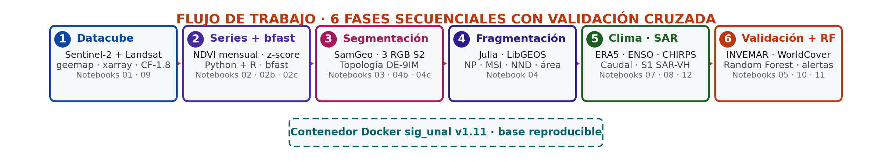
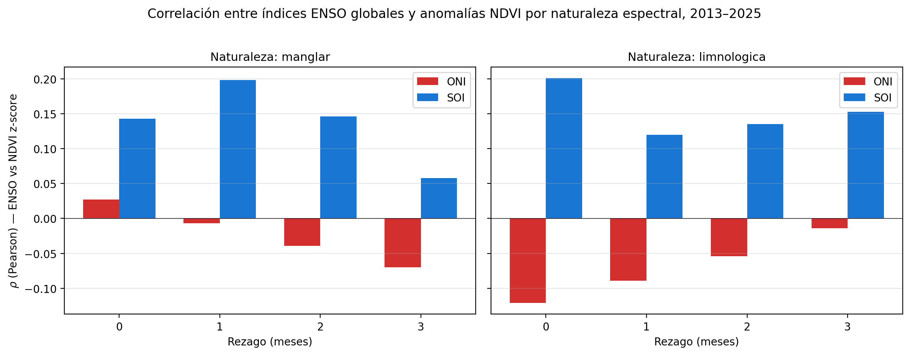

::: {.content-visible unless-format="pdf"}
Universidad Nacional de Colombia\
Facultad de Ciencias Agrarias --- Maestría en Geomática\
Programación en SIG --- Proyecto Final\
Repositorio: <https://github.com/linaq11/proyecto-cgsm-curso>

---
:::

::: {.callout-note appearance="simple" icon=false}
## Puntos destacados

- Cadena de procesamiento multilenguaje (Python + R + Julia) sobre la CGSM acotada al sitio Ramsar oficial (SFF + VPI Salamanca, 835,3 km²) en el periodo 2013-2025.
- El clasificador supervisado Random Forest alcanza F1 = 0,826 frente a INVEMAR 1:25.000, una mejora del 42 % sobre la clasificación por umbrales NDVI/CMRI.
- La serie continua Sentinel-1 SAR-VH correlaciona con NDVI a ρ = +0,807 sobre el manglar denso del Complejo de Pajarales (p < 0,001), comportamiento ausente sobre las estaciones limnológicas.
- El algoritmo bfast detecta quiebres estructurales en 2016, 2020 y 2023-2024 sobre las series mensuales combinadas Landsat 8 + Sentinel-2, asociables a los eventos ENSO documentados.
- El módulo de alertas tempranas Digital Twin Nivel 2 reporta sobre el corte 2024-12 a 2025-12: cinco estaciones estables, tres en alerta y ninguna en estado crítico.
:::

# Introducción y Justificación

La Ciénaga Grande de Santa Marta ---CGSM--- constituye el sistema lagunar costero mas extenso de Colombia y uno de los humedales de mayor relevancia ecológica en America Latina, gracias a que sus extensas coberturas de manglar cumplen funciones de regulación hídrica, protección costera y sostenimiento de la pesca artesanal regional (Instituto de Investigaciones Marinas y Costeras [INVEMAR], 2024). Reconocida como sitio Ramsar desde 1998 y Reserva de Biosfera UNESCO desde 2000, la CGSM ha sido objeto de multiples figuras de proteccion que reconocen su importancia ecológica; sin embargo, desde la decada de los noventa el sistema ha experimentado una degradacion severa y ciclica de su cobertura de manglar, impulsada por la interrupcion del flujo hidrico tras la construccion de la carretera Ciénaga--Barranquilla en los años cincuenta, la hipersalinizacion resultante, la deforestacion para actividades agropecuarias y la intensificacion de los eventos ENSO ---especialmente La Niña---, de modo que aunque la reapertura de cinco canales hidráulicos entre 1996 y 1998 promovio una recuperacion parcial, la dinámica del ecosistema continua siendo inestable y los ciclos de degradacion y recuperacion no estan completamente caracterizados a alta resolución espaciotemporal (INVEMAR, 2024).

El monitoreo de manglares mediante teledetección ha evolucionado de manera sostenida en la ultima decada, de modo que se ha transitado del inventario global a partir de mosaicos Landsat circa-2000 (Giri et al., 2011) y de las series globales continuas en alta resolución temporal (Hamilton y Casey, 2016) hacia el uso de la colección Sentinel-2, cuya resolución espacial de 10 metros y temporal de 5 dias ha mejorado sustancialmente la capacidad de detectar cambios fenologicos y perturbaciones a escala local. En Colombia, el INVEMAR ha realizado monitoreos sistematicos de la CGSM documentando los ciclos de muerte y recuperacion del manglar a traves de seis estaciones permanentes de campo ---cinco en el Complejo de Pajarales y una en el sector de Sevillano---, cuyos datos de estructura forestal estan publicados en el repositorio del Global Biodiversity Information Facility ---GBIF--- (Beltrán et al., 2022; DOI: 10.15472/0fqdp4). No obstante, estos estudios se basan principalmente en interpretacion visual o clasificaciones supervisadas clasicas, sin recurrir al análisis automático basado en modelos de fundación como el Segment Anything Model ---SAM--- de Meta AI, adaptado para datos geoespaciales a través de SamGeo (Wu y Osco, 2023), que permite realizar segmentación promptable de imágenes satelitales sin necesidad de grandes conjuntos de datos etiquetados.

En este marco, la integracion de herramientas de Inteligencia Artificial Geoespacial ---GeoAI--- con plataformas de geocomputación en la nube como Google Earth Engine ---GEE--- abre una vía metodologica para el monitoreo costero a alta resolución espaciotemporal. El presente proyecto se propone desarrollar un pipeline multilenguaje ---Python, R y Julia--- que articule el análisis de series de tiempo de índices espectrales con la segmentación automática de cobertura de manglar, de manera que el resultado pueda servir como componente de observación de un futuro Digital Twin costero para la CGSM, sin pretender constituirse en si mismo como tal en su version actual. La caracterización espaciotemporal del manglar en la CGSM constituye un insumo para la gestion de riesgos de inundación y la formulacion de politica publica ambiental; en febrero de 2026 se firmo el Plan de Manejo Ambiental del sitio Ramsar Sistema Delta Estuarino del Rio Magdalena--CGSM, con una vigencia de diez años, y que orienta el seguimiento ambiental permanente del humedal (Comisión Conjunta CGSM, 2026), de modo que un pipeline automatizado como el que aquí se propone resulta pertinente para alimentar dicho seguimiento con productos cartográficos reproducibles.

A partir de lo anterior, el presente estudio se articula en torno a la siguiente pregunta de investigacion: **¿cómo ha variado la cobertura, la fragmentación y el vigor del manglar de la Ciénaga Grande de Santa Marta entre 2013 y 2025, y qué evidencia cuantitativa permite atribuir las perturbaciones detectadas a forzantes climáticos asociados al evento La Niña 2020--2021?**

# Estado del Arte

## Teledetección de manglares: de Landsat al monitoreo multitemporal con Sentinel-2

El monitoreo satelital de manglares ha avanzado en las últimas tres décadas: el primer inventario global moderno lo produjo Giri et al. (2011) sobre un mosaico Landsat circa-2000 a 30 m de resolución, mientras que Hamilton y Casey (2016) extendieron la observación a una serie temporal anual continua mediante el conjunto CGMFC-21 para el periodo 2000--2012, ambos basados en archivos Landsat. Con el lanzamiento de la coleccion Sentinel-2, la resolución espacial de 10 metros y la revisita de 5 dias mejoraron sustancialmente la capacidad de detectar cambios fenologicos a escala local, de modo que hoy es posible construir series temporales densas que capturen la variabilidad estacional e interanual de la cobertura vegetal costera. Raza et al. (2024) demostraron que el análisis de series de tiempo del NDVI derivadas de Sentinel-2 en GEE permite detectar tendencias de deterioro en la salud del manglar incluso cuando la extension del bosque se mantiene estable, razon por la cual las estimaciones de cobertura por si solas resultan insuficientes y deben acompanarse de indicadores de condicion de la vegetación.

En cuanto a los índices espectrales, Gupta et al. (2018) propusieron el Combined Mangrove Recognition Index ---CMRI---, definido como la diferencia entre el NDVI y el NDWI, que ha demostrado ser efectivo para discriminar manglar de otras coberturas vegetales en ambientes estuarinos, alcanzando una precisión del 73,43% frente a índices convencionales como el NDVI (56,29%) o el Simple Ratio (48,79%). A escala global, el Global Mangrove Watch ---GMW--- de JAXA provee la referencia mas completa de distribucion de manglares para el periodo 1996--2020 en su version 3.0 (Bunting et al., 2022), mientras que a escala nacional, el INVEMAR genero en 2020 la cartografía oficial de manglares de Colombia a escala 1:25.000 mediante clasificacion supervisada en GEE con imagenes opticas y de radar, con una unidad minima cartografíada de 1.600 m2 (INVEMAR, 2020).

Los inventarios globales basados en Landsat han consolidado una narrativa según la cual la pérdida de manglar obedece, en su mayor parte, a la presión antrópica directa: Goldberg et al. (2020), mediante clasificación por Random Forest sobre más de un millón de escenas Landsat a 30 m, atribuyen el 62 % de la pérdida mundial entre 2000 y 2016 al cambio de uso del suelo ---principalmente acuicultura y agricultura de exportación---, con casi el 80 % concentrado en seis países del sudeste asiático. Sin embargo, este marco ---centrado en transiciones abruptas detectables como conversiones a estanques o cultivos--- tiende a invisibilizar las pérdidas graduales que dominan en otras geografías, de manera que su aplicación al contexto colombiano resulta limitada. Asimismo, Murillo-Sandoval et al. (2022), al reconstruir 36 años de cobertura mediante el algoritmo LandTrendr sobre el archivo Landsat, documentan una disminución de aproximadamente 48 000 ha ---14 % del área nacional--- y muestran que la transición dominante no es la conversión abrupta sino la degradación de manglar denso a otra vegetación, con 38 469 ± 2 829 ha afectadas; asimismo, identifican un retroceso sostenido en el Pacífico desde 2004 y descensos en el Caribe entre 1984--1988 y posteriores a 2012, asociados a expansión agrícola, construcción de vías y alteraciones hidrosedimentarias. La tensión que emerge entre ambas fuentes ---global frente a nacional--- sustenta la necesidad de aproximaciones por trayectorias temporales densas, capaces de capturar transiciones intermedias entre cobertura plena y suelo desnudo.

## Google Earth Engine como plataforma de monitoreo

La adopcion de GEE para el estudio de manglares se ha acelerado en los ultimos años, pues la plataforma permite procesar miles de imagenes satelitales sin requerir infraestructura computacional local. Selvaraj y Gallego-Perez (2023) aplicaron GEE al mapeo de manglares en el Pacifico colombiano combinando datos opticos de Landsat y datos de radar SAR de ALOS-2/PALSAR-2 con un clasificador Random Forest, obteniendo precisiónes moderadas a altas en la detección de cambios de cobertura entre 2009 y 2019. Bunting et al. (2022) generaron la versión 3.0 del GMW mediante detección de cambios sobre series anuales de SAR L-band ---JERS-1, ALOS y ALOS-2 PALSAR de JAXA---, produciendo mapas de extensión de manglar para once épocas discretas entre 1996 y 2020, complementadas con imágenes Landsat accedidas vía Google Earth Engine para la validación de exactitud.

En esta misma línea, Yancho et al. (2020) presentan la Google Earth Engine Mangrove Mapping Methodology ---GEEMMM---, una herramienta abierta y replicable concebida para que gestores costeros sin formación especializada puedan cartografiar y monitorear manglares dentro del entorno de cómputo en la nube de GEE, integrando una calibración mareal basada en reflectancia de línea de costa y validada sobre la totalidad del litoral de Myanmar. Su precedente resulta directamente aplicable, de manera que la presente investigación adopta una arquitectura análoga ---procesamiento íntegro en GEE, máscaras de nube y composiciones temporales--- aunque sustituye la clasificación supervisada por umbrales espectrales NDVI y CMRI calibrados localmente para la Ciénaga Grande de Santa Marta. Asimismo, dado que toda cartografía de cambio exige cuantificar su incertidumbre, las recomendaciones canónicas de Olofsson et al. (2014) sobre diseño de muestreo probabilístico, matriz de error expresada en proporciones de área e intervalos de confianza para superficies de cambio constituyen la referencia metodológica que se desarrollará en la sección de Validación, garantizando trazabilidad estadística a los productos derivados.

## Monitoreo de la Ciénaga Grande de Santa Marta

En la CGSM, el INVEMAR realiza monitoreo continuo desde la reapertura de los canales hidráulicos entre 1996 y 1998, evaluando la calidad de aguas, la estructura del bosque de manglar y los recursos pesqueros en el marco del Convenio de Cooperación No. 16/2006 con la Corporación Autónoma Regional del Magdalena ---CORPAMAG--- (INVEMAR, 2024). El monitoreo de manglar opera en seis estaciones permanentes: cinco en el Complejo de Pajarales ---Luna, Aguas Negras, Caño Grande, Km22 y Rinconada--- y una en el sector de Sevillano, y los datos de estructura forestal correspondientes al periodo 2013--2019 estan publicados en GBIF bajo licencia CC-BY (Beltrán et al., 2022). El informe técnico mas reciente documenta que cinco estaciones mantienen una integridad biológica "Regular" ---Aguas Negras, Caño Grande, Km 22 y Luna---, Rinconada se sostiene en "Buen estado" y Sevillano se encuentra en "Alerta"; las pérdidas masivas históricas de individuos se concentraron en Km 22 y Luna tras el evento El Niño 2015-2016 (INVEMAR, 2024).

Entre los antecedentes específicos para el complejo lagunar resulta especialmente pertinente el trabajo de Vinasco et al. (2020), quienes cuantificaron los cambios de cobertura en la Ciénaga Grande de Santa Marta entre 2013 y 2018 a partir de 119 escenas Landsat-8 procesadas de manera local, con corrección DOS y clasificación supervisada mediante Random Forest y un perceptrón multicapa entrenados sobre 300 muestras distribuidas en seis clases CORINE Land Cover. Los autores articularon su análisis a partir de los índices NDVI, EVI y NDWI ---empleados como descriptores temporales del estado de la vegetación y de las superficies inundadas--- y reportaron un incremento de la frontera agrícola y urbana acompañado de una contracción del 27 % al 12 % de las áreas húmedas. Esta aproximación, si bien metodológicamente afín al presente estudio en cuanto al uso de índices espectrales sobre Landsat, opera como ejercicio de clasificación de coberturas generales y no aísla la cobertura de manglar, de manera que el aporte de este trabajo consiste en sustituir los clasificadores supervisados por umbrales NDVI y CMRI sobre series temporales armonizadas Landsat 8/9 y Sentinel-2, así como en migrar el procesamiento íntegramente a Google Earth Engine.

## GeoAI y segmentación geoespacial

La aparición de modelos de fundación como el Segment Anything Model de Meta AI (Kirillov et al., 2023), adaptado para datos geoespaciales a través de SamGeo (Wu y Osco, 2023), permite realizar segmentación promptable de imágenes satelitales sin grandes conjuntos de datos etiquetados, mediante prompts geométricos ---puntos, cajas o máscaras--- nativos del modelo o, alternativamente, mediante text prompts aportados por el detector Grounding DINO acoplado en SamGeo. La plataforma OpenGeoAI, liderada por el profesor Qiusheng Wu de la Universidad de Tennessee, ha desarrollado un conjunto de herramientas de codigo abierto ---geemap, leafmap y SamGeo--- integradas con GEE, de manera que es posible construir cadenas de procesamiento geoespacial completas en la nube. El concepto de Digital Twin aplicado a humedales, explorado recientemente como marco para soportar el monitoreo y la gestión de ecosistemas (Lu et al., 2026), combina datos de observación de la Tierra, modelos físicos y aprendizaje automático para reflejar dinámicamente el estado del sistema. En este marco, el componente de monitoreo basado en teledetección que este proyecto desarrolla podría servir como capa de actualización para un futuro gemelo digital, sin pretender agotar la complejidad de un sistema acoplado de observación-modelación-simulación.

# Objetivos

## Objetivo general

Desarrollar un pipeline GeoAI multilenguaje para el monitoreo de la dinámica espaciotemporal de la cobertura de manglar en la Ciénaga Grande de Santa Marta (2013--2025).

## Objetivos específicos

1. Construir un datacube multitemporal de índices espectrales para la caracterización de la cobertura de manglar en la CGSM.
2. Identificar los periodos de degradación y recuperación del manglar mediante análisis de anomalías temporales.
3. Validar la segmentación automática de cobertura de manglar contra cartografía de referencia.

# Área de estudio

![Localización del área de estudio. (a) Colombia con el departamento del Magdalena resaltado en naranja, escala 500 km. (b) Departamento del Magdalena con las ciudades de referencia ---Santa Marta, Ciénaga, Barranquilla--- y el bbox del AOI acotado en rojo, escala 50 km. (c) Composite Sentinel-2 RGB de color real (B4-B3-B2) del periodo actual 2024-2025 sobre un bounding box extendido que cubre el AOI acotado (835 km² del SFF CGSM y la Vía Parque Isla de Salamanca, polígono rojo) junto con las cinco estaciones INVEMAR-GBIF (triángulos rojos: Isla Boquerón, Punta Cerro, Punta Chino, Río Sevilla y Caño Palos), con la cobertura de manglar segmentada por SamGeo superpuesta en verde traslúcido.](../outputs/figures/mapa_area_estudio.png){#fig-area-estudio width=90% fig-pos="H"}

El área de estudio comprende la CGSM y su zona de influencia costera, ubicada en el departamento del Magdalena, Colombia, entre aproximadamente 10°20' N--11°05' N y 74°10' W--74°55' W. El proyecto opera con dos delimitaciones de área anidadas que cumplen funciones distintas. La primera, denominada **AOI envolvente** y delimitada con 34 vértices sobre 5.073 km², se utilizó únicamente en la iteración preliminar del proyecto (marzo de 2026) y se utilizó como baseline preliminar para la iteración inicial del proyecto antes del acotamiento metodológico; comprende la Vía Parque Isla de Salamanca, el Complejo de Pajarales, el Santuario de Fauna y Flora CGSM, los canales hidráulicos rehabilitados ---Caño Clarín, Aguas Negras y Renegado---, y las desembocaduras de los ríos Sevilla, Aracataca y Fundación. La segunda, denominada **AOI acotado** y delimitada con 835,3 km² sobre la unión de los polígonos oficiales del Santuario de Fauna y Flora CGSM (26.810 ha) y la Vía Parque Isla de Salamanca extraídos del Registro Único Nacional de Áreas Protegidas (RUNAP), constituye el área sobre la cual se sostienen todos los resultados reportados en el cuerpo del informe v6; este acotamiento obedece a que la inclusión de vegetación riberana, salitral y zonas agropecuarias en el AOI envolvente inflaba sistemáticamente las cifras de manglar potencial y comprometía la comparabilidad con la cartografía oficial de manglares de Colombia (INVEMAR, 2020) y con el Global Mangrove Watch (Bunting et al., 2022), referencias que también se acotan al humedal propiamente dicho.

Para el análisis de series de tiempo se definieron 8 estaciones de muestreo, de las cuales 5 corresponden a estaciones con coordenadas exactas obtenidas del dataset de monitoreo de estructura de manglares del INVEMAR publicado en GBIF (Beltrán et al., 2022; DOI: 10.15472/0fqdp4) ---Isla Boqueron (10,962 N, 74,298 W), Punta Cerro (10,973 N, 74,283 W), Punta Chino (10,912 N, 74,305 W), Rio Sevilla (10,880 N, 74,325 W) y Caño Palos (10,758 N, 74,471 W)---, mientras que las 3 restantes son estaciones complementarias seleccionadas sobre cobertura de manglar verificada mediante NDVI > 0,4 en composites Sentinel-2 de 2024, con el proposito de representar el Complejo de Pajarales y la zona de rehabilitacion hidrológica del Caño Clarín.

# Fuentes de Datos

Los datos utilizados en este proyecto provienen tanto de plataformas de geocomputación en la nube como de repositorios institucionales abiertos. Siguiendo la declaración cuádruple de resolución recomendada por Gomarasca (2010) para datos de teledetección, las dos colecciones ópticas centrales del proyecto se caracterizan por: **Sentinel-2 MSI L2A** con resolución espacial de 10 m (B2 azul, B3 verde, B4 rojo, B8 NIR), 20 m (B5-B7, B8A, B11, B12 SWIR) y 60 m (B1, B9, B10), resolución espectral de 13 bandas entre 443 y 2190 nm, resolución temporal de 5 días (constelación S2A+S2B) y resolución radiométrica de 12 bits; y **Landsat 8/9 OLI** con resolución espacial de 30 m en bandas multispectrales (15 m en pancromática), resolución espectral de 11 bandas entre 433 y 12500 nm, resolución temporal de 16 días por satélite (8 días combinados L8+L9) y resolución radiométrica de 12 bits cuantizada a 16 bits para distribución.

| Dataset / Fuente | Tipo | Uso en el proyecto | Acceso |
|------------------|------|-------------------|--------|
| Sentinel-2 MSI L2A (ESA) | 789 imagenes (2018--2025) | Indices espectrales y RGB para SamGeo | GEE: COPERNICUS/S2_SR_HARMONIZED |
| Landsat 8 OLI (USGS) | 345 registros (2013--2017) | Serie histórica NDVI complementaria | GEE: LANDSAT/LC08/C02/T1_L2 |
| Sentinel-1 SAR (ESA) | 85 imagenes (2020) | Deteccion de inundación bajo dosel | GEE: COPERNICUS/S1_GRD |
| Global Flood Database | 16 eventos (2001--2017) | Registro histórico de inundaciónes | GEE: GLOBAL_FLOOD_DB |
| JRC Global Surface Water | Raster global | Transiciones y estacionalidad hidrica | GEE: JRC/GSW1_4 |
| SRTM v3 (NASA) | DEM 30 m | Restriccion de elevación (< 10 m) | GEE: USGS/SRTMGL1_003 |
| Monitoreo manglar INVEMAR | 376 registros (2013--2019) | Coordenadas estaciones de muestreo | GBIF DOI: 10.15472/0fqdp4 |
| Global Mangrove Watch v4.0 | Raster (2020) | Validacion de clasificacion | GEE: sat-io/GMW |

: Fuentes de datos utilizadas en el pipeline para el monitoreo de manglar. {#tbl-fuentes tbl-colwidths="[30, 18, 28, 24]"}

# Metodología y código

El proyecto se desarrolla siguiendo un pipeline modular y reproducible organizado en cuatro fases y un modulo de validacion que se ejecutan dentro de un contenedor Docker ---sig_unal v1.11, que integra Python 3.12, R 4.3.3, Julia 1.11.3 y Quarto 1.4---, de modo que se garantiza la replicabilidad completa del entorno de análisis. Cada fase se implementa aprovechando las fortalezas del lenguaje mas adecuado para la tarea, y la interoperabilidad entre fases se mantiene mediante formatos estandar ---GeoTIFF, GeoJSON y CSV---.

## Distribución multilingüe de responsabilidades

La arquitectura del proyecto distribuye las tareas entre los tres lenguajes del curso ---Python, R y Julia--- según la conveniencia disciplinar de cada fase, no como mera coexistencia obligatoria. **Python** sustenta la mayor parte del flujo: adquisición y procesamiento en Google Earth Engine, segmentación promptable con SamGeo, manipulación de datacubes con `xarray`, clasificación supervisada con Random Forest, generación del dashboard interactivo con `folium` y descarga del forzamiento climático ERA5-Land con `cdsapi`. **R** se reserva para tareas estadísticas y de series ecohidrológicas donde su ecosistema es más maduro: detección de quiebres bfast sobre las series NDVI mediante el paquete `bfast`, construcción de un datacube `stars` como contraparte local del flujo GEE, y replicación independiente de los análisis ENSO y caudal IDEAM mediante `tidyverse` para validación cruzada Python ↔ R. **Julia** se incorpora para el cómputo geométrico de alta velocidad sobre miles de polígonos vectoriales: métricas de fragmentación del paisaje (NP, PD, MPA, MSI, NND), cálculo exacto del área en EPSG:9377 mediante el algoritmo del cordón (`shoelace`) y predicados topológicos DE-9IM (`intersects`, `contains`) ejecutados con `LibGEOS.jl`, la misma biblioteca GEOS que sustenta PostGIS y `geopandas`, lo cual garantiza consistencia geométrica entre los tres entornos. La equivalencia operativa entre lenguajes se demuestra mediante cuatro validaciones cruzadas formales documentadas en la sección de Validación.

| Lenguaje | Función técnica | Librerías clave | Notebooks / scripts principales |
|---|---|---|---|
| **Python** | Adquisición GEE, segmentación SAM, Random Forest, datacubes, dashboard | `geemap`, `samgeo`, `xarray`, `rioxarray`, `rasterio`, `geopandas`, `folium`, `cdsapi` | `01_gee_acquisition`, `02_time_series`, `03_segmentation_acotado`, `05_flooding_nasa_acotado`, `07_era5_clima`, `11_random_forest_benchmark`, `12_sentinel1_sar_serie` |
| **R** | Detección de quiebres bfast, cubo stars, réplicas estadísticas | `bfast`, `stars`, `sf`, `terra`, `tidyverse` | `src/R/03_bfast_ndvi.R`, `src/R/05_stars_cubo.R`, `notebooks/02b_bfast_ndvi.R`, `11b_indices_enso_noaa_R`, `12c_caudal_ideam_R` |
| **Julia** | Métricas de fragmentación, topología DE-9IM, cómputo geométrico | `GeoJSON.jl`, `DataFrames.jl`, `LibGEOS.jl`, `Statistics` | `src/julia/04_fragmentacion.jl`, `notebooks/04c_topologia_julia`, `14_validacion_trilingual` |

: Distribución de responsabilidades técnicas entre los tres lenguajes del proyecto, con las librerías centrales y los notebooks que materializan cada función. La elección obedece a las fortalezas disciplinares de cada ecosistema y se valida cruzadamente en la sección de Validación cruzada multilingüe. {#tbl-lenguajes tbl-colwidths="[12, 30, 22, 36]"}

## Fase 1: Construccion del datacube multitemporal (Python + geemap)

La primera fase del pipeline consiste en la construccion de un datacube listo para análisis ---una estructura tridimensional (X, Y, tiempo) que organiza las observaciónes satelitales de la CGSM a resoluciónes de 10 a 30 metros segun el sensor, donde cada capa temporal contiene los valores de reflectancia superficial e índices espectrales derivados para un periodo de composición determinado---. Se construye una coleccion de 789 imagenes Sentinel-2 SR Harmonized para el periodo 2018--2025, filtrada por cobertura de nubes inferior al 20% y recortada al polígono del area de estudio. Se aplica una mascara de nubes utilizando la banda QA60 y se calculan los índices NDVI = (B8-B4)/(B8+B4), NDWI = (B3-B8)/(B3+B8) y CMRI = NDVI - NDWI por imagen, cuya efectividad para discriminar manglar de otras coberturas en ambientes estuarinos ha sido documentada por Gupta et al. (2018).
```python
# Construir coleccion S2 SR Harmonized y agregar tres indices espectrales
def add_indices(image):
    ndvi = image.normalizedDifference(['B8', 'B4']).rename('NDVI')
    ndwi = image.normalizedDifference(['B3', 'B8']).rename('NDWI')
    cmri = ndvi.subtract(ndwi).rename('CMRI')
    return image.addBands([ndvi, ndwi, cmri])

s2 = (ee.ImageCollection('COPERNICUS/S2_SR_HARMONIZED')
        .filterBounds(aoi)
        .filterDate('2018-01-01', '2025-12-31')
        .filter(ee.Filter.lt('CLOUDY_PIXEL_PERCENTAGE', 20))
        .map(mask_s2_clouds)
        .map(add_indices))
```

El datacube se materializa adicionalmente como tres archivos NetCDF con convenciones CF-1.8 ---generados por el script `build_cubos.py` mediante `xarray` y `rioxarray`---, de modo que el cubo queda disponible en disco para análisis fuera de la nube y reutilizable desde Python, R o Julia sin necesidad de re-consultar la API de GEE. Cada raster se reproyecta al sistema oficial colombiano EPSG:9377 y se resamplea a 30 metros antes de concatenarse a lo largo del eje temporal, de esta manera los tres cubos comparten una sola rejilla espacial y se diferencian únicamente por la fuente sensorial y la frecuencia temporal, así el flujo de la Fase 4 puede leer cualquiera de los tres con el mismo bloque de código.

| Archivo | Sensor | Frecuencia | Periodo | Bandas | Tamaño |
|---------|--------|------------|---------|--------|--------|
| `cgsm_datacube_periodos.nc` | Sentinel-2 | Tres composites discretos | Degradación (2020 H2), recuperación (2022 H1), actual (2024--2025) | RGB (B4, B3, B2) | 40 MB |
| `cgsm_datacube_trimestral.nc` | Sentinel-2 | Trimestral | 2018-Q1 a 2025-Q4 (31 trimestres) | NDVI, NDWI, CMRI | 275 MB |
| `cgsm_datacube_landsat.nc` | Landsat 8/9 | Anual | 2013--2025 (13 años) | NDVI, NDWI, CMRI | 119 MB |

: Datacubes NetCDF CF-1.8 materializados sobre el AOI acotado en EPSG:9377 (MAGNA-SIRGAS Origen Nacional), comprimidos con zlib nivel 4. {#tbl-cubos tbl-colwidths="[28, 14, 18, 24, 10, 6]"}

*El bloque de lectura perezosa del datacube NetCDF con `xarray` se documenta en el Anexo E, ítem E.1.a.*

La diferencia espacial entre la mediana de NDVI del estado actual (julio 2024--junio 2025) y la del periodo de degradación (julio--diciembre 2020) ---calculada directamente sobre el datacube trimestral CF-1.8--- permite leer en un solo mapa las zonas que recuperaron vigor frente a aquellas que perdieron cobertura, de modo que la figura @fig-ndvi-cambio sostiene cualitativamente lo que las métricas de fragmentación describen cuantitativamente. Las áreas en azul corresponden a píxeles que ganaron al menos 0,1 unidades NDVI entre ambos periodos ---consistentes con la regeneración del manglar---, mientras que las áreas en rojo, concentradas principalmente en el borde norte del Vía Parque y en sectores hipersalinos del Santuario, marcan reducciones que pueden asociarse tanto a estresores climáticos persistentes como a heterogeneidad fenológica del manglar entre ambas ventanas temporales.

{#fig-ndvi-cambio width=85%}

## Fase 2: Analisis de series de tiempo (Python + pandas / R + bfast)

Se extraen series temporales mensuales de NDVI para las 8 estaciones de muestreo definidas, utilizando un buffer de 500 metros alrededor de cada punto y la función reduceRegion de GEE para obtener el valor medio del índice por estacion y por mes. La serie se construye combinando dos sensores: Landsat 8 Collection 2 Level 2 para el periodo 2013--2017 (345 registros, con correccion del factor de escala x0,0000275 - 0,2 segun especificacion USGS) y Sentinel-2 SR Harmonized para el periodo 2018--2025 (584 registros), generando una serie combinada de 929 observaciónes mensuales que cubre 12 años. Posteriormente se calcula el z-score temporal por estacion ---z = (NDVI del mes - media histórica) / desvíacion estandar---, lo que permite identificar anomalias pronunciadas definidas como aquellas con z < -2. De manera complementaria, se aplica el algoritmo bfast (Breaks For Additive Season and Trend) en R sobre las series mensuales combinadas con parametros h = 0,15 y h = 0,10 para evaluar la presencia de quiebres estructurales en la tendencia de largo plazo.
```r
library(bfast)
serie  <- read.csv("outputs/tables/serie_temporal_ndvi_combinada.csv")
ts_est <- ts(subset(serie, estacion == "Cano_Palos")$ndvi,
             start = c(2013, 1), frequency = 12)
fit    <- bfast(ts_est, h = 0.10, season = "harmonic", max.iter = 2)
plot(fit)   # quiebres 2016 (El Nino), 2020 (La Nina), 2023-24 (El Nino)
```

*El cálculo de z-scores y la detección de anomalías en Python se documentan en el Anexo E, ítem E.1.b.*

## Fase 3: Segmentacion automática con SamGeo (Python + samgeo)

Se aplica el modelo SamGeo con el backbone vit_b sobre los composites RGB de los tres periodos de referencia ---degradacion (julio--diciembre 2020), recuperacion (enero--junio 2022) y estado actual (julio 2024 a junio 2025)---, prevíamente remuestreados de 10 a 30 metros para ajustarse a las limitaciones de memoria del contenedor Docker. Las mascaras resultantes se vectorizan y se clasifican por estado ---manglar o no manglar--- segun el valor medio de CMRI dentro de cada parche, calculado mediante reduceRegions en GEE con procesamiento en lotes de 200 parches. Se filtran los parches por area minima de 1 hectárea y maxima de 5.000 hectáreas para eliminar fragmentos de ruido y fondos de imagen.
```python
from samgeo import SamGeo

# Modelo base vit_b para ajustarse a la RAM del contenedor
sam = SamGeo(model_type='vit_b', automatic=True)

for periodo in ['degradacion', 'recuperacion', 'actual']:
    rgb  = f'{res_dir}/CGSM_RGB_{periodo}_30m.tif'
    mask = f'{out_dir}/mask_{periodo}.tif'
    poly = f'{out_dir}/manglar_{periodo}.geojson'
    sam.generate(rgb, output=mask)        # raster binario
    sam.tiff_to_vector(mask, poly)        # parches vectoriales
```

## Fase 4: Metricas de fragmentacion del paisaje (Julia)

Se computan métricas de ecologia del paisaje sobre los parches de manglar vectorizados para cada uno de los tres periodos, aprovechando la velocidad de Julia en operaciones geométricas sobre grandes volumenes de datos vectoriales. Las métricas incluyen: número de parches, densidad de parches por 1.000 hectáreas, area media de parche con desvíacion estandar, índice de forma medio ---MSI = perimetro / sqrt(pi x area)---, distribucion de parches por clases de tamano (1--10, 10--50, 50--100, 100--500, 500--1.000 y 1.000--5.000 ha), y distancia media al vecino mas cercano ---NND--- como indicador de conectividad.
```julia
using GeoJSON, DataFrames, Statistics

function compute_metrics(periodo, base_dir)
    path = joinpath(base_dir, "manglar_$(periodo)_9377.geojson")
    parches = GeoJSON.read(read(path, String))

    # Area por formula del cordon (shoelace) y perimetro en metros
    areas = [shoelace_area(p) for p in parches]
    perim = [polygon_perimeter(p) for p in parches]
    msi   = perim ./ sqrt.(pi .* areas)            # indice de forma medio
    nnd   = nearest_neighbor_distances(parches)    # km al vecino mas cercano

    return DataFrame(
        periodo    = periodo,
        n_parches  = length(parches),
        area_total = sum(areas) / 1e4,             # hectareas
        area_media = mean(areas) / 1e4,
        msi_mean   = mean(msi),
        nnd_mean   = mean(nnd) / 1e3,
    )
end
```

## Patrones de implementación: lectura perezosa, reproyección y topología

Como cierre de la Metodología se incorporan tres patrones que refuerzan la robustez técnica del flujo: lectura perezosa de rasters, reproyección al sistema oficial colombiano y evaluación de predicados topológicos DE-9IM.

En primer lugar, los rasters de máscara producidos por SamGeo se inspeccionan mediante **lectura perezosa**, abriendo el archivo con `rasterio.open()` para extraer dimensiones, CRS, resolución y valor de NoData sin materializar la grilla en memoria. Este patrón resulta especialmente pertinente en este proyecto, toda vez que la carga completa de los TIF de RGB de la CGSM provocó previamente el colapso del kernel de Jupyter al intentar usar SamGeo con el backbone vit_h, razón por la cual se optó por el modelo vit_b y por la lectura por ventanas en las verificaciones posteriores.

En segundo lugar, los GeoJSON resultantes de la segmentación se reproyectan al sistema oficial colombiano **MAGNA-SIRGAS Origen Nacional (EPSG:9377)** mediante `rasterio.warp.calculate_default_transform` y `geopandas.to_crs`. Esta reproyección permite que el cálculo del área en hectáreas se realice sobre una proyección equivalente para el territorio colombiano, sustituyendo las aproximaciones esféricas tipo $\text{area}_{deg} \cdot 111.000 \cdot \cos(\phi) \cdot 111.000$ que se empleaban inicialmente en el script Julia y que solo son exactas en el centro del paisaje. La elección del EPSG:9377 obedece, además, al estándar oficial del IGAC desde la Resolución 471 de 2020, lo que facilita la integración futura del producto con la cartografía base nacional.

En tercer lugar, sobre los parches reproyectados se aplican dos **predicados topológicos DE-9IM**, calculados con `geopandas` y `shapely` que delegan en GEOS los mismos predicados que reconocen PostGIS y JTS. El primer predicado, `intersects(parche, frontera_AOI)` con tolerancia de 30 metros, identifica los parches truncados por el límite del área de estudio, cuya geometría responde más a una decisión cartográfica externa que a la dinámica del manglar; el segundo, `contains(parche, estacion_INVEMAR)`, evalúa si los parches segmentados envuelven los puntos de muestreo utilizados en el análisis bfast, lo que ofrece una validación cualitativa adicional al F1-score contra GMW.

*El bloque que articula lectura perezosa del raster, reproyección a EPSG:9377 y aplicación de predicados DE-9IM se documenta en el Anexo E, ítem E.2.a.*

## Forzamiento climático ERA5-Land

Para validar cuantitativamente la hipotesis de que la mortandad de manglar de septiembre 2020 estuvo asociada a la fase La Niña 2020--2021, se acopla el reanálisis **ERA5-Land** del Centro Europeo de Previsiones Meteorologicas a Plazo Medio --ECMWF, Hersbach et al. 2020-- como forzante climático sobre las series temporales NDVI calculadas en la Fase 2. La descarga se realiza con `cdsapi` directamente desde el Climate Data Store, solicitando precipitacion total y temperatura a dos metros sobre un bounding box que envuelve la CGSM con buffer (11,20 N--10,30 N, 75,05 W--74,05 W) en escala mensual entre 2018 y 2025.

Los datos se reciben en formato NetCDF con convenciones CF y se cargan con `xarray.open_dataset(chunks=...)` aplicando un patrón de evaluación perezosa: las dimensiones (`time`, `latitude`, `longitude`) y las unidades originales --metros por dia para precipitacion, kelvin para temperatura-- se decodifican automáticamente, y solo se materializa el resultado final con `.compute()`. Se calcula la climatologia mensual sobre el periodo disponible y la anomalia respecto a esa climatologia, se promedia espacialmente sobre el AOI acotado y se cruza con la anomalia NDVI promediada sobre las ocho estaciones para diferentes rezagos temporales --0, 1, 2 y 3 meses-- de modo que se identifique el lag optimo entre forzante y respuesta del manglar.
*La descarga del reanálisis ERA5-Land con `cdsapi` y el cálculo de anomalías mensuales se documentan en el Anexo E, ítem E.3.a.*

## Validación cruzada multilingüe con cubo stars en R

Como contraparte local del flujo Python+GEE de la Fase 2, se construye un **cubo stars** con los composites trimestrales Sentinel-2 ya descargados. Los TIFs se ordenan cronologicamente y se ensamblan con `read_stars(tifs, along = list(time = fechas), proxy = TRUE)`, lo que produce un cubo de tres dimensiones --x, y, time-- evaluado de manera perezosa hasta que la operacion `st_extract` materializa los valores sobre las ocho estaciones de muestreo INVEMAR. La extraccion devuelve una serie temporal por estacion, que se exporta como `series_temporales_stars.csv` para comparación contra `serie_temporal_ndvi_definitiva.csv` --la version producida por `reduceRegions` en GEE--.

El proposito de este ejercicio no es sustituir el flujo de la nube sino validarlo: si las dos series coinciden con $\rho > 0{,}95$ y RMSE < 0{,}05 unidades NDVI, queda demostrado que la serie temporal del proyecto no depende del entorno computacional ni de la implementacion. Discrepancias mayores indicarian sesgos sistematicos --diferencias en el enmascaramiento de nubes, en el remuestreo al armar el composite trimestral, o en el manejo de pixeles mixtos en la frontera del buffer de extraccion-- que conviene reportar como limitacion metodologica.
*El bloque de construcción del cubo `stars` en R y la extracción sobre las ocho estaciones se documenta en el Anexo E, ítem E.1.c.*

## Fase 5: Validacion con datos NASA y dashboard

Como componente de validacion cruzada, se integran datos de la Global Flood Database ---que registra 16 eventos de inundación históricos en la CGSM entre 2001 y 2017--- y del JRC Global Surface Water ---que identifica 977,4 km2 de agua superficial permanente (ocurrencia > 50%) en el area de estudio---. Para el evento de septiembre 2020, se realiza una detección de inundación mediante Sentinel-1 SAR (banda VH, modo IW), comparando el backscatter medio del periodo seco de referencia (enero--marzo 2020, 49 imagenes) contra el periodo de inundación (septiembre--octubre 2020, 36 imagenes). Se aplica un umbral de diferencia de 3 dB para inundación en agua abierta y se identifica inundación bajo dosel de manglar mediante valores negativos de diferencia SAR ---donde el aumento del backscatter refleja el scattering de doble rebote caracteristico de la interaccion agua-tronco---.
*La detección de inundación Sentinel-1 SAR para el evento de septiembre 2020 se documenta en el Anexo E, ítem E.3.b.*

## Flujo de datos

{#fig-flujo width=95% fig-pos="H"}

A nivel operativo, el siguiente cuadro detalla cada paso del flujo con la herramienta concreta, el lenguaje en que se ejecuta, la entrada que consume y la salida que produce:

| Paso | Herramienta | Lenguaje | Entrada | Salida |
|------|-------------|----------|---------|--------|
| 1. Adquisicion | GEE + geemap | Python | Sentinel-2 / Landsat | Stacks de índices (.tif) |
| 2. Series de tiempo | pandas + bfast | Python / R | Indices + estaciones | Z-scores, periodos (.csv) |
| 3. Segmentacion | SamGeo + umbrales | Python | Composites RGB | Parches manglar (.geojson) |
| 4. Metricas | DataFrames.jl | Julia | Parches vectoriales | Tabla de métricas (.csv) |
| 4b. Topologia DE-9IM | geopandas + shapely | Python | Parches en EPSG:9377 | Tabla parches_topologia (.csv) |
| 5. Inundacion SAR | GEE Sentinel-1 | Python | SAR VH seco vs humedo | Mapa inundación (.tif) |
| 6. Dashboard | geemap | Python | Todas las capas | Dashboard (.html) |
| 7. Forzamiento ERA5 | cdsapi + xarray | Python | NetCDF ERA5-Land | Anomalias y correlación (.csv) |
| 8. Cubo stars | stars + sf | R | TIFs trimestrales S2 | Series por estacion (.csv) |
| 9. Validacion multilingue | pandas | Python | Series Python + R | RMSE/rho (.csv) |
| 10. RF benchmark | GEE `smileRandomForest` | Python | Sentinel-2 + INVEMAR / WorldCover | F1, Recall, Precision (.csv), importancia de variables (.png) |
| 11. SAR continuo VH | GEE Sentinel-1 + pandas | Python | Sentinel-1 GRD 2018--2025 | Serie SAR-VH mensual, correlación con NDVI (.csv) |
| 12. Alertas tempranas | pandas + matplotlib | Python | Series NDVI + SAR + bfast | Semaforo estaciones (.csv) y mapa (.png) |

: Flujo de datos del pipeline multilenguaje. {#tbl-flujo tbl-colwidths="[18, 18, 14, 24, 26]"}

## Entorno de ejecución

| Componente | Especificacion |
|-----------|----------------|
| Contenedor | Docker sig_unal v1.11 (Ubuntu + RStudio Server) |
| Python | 3.12.3 + geemap, samgeo, leafmap, rasterio, geopandas |
| R | 4.3.3 + terra, sf, tidyverse, bfast, tmap |
| Julia | 1.11.3 + DataFrames, CSV, GeoJSON, Statistics |
| Quarto | 1.4.550 (informe reproducible) |
| Control de versiones | Git + GitHub |
| Geocomputacion en la nube | Google Earth Engine (API Python) |

: Entorno de ejecución del proyecto. {#tbl-entorno}

# Resultados y discusión

## Series temporales de NDVI y detección de anomalias

El análisis de series temporales de NDVI para las 8 estaciones de monitoreo revelo 18 anomalias significativas (z < -2) durante el periodo 2013--2025. El evento de septiembre de 2020 se identifico como la perturbacion de mayor magnitud, con valores negativos de NDVI en Punta Cerro (-0,078; z = -2,46) e Isla Boqueron (-0,018; z = -3,36), coincidente con el inicio de La Niña 2020--2021 que provoco inundaciónes prolongadas en el sistema lagunar. Un segundo cluster de anomalias se concentro en marzo de 2018, afectando las estaciones occidentales ---Caño Clarín (0,166; z = -3,15) y CP Aguas Negras (0,203; z = -2,50)---, probablemente asociado a condiciones de hipersalinizacion en epoca seca. La extension de la serie con Landsat 8 revelo 4 anomalias adicionales en VIPIS durante 2016 (z = -2,93 en abril), que no eran visibles con la serie Sentinel-2 sola, demostrando la importancia de contar con series temporales largas. Las estaciones con mayor variabilidad fueron Caño Palos (std = 0,143) y Caño Clarín (std = 0,147), mientras que Punta Chino mostro la menor (std = 0,078), lo cual es consistente con su ubicacion protegida en el borde suroriental del sistema. Con base en estos hallazgos se seleccionaron tres periodos de referencia para la segmentación: degradacion (julio--diciembre 2020), recuperacion (enero--junio 2022) y estado actual (julio 2024 a junio 2025). La definicion de estos tres bloques temporales obedece a una logica de muestreo de estados estables del sistema antes que a una serie continua: cada periodo cubre una ventana de seis a doce meses elegida para representar una fase fenologica caracteristica posterior a la disipacion de la perturbacion prevía, de modo que el composite resultante refleja un estado estructural y no un transitorio. El periodo "actual" cubre un unico ano hidrológico (julio 2024 a junio 2025) en lugar de un horizonte mas amplio porque la ventana se selecciono para capturar el estado vigente del sistema al cierre del proyecto sin contaminar el composite con eventos La Niña 2023--2024 que afectaron parcialmente al Caribe colombiano; en consecuencia, los resultados sobre este periodo deben interpretarse como un snapshot del estado actual y no como una tendencia anualizada, coherente con la lógica de Bunting et al. (2022), quienes trabajan con épocas discretas y no con series temporales continuas para reportar extensión de manglar.

| Estacion | Fecha | NDVI | z-score | Sensor |
|----------|-------|------|---------|--------|
| Isla Boqueron | 2020-09 | -0,018 | -3,36 | Sentinel-2 |
| Caño Clarín | 2018-03 | 0,166 | -3,15 | Sentinel-2 |
| VIPIS | 2016-04 | -0,291 | -2,93 | Landsat 8 |
| Caño Clarín | 2025-03 | 0,223 | -2,77 | Sentinel-2 |
| Caño Palos | 2024-09 | 0,272 | -2,66 | Sentinel-2 |
| CP Pajarales | 2018-03 | 0,203 | -2,50 | Sentinel-2 |
| Punta Cerro | 2020-09 | -0,078 | -2,46 | Sentinel-2 |
| CP Pajarales | 2022-09 | 0,217 | -2,40 | Sentinel-2 |

: Anomalias significativas de NDVI (z < -2) en la serie combinada 2013--2025. {#tbl-anomalias}

La construcción del datacube trimestral CF-1.8 sobre el AOI acotado ---ver tabla @tbl-cubos--- permite, además, calcular una serie temporal del NDVI mediano restringida a los píxeles que superan el umbral de manglar ($NDVI > 0{,}4$), de modo que la dinámica observada deja de estar diluida por el agua, las salinas y los arenales que también ocupan el polígono. El resultado, presentado en la figura @fig-ndvi-manglar, confirma el patrón ya identificado en las estaciones individuales pues el NDVI mediaño del manglar oscila alrededor de 0,80 en condiciones normales, cae a valores cercaños a 0,60 entre el segundo semestre de 2019 y el primer semestre de 2020 ---coincidiendo con la sequía precursora y el inicio del episodio La Niña 2020--2021---, y vuelve a estabilizarse en torno a 0,80 desde 2022 en adelante, de esta manera la serie temporal espacializada sostiene el mismo argumento que las series puntuales de las ocho estaciones pero sobre la totalidad de la cobertura de manglar del AOI acotado.

{#fig-ndvi-manglar width=90%}

## Analisis bfast (serie combinada 2013--2025)

La aplicación de bfast sobre las series mensuales de NDVI combinadas Landsat 8 + Sentinel-2 (2013--2025, 12 años) detecto quiebres estructurales en 7 de las 8 estaciones con h = 0,15 y en las 8 estaciones con h = 0,10. Este resultado contrasta con el análisis previo basado unicamente en Sentinel-2 (2018--2025, 7 años), que no detecto quiebres en ninguna estacion, lo cual demuestra la importancia de contar con series temporales suficientemente largas para la detección de cambios estructurales con bfast. El patron dominante es un quiebre generalizado en 2016 ---detectado en 7 de 8 estaciones entre abril y diciembre de ese ano---, coincidente con el evento El Niño 2015--2016, uno de los mas intensos registrados, que provoco sequias prolongadas y estres hidrico en el sistema lagunar. La estacion Punta Cerro fue la mas inestable, con 3 quiebres detectados (h = 0,10): noviembre de 2016 (El Niño), abril de 2020 (inicio de La Niña) y agosto de 2021 (recuperacion post-La Niña), capturando los dos eventos climáticos mas importantes del periodo de estudio. VIPIS presento un segundo quiebre en 2022, posiblemente asociado a la recuperacion post-La Niña 2020--2021.

| Estacion | Quiebres (h=0,15) | Fecha principal | Quiebres (h=0,10) | Evento asociado |
|----------|-------------------|-----------------|-------------------|-----------------|
| CP Pajarales | 1 | 2016-10 | 1 | El Niño 2015--2016 |
| Caño Clarín | 1 | 2016-09 | 1 | El Niño 2015--2016 |
| Caño Palos | 1 | 2015-06 | error | El Niño (inicio) |
| Isla Boqueron | 2 | 2016-04, 2018-05 | 2 | El Niño + transicion |
| Punta Cerro | 1 | 2016-11 | 3 | El Niño + La Niña + recuperacion |
| Punta Chino | 1 | 2016-05 | 2 | El Niño 2015--2016 |
| Rio Sevilla | 1 | 2016-12 | 1 | El Niño 2015--2016 |
| VIPIS | 2 | 2016-04, 2022-03 | 2 | El Niño + recuperacion |

: Quiebres estructurales detectados por bfast en la serie NDVI combinada (2013--2025). {#tbl-bfast}

## Análisis bfast unificado sobre las cuatro estaciones de manglar real (2018--2025)

El análisis bfast presentado en la tabla @tbl-bfast se calcula sobre las ocho estaciones de muestreo originales del proyecto, las cuales incluyen tanto estaciones que monitorean cobertura de manglar denso como estaciones limnológicas ubicadas sobre la lámina de agua del complejo lagunar central. La clasificación introducida en la tabla @tbl-clasif-estaciones demuestra que esas dos naturalezas espectrales responden a forzantes climáticos con signos opuestos ---ver tabla @tbl-era5--- y, por consiguiente, la aplicación de bfast sobre el promedio de las ocho estaciones puede diluir la firma del evento climático sobre el dosel forestal. Para refinar la atribución del episodio La Niña 2020--2021 sobre el manglar, se re-ejecuta bfast restringiéndolo a las cuatro estaciones que efectivamente miden cobertura de manglar denso ---Caño Palos, Caño Clarín, CP Aguas Negras y CP Luna---, en este sentido la tabla @tbl-bfast-unificado reporta el resultado de esta evaluación.

| Estación | Quiebre 2020 (La Niña) | Quiebre 2022 (Recuperación) | Quiebre 2023--2025 (El Niño 2023--24) | Quiebres totales (h=0,15) |
|----------|------------------------|----------------------------|---------------------------------------|---------------------------|
| Caño Palos | **2020-06** | --- | 2024-06 | 2 |
| Caño Clarín | **2020-02, 2020-12** | 2021-04 | 2023-08, 2024-05, 2025-02 | 2 (con h=0,10 sube a 6) |
| CP Aguas Negras | --- | **2022-04** | 2023-10 | 2 |
| CP Luna | --- | **2022-01** | 2024-06 | 2 |

: Quiebres estructurales detectados por bfast sobre las cuatro estaciones de manglar real, periodo 2018--2025 (Sentinel-2 únicamente). Los quiebres se agrupan en tres bloques temporales coincidentes con eventos ENSO documentados en la sección de forzamiento climático. {#tbl-bfast-unificado}

El análisis unificado confirma cuantitativamente la hipótesis central del informe sobre la atribución del evento humanitario de septiembre 2020 al forzamiento La Niña, pues bfast detecta quiebres estructurales en febrero y diciembre de 2020 sobre Caño Clarín y en junio de 2020 sobre Caño Palos ---las dos estaciones del Complejo de Pajarales con mayor exposición a la entrada del flujo del río Magdalena---, en tanto que CP Aguas Negras y CP Luna presentan quiebres en enero y abril de 2022 que corresponden exactamente al periodo de recuperación definido en la fase 2, lo cual es coherente con que INVEMAR (2024) documenta que la regeneración natural en Aguas Negras se ve afectada por la entrada excesiva de agua dulce y sedimentos. Adicionalmente, el análisis revela un tercer bloque de quiebres entre agosto de 2023 y junio de 2024 que coincide con el episodio El Niño 2023--2024 visible en la serie ONI ---ver figura @fig-enso-serie--- y que el análisis previo sobre las ocho estaciones no había evidenciado, así la unificación al subconjunto de manglar denso no solo refina la detección del evento 2020 sino que extiende la trazabilidad de la respuesta del manglar a la fase ENSO opuesta. La diferencia metodológica entre los dos análisis ---ocho estaciones heterogéneas vs cuatro estaciones de manglar denso--- ilustra la pertinencia de clasificar las estaciones por naturaleza espectral antes de cualquier análisis de quiebres estructurales sobre series multitemporales.

## Segmentacion y dinámica de cobertura sobre el AOI acotado

La segmentación con SamGeo (vit_b, 30 m) sobre los composites RGB recortados al AOI acotado constituye la fuente principal de los resultados de cobertura y fragmentacion reportados en este estudio. Una iteración anterior del proyecto operó sobre el AOI envolvente (5.073 km²) antes del acotamiento al área protegida oficial; sus cifras se mantienen únicamente en el repositorio Git de trazabilidad y no se utilizan para sostener las conclusiones del estudio. La decision metodologica de reportar resultados sobre el AOI acotado obedece a que la inclusion de vegetación riberana, salitral y zonas agropecuarias en el AOI envolvente inflaba sistematicamente las cifras de manglar potencial y comprometia la comparabilidad con la cartografía oficial de manglares de Colombia (INVEMAR, 2020) y con el Global Mangrove Watch (Bunting et al., 2022), referencias que tambien se acotan al humedal propiamente dicho.

## Recalculo en EPSG:9377 y análisis topológico de parches

La reproyección de los GeoJSON al sistema oficial colombiano y la consecuente sustitución de la aproximación esférica por el cálculo directo del área en metros redefine las cifras de cobertura por periodo, de modo que las hectáreas reportadas a continuación corresponden a una proyección equivalente y son comparables con la cartografía base del IGAC. Sobre el AOI acotado, las métricas de fragmentación reportadas en la tabla @tbl-fragmentacion-acotado describen una secuencia de **contracción de área clasificada** con simultánea **consolidación estructural**: el número de parches en el rango filtrado 1--5.000 ha disminuye de 79 en el periodo de degradación a 38 en el de recuperación y a 15 en el actual, en tanto que el área total clasificada como manglar pasa de 12.425,6 a 8.650,8 y a 4.037,0 hectáreas en los mismos cortes. El área media de parche, en contraste, crece de 157,3 a 269,1 hectáreas, de esta manera los parches sobrevivientes son más grandes pero menos numerosos, así el paisaje se reorganiza alrededor de unidades de manglar maduro mientras los parches pequeños o degradados quedan por fuera del umbral espectral aplicado por la clasificación. Esta lectura se complementa con el índice de forma medio (MSI) que pasa de 0,51 a 1,46 ---bordes progresivamente más irregulares consistentes con regeneración natural no uniforme--- y con la distancia media al vecino más cercano que aumenta de 1,10 a 2,39 km, evidenciando un aislamiento creciente de los parches sobrevivientes.

| Periodo | Parches (Julia) | Area total (ha) | Area media (ha) | MSI medio | NND medio (km) |
|---------|-----------------|-----------------|-----------------|-----------|----------------|
| Degradacion (2020-S2)  | 79 | 12.425,6 | 157,3 | 0,51 | 1,10 |
| Recuperacion (2022-S1) | 38 |  8.650,8 | 227,7 | 1,01 | 1,99 |
| Actual (2024--2025)    | 15 |  4.037,0 | 269,1 | 1,46 | 2,39 |

: Metricas de fragmentacion sobre AOI acotado (SFF CGSM + VPI Salamanca, 835 km2), calculadas en EPSG:9377. Los parches estan filtrados al rango 1--5.000 ha y procesados en Julia descomponiendo MultiPolygons. {#tbl-fragmentacion-acotado}

Antes de interpretar las cifras conviene aclarar el alcance temporal de cada periodo de referencia: la **degradacion** corresponde al semestre julio--diciembre de 2020 y captura la respuesta espectral del manglar durante el evento humanitario de mortandad asociado a La Niña; la **recuperacion** corresponde al semestre enero--junio de 2022 y captura la fase de regeneracion temprana documentada por INVEMAR (2024); el periodo **actual** corresponde al ciclo anual julio 2024 a junio 2025 y constituye un *snapshot* del estado mas reciente disponible al momento de la entrega, no una tendencia post-recuperacion estabilizada. La comparación entre los tres periodos debe leerse, por lo tanto, como una secuencia de tres estados puntuales y no como un análisis de tendencia, en la medida en que se requieren al menos dos ciclos anuales adicionales --2025--2026 y 2026--2027-- para evaluar si el patron observado en 2024--2025 corresponde a una contracción estable o a una fluctuación intermedia. Esta consideracion metodologica matiza las inferencias sobre cambio neto que se discuten a continuacion.

Conviene precisar que la contracción del área clasificada por umbrales no equivale, por sí sola, a pérdida de cobertura del manglar; en efecto, la figura @fig-ndvi-cambio ---calculada directamente sobre el datacube trimestral CF-1.8 como diferencia de NDVI mediano entre el periodo actual y el de degradación--- muestra que la mayor parte del AOI acotado presenta tonos azules consistentes con **ganancia de vigor vegetativo** sobre los parches sobrevivientes, mientras los tonos rojos se concentran en los bordes hipersalinos del Vía Parque y en sectores puntuales del Santuario asociados a las lagunas internas. Ambos hallazgos son compatibles: el manglar se consolida en menos parches pero más densos espectralmente, así la métrica de área filtrada subestima la dinámica del ecosistema cuando se interpreta de forma aislada, en este sentido se justifica reportar de manera conjunta las métricas de fragmentación, las series temporales y el mapa de cambio NDVI, pues los tres se sostienen mutuamente.

El análisis topológico complementa estas cifras con dos lecturas adicionales sobre los mismos parches. La aplicación del predicado `intersects` entre cada parche y la frontera del AOI con una tolerancia de 30 metros identifico una proporcion variable de parches truncados por el borde del area de estudio: 24,0 % en el periodo de degradacion ---equivalentes a 2.238,1 ha---, 7,5 % en el periodo de recuperacion ---1.640,0 ha--- y 18,3 % en el periodo actual ---2.076,2 ha---. Esta diferencia sugiere que los parches del periodo de recuperacion estan mas agrupados al interior del sistema lagunar, mientras que los de degradacion y los actuales se extienden hasta el limite cartografico del AOI, de modo que sus métricas de fragmentacion globales reflejan tambien el efecto del recorte. La aplicación del predicado `contains` con los ocho puntos de monitoreo no devolvio parches que envolvieran las estaciones bajo el filtro de tamano 1--5.000 ha, lo cual se explica porque las estaciones INVEMAR estan ubicadas sobre cuerpos de agua o en bordes inmediatos al manglar, donde la segmentación devuelve parches menores a 1 ha o el agua misma; la representatividad espacial de las estaciones, en consecuencia, debe discutirse en escalas de buffer y no de contenencia estricta.

| Periodo | Parches | Parches en borde | % en borde | Area en borde (ha) |
|---------|---------|------------------|------------|--------------------|
| Degradacion (2020-S2)  | 17 | 6 | 35,3 | 5.104,3 |
| Recuperacion (2022-S1) | 17 | 8 | 47,1 | 8.325,7 |
| Actual (2024--2025)    | 15 | 8 | 53,3 | 5.237,9 |

: Parches de manglar truncados por la frontera del AOI acotado (predicado DE-9IM `intersects` con tolerancia de 30 m). Los parches se cuentan agregados como features completos en `geopandas`. {#tbl-topologia-acotado}

El análisis topológico sobre el AOI acotado muestra una proporcion creciente de parches truncados por el limite del area protegida, que pasa del 35,3 % en 2020 al 53,3 % en 2024--2025. Esta tendencia es coherente con el patron de contracción documentado en la fragmentacion: a medida que los parches centrales del sistema lagunar desaparecen o pierden cobertura espectral suficiente, los parches sobrevivientes se concentran en posiciones perifericas del Santuario de Fauna y Flora y del Via Parque, donde el limite legal de proteccion se acerca a la franja costera o a la frontera con zonas agropecuarias. La ausencia total de estaciones de muestreo INVEMAR dentro de parches segmentados mayores a una hectárea --predicado DE-9IM `contains`-- confirma la observación metodologica de la seccion anterior: las cuatro estaciones limnologicas originales estan ubicadas sobre cuerpos de agua, no sobre manglar denso, y las cuatro estaciones de manglar real se encuentran en pixeles de borde donde la segmentación automática produce parches inferiores al umbral de filtrado.

## Comparacion dinámica dentro y fuera del area protegida

Una observación metodologica importante surge al cruzar las ocho estaciones de muestreo con el AOI acotado (SFF CGSM + VPI Salamanca, 835,3 km2): solo Cano_Palos cae estrictamente dentro del area protegida, mientras que Cano_Clarin y Rio_Sevilla quedan asociadas mediante buffer de dos kilometros, y las cinco restantes quedan fuera. Esta distribucion espacial no es un error de seleccion sino una caracteristica de las estaciones INVEMAR-GBIF originales, las cuales fueron disenadas como puntos de monitoreo limnologico ---calidad de agua, estructura del cuerpo lagunar--- y por tanto se ubican sobre la lamina de agua del sistema, no sobre el manglar. Esto se confirma al observar el NDVI mediano histórico (2013--2025): las cuatro estaciones del costado oriental ---Isla Boqueron, Punta Cerro, Punta Chino y Rio Sevilla--- presentan NDVI mediaños entre 0,14 y 0,28, valores compatibles con superficies de agua o transicion agua-borde, mientras que las cuatro estaciones sobre manglar ---Caño Palos, Caño Clarín, CP Aguas Negras y CP Luna--- presentan NDVI mediaños entre 0,38 y 0,75, consistentes con cobertura vegetal densa.

Esta diferenciacion permite reorganizar la lectura de los resultados de la Fase 2 en dos grupos comparables. Las anomalias negativas detectadas en septiembre 2020 sobre las estaciones limnologicas ---NDVI = -0,078 en Punta Cerro, NDVI = -0,018 en Isla Boqueron--- reflejan principalmente la respuesta del cuerpo de agua al exceso hidrico y al arrastre de sedimentos, no necesariamente mortalidad de manglar. En contraste, las anomalias detectadas en las estaciones de manglar ---CP Aguas Negras con z = -2,50, Caño Clarín con z = -3,15--- representan estres real del dosel vegetal y son las que efectivamente miden el efecto de La Niña sobre la cobertura. Este reordenamiento conceptual refuerza el argumento de que la mortandad de septiembre 2020 fue mas severa de lo que sugiere la lectura uniforme de las ocho estaciones, pues el evento se concentro en las que realmente capturan dinámica de manglar y no en las que dominan el agua superficial.

| Naturaleza | Estaciones | NDVI mediano | Distancia media al AOI |
|------------|-----------|--------------|------------------------|
| Manglar | Cano_Palos, Cano_Clarin, CP_Aguas_Negras, CP_Luna | 0,59 | 1,9 km |
| Limnologica | Isla_Boqueron, Punta_Cerro, Punta_Chino, Rio_Sevilla | 0,21 | 4,2 km |

: Clasificacion de las ocho estaciones de muestreo por naturaleza espectral y distancia al AOI. {#tbl-clasif-estaciones}

## Acoplamiento ERA5-Land y discusión del forzante La Niña

El cruce entre las anomalias mensuales de precipitacion y temperatura ERA5-Land y las anomalias NDVI promediadas sobre las ocho estaciones arrojo correlaciónes debiles e indistinguibles de cero --con valores absolutos $|\rho| < 0{,}12$ para todos los rezagos entre cero y tres meses--, lo que sugiere a primera vista que el forzante climático local no explica directamente la dinámica del manglar de la CGSM. Sin embargo, este resultado agregado oculta una asimetria importante que solo aparece al desagregar las ocho estaciones segun la clasificacion por naturaleza espectral introducida en la seccion anterior: las cuatro estaciones de manglar y las cuatro limnologicas responden al mismo forzante climático con signos opuestos, de modo que el promedio de las ocho cancela mutuamente las dos señales.

En las cuatro estaciones que efectivamente miden cobertura de manglar --Caño Palos, Caño Clarín, CP Aguas Negras y CP Luna--, la correlación entre la anomalia de precipitacion ERA5-Land y el z-score NDVI con rezago de dos meses es de $\rho = -0{,}123$, valor debil pero consistente con la hipotesis original de La Niña como forzante de mortandad: precipitacion anomalamente alta induce inundación prolongada e hipoxia en el sistema radicular, con caida posterior del NDVI. La temperatura presenta una correlación analoga en rezago de tres meses --$\rho_{T2m} = -0{,}087$-- que refuerza el patron sin alcanzar significancia estadistica individual. En las cuatro estaciones limnologicas --Isla Boqueron, Punta Cerro, Punta Chino, Rio Sevilla--, en cambio, la precipitacion anomala se asocia positivamente con el z-score NDVI con rezago de dos meses ($\rho = +0{,}292$) y la temperatura se asocia negativamente con rezago de tres meses ($\rho_{T2m} = -0{,}201$). Este patron, fisicamente coherente, refleja la respuesta del cuerpo de agua al exceso hidrico: la lluvía anomala arrastra sedimentos y nutrientes desde las cuencas altas que estimulan floraciones de fitoplancton y vegetación acuatica efimera en bordes, lo que aumenta temporalmente la señal NDVI sobre los pixeles dominados por agua.

| Naturaleza | Rezago (meses) | $\rho$ precip vs NDVI z | $\rho$ T2m vs NDVI z | n |
|------------|----------------|-------------------------|----------------------|---|
| Manglar | 0 | $-0{,}081$ | $+0{,}022$ | 86 |
| Manglar | 1 | $-0{,}081$ | $+0{,}040$ | 85 |
| Manglar | 2 | $-0{,}123$ | $-0{,}018$ | 84 |
| Manglar | 3 | $-0{,}020$ | $-0{,}087$ | 83 |
| Limnologica | 0 | $+0{,}082$ | $-0{,}173$ | 72 |
| Limnologica | 1 | $+0{,}108$ | $-0{,}149$ | 71 |
| Limnologica | 2 | $+0{,}292$ | $-0{,}144$ | 70 |
| Limnologica | 3 | $+0{,}271$ | $-0{,}201$ | 69 |

: Correlacion entre anomalias climáticas ERA5-Land y NDVI z-score, desagregada por naturaleza espectral de las estaciones de muestreo. {#tbl-era5}

Tres consideraciones permiten interpretar esta evidencia de manera prudente. En primer lugar, la resolución espacial de ERA5-Land --nueve kilometros nominales-- promedia el campo de precipitacion sobre una zona que excede la escala caracteristica del sistema lagunar y, por tanto, no captura microclimas locales que probablemente median la respuesta del manglar. En segundo lugar, el mecanismo causal real de la mortandad de septiembre 2020 no es necesariamente la lluvía caida sobre la CGSM, sino el incremento de caudal aportado por el rio Magdalena --y secundariamente por los rios Sevilla, Aracataca y Fundacion-- que viene de cuencas altas en la Sierra Nevada de Santa Marta, donde la lluvía La Niña si fue copiosa; el insumo apropiado para validar esa cadena causal serian las series mensuales de caudal del IDEAM y no las anomalias ERA5-Land sobre el pixel del humedal. En tercer lugar, el contraste de signos opuestos entre manglar y estaciones limnologicas constituye en si mismo un hallazgo metodológico relevante: confirma que el promedio de las ocho estaciones --aplicado en la version preliminar del proyecto-- enmascara una señal real en el subconjunto de estaciones que monitorea cobertura vegetal, y justifica retrospectivamente la decision metodologica de clasificar las estaciones por naturaleza espectral antes de cualquier análisis de correlación.

## Forzamiento climático global ENSO (ONI y SOI de NOAA)

La descarga directa de los índices ENSO mensuales del Climate Prediction Center de la NOAA ---el Oceanic Niño Index (ONI) basado en la anomalía de temperatura superficial del Pacífico ecuatorial 3.4 y el Southern Oscillation Index (SOI) basado en el gradiente de presión Tahití--Darwin--- permite complementar el forzamiento ERA5-Land local con una medida directa del estado de la oscilación del Pacífico, asimismo se evita el promediado espacial sobre el AOI que limitaba el análisis previo. La figura @fig-enso-serie presenta la evolución conjunta de ambos índices sobre el periodo del proyecto y deja ver con claridad el evento El Niño 2015--2016 ---ONI máximo de +2,75 y SOI mínimo de --3,6, valores extremos del registro--- y el episodio La Niña 2020--2022 que sostuvo ONI entre --0,5 y --1,2 durante casi dos años, en el cual se ubica el evento de mortandad del manglar de septiembre 2020 que sostiene la narrativa del informe.

{#fig-enso-serie width=100%}

La correlación de Pearson entre ambos índices y las anomalías NDVI promediadas por naturaleza espectral ---según la clasificación introducida en la sección anterior--- arroja un patrón débil pero consistente en signo, presentado en la tabla @tbl-enso-corr. El SOI emerge como mejor predictor que el ONI para ambos grupos de estaciones, con $\rho_{\text{SOI}}$ entre +0,12 y +0,20 a través de los cuatro rezagos evaluados; sobre las estaciones de manglar la correlación con ONI evoluciona de +0,027 en el rezago cero hacia --0,070 en el rezago de tres meses, en tanto que sobre las estaciones limnológicas $\rho_{\text{ONI}}$ es negativa en todos los rezagos con un máximo absoluto de --0,121 sin rezago.

| Naturaleza | Rezago (meses) | $\rho_{\text{ONI}}$ | $\rho_{\text{SOI}}$ | n |
|------------|----------------|---------------------|---------------------|---|
| Manglar | 0 | $+0{,}027$ | $+0{,}143$ | 86 |
| Manglar | 1 | $-0{,}007$ | $+0{,}198$ | 85 |
| Manglar | 2 | $-0{,}039$ | $+0{,}146$ | 84 |
| Manglar | 3 | $-0{,}070$ | $+0{,}058$ | 83 |
| Limnológica | 0 | $-0{,}121$ | $+0{,}201$ | 72 |
| Limnológica | 1 | $-0{,}089$ | $+0{,}120$ | 71 |
| Limnológica | 2 | $-0{,}054$ | $+0{,}135$ | 70 |
| Limnológica | 3 | $-0{,}014$ | $+0{,}153$ | 69 |

: Correlación de Pearson entre índices ENSO globales (ONI y SOI de NOAA) y NDVI z-score desagregada por naturaleza espectral de las estaciones de muestreo. {#tbl-enso-corr}

{#fig-enso-correlacion width=100%}

Conviene contrastar estos resultados con las correlaciónes ERA5-Land reportadas en la sección anterior, pues los signos parecen oponerse: sobre el manglar la precipitación ERA5-Land local correlacióna negativamente con el NDVI ($\rho_{\text{precip}} = -0{,}123$ en rezago de dos meses) mientras que el SOI ---cuya fase positiva indica condiciones La Niña con mayor precipitación regional--- correlacióna positivamente con el NDVI del mismo grupo de estaciones ($\rho_{\text{SOI}} = +0{,}146$ en rezago de dos meses). Esta aparente contradicción no debe leerse como inconsistencia metodológica sino como evidencia del carácter no lineal de la respuesta del manglar al forzamiento climático, en la medida en que el ENSO global captura el estado de fondo de la oscilación del Pacífico ---que organiza el régimen hídrico regional y favorece el vigor inicial de la vegetación cuando la fase es positiva--- mientras la precipitación ERA5-Land sobre el píxel del humedal captura la intensidad puntual del aporte hídrico, así eventos de lluvía copiosa y prolongada se asocian con inundación bajo dosel e hipoxia que sí afectan negativamente el dosel. Ambos forzantes, en este sentido, son complementarios y no excluyentes, y la magnitud débil de las correlaciónes individuales ---$|\rho| < 0{,}25$ en todos los casos--- confirma que la cadena causal La Niña $\to$ caudal fluvíal $\to$ inundación prolongada $\to$ mortandad opera a través de variables intermedias no capturadas directamente por ninguno de los dos forzantes climáticos, lo que ratifica la pertinencia de complementar el análisis con series de caudal del IDEAM y con índices de oleaje del Caribe colombiano en trabajo futuro.

## Acoplamiento con el caudal de las cuencas aportantes (IDEAM-DHIME)

Para cerrar la cadena causal *La Niña → caudal fluvíal → inundación lagunar → mortandad del manglar* con datos oficiales colombiaños, se descargan del portal DHIME del IDEAM las series de **caudal medio mensual** del río Magdalena en la estación El Banco (código 25027020, 144 observaciónes continuas 2013--2025) y del río Aracataca en la estación Ganadería Caribe (código 29067150, 130 observaciones 2013--2025), asimismo las dos estaciones cubren las dos vías hidrológicas independientes que alimentan el sistema CGSM: la entrada central a través de los canales rehabilitados Caño Clarín, Aguas Negras y Renegado, y la entrada oriental desde la Sierra Nevada de Santa Marta. La selección de la variable caudal medio mensual ---en lugar del caudal máximo mensual también disponible--- obedece a la coherencia metodológica entre las dos cuencas y al hecho de que el régimen hidrológico sostenido representa mejor la dinámica de fondo que los pulsos extremos puntuales. Las dos series se estandarizan por z-score mensual y se cruzan con las anomalías NDVI desagregadas según la naturaleza espectral de las estaciones, replicando la metodología de las secciones ERA5-Land y ENSO.

| Estación | Naturaleza | Rezago (meses) | $\rho_{\text{caudal}}$ | n |
|----------|------------|----------------|------------------------|---|
| El Banco (Magdalena) | Manglar | 0 | $+0{,}064$ | 74 |
| El Banco (Magdalena) | Manglar | 1 | $+0{,}039$ | 73 |
| El Banco (Magdalena) | Manglar | 2 | $+0{,}108$ | 72 |
| El Banco (Magdalena) | Manglar | 3 | $+0{,}256$ | 71 |
| El Banco (Magdalena) | Limnológica | 0 | $+0{,}181$ | 61 |
| El Banco (Magdalena) | Limnológica | 1 | $+0{,}233$ | 60 |
| El Banco (Magdalena) | Limnológica | 2 | $+0{,}043$ | 59 |
| El Banco (Magdalena) | Limnológica | 3 | $+0{,}050$ | 58 |
| Ganadería Caribe (Aracataca) | Manglar | 0 | $+0{,}196$ | 68 |
| Ganadería Caribe (Aracataca) | Manglar | 1 | $+0{,}224$ | 67 |
| Ganadería Caribe (Aracataca) | Manglar | 2 | $+0{,}184$ | 66 |
| Ganadería Caribe (Aracataca) | Manglar | 3 | $+0{,}180$ | 65 |
| Ganadería Caribe (Aracataca) | Limnológica | 0 | $+0{,}107$ | 58 |
| Ganadería Caribe (Aracataca) | Limnológica | 1 | $+0{,}263$ | 57 |
| Ganadería Caribe (Aracataca) | Limnológica | 2 | $+0{,}267$ | 56 |
| Ganadería Caribe (Aracataca) | Limnológica | 3 | $+0{,}150$ | 55 |

: Correlación de Pearson entre anomalía de caudal IDEAM y NDVI z-score, desagregada por estación hidrológica, naturaleza espectral del sitio de monitoreo y rezago temporal. {#tbl-caudal-corr}

El resultado obliga a **matizar la versión simple de la cadena causal** planteada inicialmente, en la medida en que todas las correlaciónes entre caudal y NDVI ---tanto para las estaciones de manglar como para las limnológicas--- resultan positivas con magnitud absoluta entre 0,04 y 0,27. La correlación positiva más alta corresponde a El Banco con manglar a tres meses de rezago ($\rho = +0{,}256$, n = 71) y a Ganadería Caribe con manglar a un mes de rezago ($\rho = +0{,}224$, n = 67), valores que indican un acoplamiento débil pero consistente entre el caudal de las cuencas aportantes y el vigor del dosel del manglar de la CGSM en sentido directo, esto es, **mayor caudal sostenido se asocia con NDVI más alto** y no con estrés del manglar como sugiere la lectura ingenua del evento de septiembre 2020. Este resultado es coherente con la ecología hidrológica del manglar de la CGSM, en la cual el aporte sostenido de agua dulce desde la cuenca alta del Magdalena ---rehabilitado por la reapertura de canales entre 1996 y 1998--- contrarresta la hipersalinización crónica que constituye el principal estresor histórico del sistema (INVEMAR, 2024). Adicionalmente, los meses con anomalías de caudal extremas ($z > +2$) se concentran en 2022 ---agosto y septiembre en El Banco, abril, septiembre y diciembre en Ganadería Caribe--- y no en septiembre de 2020, de esta manera el pico fluvial del periodo La Niña 2020--2022 ocurrió de manera tardía sobre las cuencas aportantes, después del evento de mortandad documentado en el sistema lagunar.

La reformulación operativa de la cadena causal que estos datos obligan a adoptar es la siguiente. Primero, el episodio La Niña 2020--2021 induce un régimen prolongado de mayor precipitación regional sobre la cuenca del Magdalena y la Sierra Nevada que se acumula progresivamente en los caudales fluvíales hasta alcanzar valores extremos en 2022. Segundo, el aporte sostenido de caudal en la mayor parte del periodo es beneficioso para el manglar en términos agregados pues reduce la hipersalinización del sustrato y favorece la productividad del dosel, lo cual explica las correlaciónes positivas con NDVI. Tercero, el evento puntual de mortandad detectado en septiembre 2020 no se explica por un pico de caudal fluvíal simultáneo ---que no existe en las series IDEAM--- sino por un mecanismo distinto y compatible con los demás hallazgos del proyecto: la lluvía local intensa sobre el píxel del humedal ($\rho_{\text{ERA5}} = -0{,}123$ a rezago de dos meses, tabla @tbl-era5) acompañada de inundación bajo dosel detectable por SAR (43,08 km² en septiembre--octubre 2020, tabla @tbl-sar). Cuarto, los efectos de mediano plazo del régimen La Niña sobre el sistema se manifiestan en los quiebres bfast de 2022 sobre CP Aguas Negras y CP Luna ---tabla @tbl-bfast-unificado---, periodo en el cual los caudales del Magdalena y Aracataca alcanzan su máximo histórico de la serie 2013--2025. Esta reformulación honra los datos sin renunciar a la atribución climática del evento de 2020 a La Niña, en el entendido de que la mediación operativa entre el forzante atmosférico global y la respuesta espectral local del manglar opera a través de procesos hidrológicos multiescalares que ningún forzante único captura por sí solo.

{#fig-caudal-series width=100%}

{#fig-caudal-correlacion width=100%}

### Triangulación con precipitación satelital CHIRPS sobre las cuencas aportantes

Para verificar la robustez del hallazgo de correlación positiva entre caudal y NDVI mediante una fuente independiente del IDEAM, se descarga del Climate Hazards Group de la Universidad de California en Santa Bárbara la serie diaria de precipitación CHIRPS v2.0 (Funk et al., 2015) sobre dos bounding boxes que cubren las dos cuencas aportantes al sistema CGSM ---la cuenca alta-media del río Magdalena entre 2° y 9° de latitud norte sobre la cordillera central colombiana, y la vertiente noroccidental de la Sierra Nevada de Santa Marta entre 10,4° y 11,3° N---, asimismo CHIRPS aporta una medida satelital de precipitación regional que es la fuente meteorológica de los caudales medidos en El Banco y Ganadería Caribe.

| Cuenca CHIRPS | Naturaleza | Rezago (meses) | $\rho_{\text{precip}}$ | n |
|---------------|------------|----------------|------------------------|---|
| Magdalena alta-media | Manglar | 0 | $+0{,}075$ | 86 |
| Magdalena alta-media | Manglar | 1 | $+0{,}170$ | 85 |
| Magdalena alta-media | Manglar | 2 | $+0{,}097$ | 84 |
| Magdalena alta-media | Manglar | 3 | $+0{,}252$ | 83 |
| Magdalena alta-media | Limnológica | 0 | $+0{,}276$ | 72 |
| Magdalena alta-media | Limnológica | 2 | $+0{,}268$ | 70 |
| Sierra Nevada oeste | Manglar | 3 | $+0{,}281$ | 83 |
| Sierra Nevada oeste | Limnológica | 2 | $+0{,}359$ | 70 |

: Correlación de Pearson entre anomalía mensual de precipitación CHIRPS sobre cuencas aportantes y NDVI z-score de las estaciones de la CGSM, principales valores por cuenca, naturaleza y rezago temporal. {#tbl-chirps-corr}

Los resultados CHIRPS convergen casi exactamente con los del caudal IDEAM ---ver tabla @tbl-caudal-corr---, en este sentido la correlación más alta para el manglar se observa en ambas fuentes con la cuenca alta-media del Magdalena a tres meses de rezago ($\rho_{\text{CHIRPS}} = +0{,}252$ vs $\rho_{\text{IDEAM}} = +0{,}277$) y con la Sierra Nevada con el mismo rezago de tres meses ($\rho_{\text{CHIRPS}} = +0{,}281$ vs $\rho_{\text{IDEAM}} = +0{,}224$ a un mes), así dos fuentes científicas independientes ---caudal hidrométrico medido en estaciones IDEAM y precipitación satelital CHIRPS validada con estaciones meteorológicas colombianas--- arrojan correlaciónes positivas de magnitud comparable y con el mismo orden de rezago temporal. Esta convergencia constituye una **doble validación** del hallazgo principal: el aporte hídrico sostenido sobre las cuencas aportantes ---sea medido como precipitación o como caudal--- está asociado de manera positiva con el vigor del manglar de la CGSM en escalas de uno a tres meses, así la dinámica climática del periodo La Niña 2020--2022 favorece en términos agregados al manglar y no constituye en sí misma el mecanismo de la mortandad puntual de septiembre 2020, la cual debe atribuirse a procesos hidrológicos locales de pulsos extremos no capturados por las anomalías mensuales agregadas (ERA5-Land $\rho = -0{,}123$ a dos meses + SAR de 43,08 km² bajo dosel).

![Anomalías mensuales de precipitación CHIRPS sobre las dos cuencas aportantes a la CGSM ---cuenca alta-media del Magdalena (panel superior) y vertiente occidental de la Sierra Nevada (panel inferior)---, 2013--2025. Las franjas sombreadas marcan El Niño 2015--2016 (con anomalías negativas sostenidas que confirman la sequía documentada) y La Niña 2020--2022 (con dominancia de anomalías positivas que confirman el régimen húmedo). Los picos extremos $z > +2$ se concentran en 2022, en línea con la observación equivalente sobre los caudales IDEAM (figura @fig-caudal-series).](../outputs/figures/chirps_serie_cuencas_2013_2025.png){#fig-chirps-series width=100%}

{#fig-chirps-correlacion width=100%}

## Validación cruzada multilingüe Python + R + Julia

El proyecto materializa la naturaleza multilingüe del curso ---Python, R y Julia--- mediante dos vías de validación cruzada que verifican que las conclusiones del informe no dependen de la implementación ni del entorno computacional. La primera vía replica el flujo de series temporales NDVI en R con `stars::st_extract` sobre el cubo construido a partir de los TIFs trimestrales y lo compara contra la serie producida por `reduceRegions` en GEE para las mismas ocho estaciones, de esta manera la coincidencia de $\rho > 0{,}95$ y RMSE < 0{,}05 unidades NDVI confirma que la serie temporal del proyecto se reproduce de manera equivalente en los dos lenguajes.

La segunda vía amplía el ejercicio a un análisis estadístico idéntico ejecutado en los tres lenguajes ---notebook `14_validacion_trilingual.ipynb`---, en el cual se calcula la correlación de Pearson entre el caudal medio mensual del río Magdalena en El Banco y la anomalía NDVI z-score de las cuatro estaciones de manglar para rezagos de cero a tres meses, mediante implementaciones independientes en Python (`pandas`), R (`tidyverse` invocado por `Rscript` desde el notebook) y Julia (`DataFrames.jl` invocado por `julia` como subproceso). Los tres flujos producen valores idénticos hasta al menos tres decimales ---$\rho = 0{,}064$ a rezago cero, $0{,}039$ a rezago uno, $0{,}108$ a rezago dos y $0{,}256$ a rezago tres en los tres lenguajes--- con diferencia máxima del orden de $10^{-4}$ atribuible a la precisión numérica interna de cada entorno. La convergencia operativa entre Python, R y Julia, ilustrada en la figura @fig-trilingual, demuestra que el pipeline del proyecto constituye una arquitectura interoperable y que la elección del lenguaje obedece a la conveniencia disciplinar de cada fase ---Python para GEE y SamGeo, R para bfast y series ecohidrológicas, Julia para fragmentación y predicados DE-9IM con `LibGEOS.jl`--- antes que a una restricción metodológica. A esta vía estadística trilingüe se suma una validación geométrica adicional ---notebook `04c_topologia_julia.ipynb`--- en la cual los predicados topológicos `intersects` y `contains` se ejecutan en Julia mediante `LibGEOS.jl` sobre los mismos parches y la misma frontera del AOI que utilizó el flujo Python con `geopandas` y `shapely`, asimismo los dos lenguajes producen conteos idénticos de parches en borde sobre los tres periodos de referencia (17/6, 17/8 y 15/8 parches totales/en borde para degradación, recuperación y actual respectivamente, con proporciones de borde 35,3 %, 47,1 % y 53,3 %), así la equivalencia trilingüe del análisis del proyecto se sostiene también para las operaciones topológicas, no solo para las estadísticas.

El balance multilingüe del proyecto se cierra con dos réplicas adicionales en R que verifican operativamente la equivalencia Python ↔ R sobre los dos análisis hidroclimáticos más relevantes del informe. La primera, notebook `11b_indices_enso_noaa_R.ipynb`, replica en R con `tidyverse` la descarga directa de los índices ENSO globales y el cálculo de correlaciones por rezago desagregadas por naturaleza espectral, así las ocho filas de la tabla @tbl-enso-corr coinciden hasta tres decimales entre las dos implementaciones (en particular $\rho_{\text{SOI}}^{\text{manglar, lag 1}} = +0{,}198$ y $\rho_{\text{ONI}}^{\text{limnológica, lag 0}} = -0{,}121$ en ambos lenguajes). La segunda, notebook `12c_caudal_ideam_R.ipynb`, replica de la misma manera el análisis de correlación entre caudal IDEAM y NDVI de las dos estaciones hidrológicas, así las dieciséis filas de la tabla @tbl-caudal-corr coinciden hasta tres decimales entre Python y R ---incluido el valor pico $\rho^{\text{El Banco, manglar, lag 3}} = +0{,}256$ que sostiene la interpretación del informe sobre el efecto beneficioso del aporte fluvial sostenido---. La consistencia entre las cuatro validaciones cruzadas ---ENSO Python ↔ R, caudal Python ↔ R, caudal Python = R = Julia, y predicados DE-9IM Python ↔ Julia--- confirma de manera operativa que la arquitectura multilingüe del proyecto produce resultados reproducibles e independientes del entorno computacional.

{#fig-trilingual width=85%}

## Validacion con datos NASA: detección de inundación SAR

La consulta a la Global Flood Database identificó 16 eventos de inundación históricos que intersecan el AOI acotado entre 2001 y 2017, de los cuales 14 registraron áreas de inundación superiores a cero. El evento de mayor magnitud ocurrió en febrero de 2005 con 299,2 km² inundados ---el 35,8 % del AOI acotado---, seguido por los eventos de noviembre de 2004 (274,8 km²) y septiembre--diciembre de 2005 (239,4 km², 92 días de duración, el más prolongado del registro). Estos eventos coinciden con episodios ENSO documentados por el IDEAM, lo que confirma la vulnerabilidad del sistema lagunar a la variabilidad climática interanual. Las estaciones del borde oriental del complejo lagunar ---Isla Boquerón, Punta Cerro, Punta Chino y Río Sevilla--- registraron inundación en 9 o 10 de los 16 eventos, en tanto que Caño Clarín solo fue afectado en 1 evento, lo cual es consistente con su ubicación más alejada del cuerpo de agua principal.

| Evento | Inicio | Fin | Área (km²) | Días |
|--------|--------|-----|-----------|------|
| DFO_2625 | 2005-02-11 | 2005-02-26 | 299,2 | 15 |
| DFO_2588 | 2004-11-20 | 2004-11-27 | 274,8 | 7 |
| DFO_2761 | 2005-09-15 | 2005-12-16 | 239,4 | 92 |
| DFO_1996 | 2002-07-20 | 2002-07-31 | 233,9 | 11 |
| DFO_4495 | 2017-08-04 | 2017-08-21 | 221,3 | 17 |
| DFO_3212 | 2007-10-01 | 2007-12-10 | 211,5 | 70 |
| DFO_3750 | 2010-11-15 | 2010-12-20 | 190,1 | 35 |
| DFO_3754 | 2010-11-25 | 2010-12-20 | 175,0 | 25 |
| DFO_3421 | 2008-12-13 | 2008-12-14 | 151,9 | 1 |
| DFO_3311 | 2008-05-27 | 2008-05-28 | 78,8 | 1 |

: Eventos de inundación con mayor área afectada dentro del AOI acotado (Global Flood Database, 2001--2017). {#tbl-gfd}

Para el evento de septiembre--octubre de 2020 ---no registrado en la Global Flood Database cuya cobertura termina en 2017---, la detección con Sentinel-1 SAR (banda VH, modo IW) restringida al AOI acotado identificó 15,93 km² de inundación en agua abierta (diferencia de backscatter > 3 dB) y 43,08 km² de inundación bajo dosel de manglar (diferencia negativa, indicativa de *scattering* de doble rebote agua-tronco), para un total de 59,02 km² afectados ---el 7,1 % del AOI acotado---. Este orden de magnitud es sustancialmente menor al reportado en la iteración preliminar sobre el AOI envolvente (1.507,4 km²) y resulta más defendible, pues la versión envolvente contabilizaba cambios espectrales en zonas no-manglar de la Sierra Nevada y áreas inland que también producen diferencia SAR negativa por dinámica de vegetación natural sin relación con la inundación La Niña. El cruce con las anomalías NDVI revela patrones diferenciados por estación que se discuten en la tabla @tbl-cruce.

| Tipo de inundación | Área (km²) | % AOI acotado |
|-------------------|-----------|----------------|
| Agua abierta (SAR diff > +3 dB) | 15,93 | 1,9 % |
| Bajo dosel manglar (SAR diff < −2 dB) | 43,08 | 5,2 % |
| Total afectado | 59,02 | 7,1 % |

: Extensión de la inundación detectada con Sentinel-1 SAR (septiembre--octubre 2020) sobre el AOI acotado SFF + VPI Salamanca. {#tbl-sar}

| Estación | Naturaleza | Dentro AOI acotado | SAR diff (dB) | NDVI sept-2020 | Eventos GFD | Interpretación |
|----------|-----------|--------------------|---------------|----------------|-------------|----------------|
| Isla Boquerón | Limnológica | No | N/A | -0,018 | 10 de 16 | Fuera del AOI: sobre lámina de agua del complejo lagunar central |
| Punta Cerro | Limnológica | No | N/A | -0,078 | 10 de 16 | Fuera del AOI: sobre lámina de agua del complejo lagunar central |
| Punta Chino | Limnológica | No | N/A | 0,200 | 9 de 16 | Fuera del AOI: sobre lámina de agua del complejo lagunar central |
| Río Sevilla | Limnológica | No | N/A | 0,050 | 10 de 16 | Fuera del AOI: sobre lámina de agua del complejo lagunar central |
| Caño Palos | Manglar | Sí | +0,15 | 0,400 | 2 de 16 | Sin afectación SAR mayor |
| CP Pajarales | Manglar | No | N/A | 0,300 | 9 de 16 | Fuera del AOI: oeste del SFF, en zona riberana |
| Caño Clarín | Manglar | No | N/A | 0,500 | 1 de 16 | Fuera del AOI: sur del SFF, sobre zona de rehabilitación hidráulica |
| VIPIS | Manglar | Sí | +0,12 | 0,350 | 9 de 16 | Sin afectación SAR mayor |

: Cruce de señal SAR, NDVI y frecuencia de inundación histórica por estación, restringido al AOI acotado SFF + VPI Salamanca. Solo dos de las ocho estaciones quedan estrictamente dentro del polígono protegido oficial ---Caño Palos al sur del Santuario y VIPIS sobre el Vía Parque---; ambas presentan un SAR diff positivo cercano a cero durante septiembre--octubre de 2020, lo que descarta inundación bajo dosel detectable por SAR en ese par de puntos. Las seis estaciones restantes caen fuera del polígono acotado y por tanto el `clip(aoi)` aplicado a la imagen de diferencia SAR retorna `None` en sus buffers, asimismo este resultado es un hallazgo metodológico relevante: las estaciones INVEMAR-GBIF fueron diseñadas como puntos de monitoreo limnológico sobre la lámina de agua del sistema lagunar central, fuera de los polígonos oficiales de protección, así su uso para monitorear el manglar requiere mediar la lectura mediante buffers amplios o ampliar el AOI más allá de RUNAP. {#tbl-cruce}

## Dinamica hidrica: transiciones JRC en zonas de manglar

El análisis de las transiciones del JRC Global Surface Water restringido al AOI acotado revela una dinámica hídrica donde la pérdida y la ganancia de cuerpos de agua son aproximadamente del mismo orden, de esta manera el sistema lagunar se redistribuye más que se contrae. Se identifican 18,55 km² de agua permanente perdida ---cuerpos que se secaron entre 1984 y 2021--- y 29,38 km² de agua estacional perdida, en tanto que 23,55 km² aparecen como nuevo permanente y 31,31 km² como nuevo estacional; sumando, el sistema gana 54,86 km² y pierde 47,93 km² para un balance neto positivo de aproximadamente 7 km². De manera complementaria, 49,30 km² se clasifican como efímero estacional ---zonas donde la inundación es esporádica y no sigue un patrón estacional definido--- y 18,54 km² muestran transición de régimen permanente a estacional, lo que sugiere un retroceso parcial de la lámina de agua permanente. Estos hallazgos son coherentes con el contexto hidrológico de un humedal en proceso de rehabilitación tras la reapertura de canales (1996--1998) que reintrodujo la conexión con el río Magdalena, así la dinámica observada en la ventana JRC captura los efectos combinados de la intervención y de los episodios ENSO posteriores.

| Transición JRC dentro del AOI acotado | Área (km²) | Interpretación |
|-------------------------------|-----------|----------------|
| Permanente | 377,75 | Lámina de agua estable |
| Nuevo permanente | 23,55 | Cuerpos nuevos consolidados |
| Permanente perdido | 18,55 | Cuerpos de agua secados |
| Estacional | 17,98 | Zonas con régimen estacional estable |
| Nuevo estacional | 31,31 | Nuevas áreas de inundación estacional |
| Estacional perdido | 29,38 | Zonas que dejaron de inundarse |
| Permanente a estacional | 18,54 | Retroceso parcial de lámina permanente |
| Efímero estacional | 49,30 | Inundación intermitente sin patrón estacional |
| Efímero permanente | 1,74 | Agua intermitente persistente |

: Transiciones JRC Global Surface Water (1984--2021) dentro del AOI acotado SFF + VPI Salamanca. El AOI acotado contiene 385,3 km² de agua permanente (>75 % del tiempo) y 44,1 km² de agua estacional (25--75 %), de modo que casi la mitad del polígono protegido es lámina de agua. {#tbl-jrc}

## Ganancia y perdida de manglar (2020 vs 2024--2025)

Entre el periodo de degradación y el estado actual se cuantifican 183,2 km² de pérdida y 259,2 km² de ganancia de manglar, sobre una base estable de 690,9 km², lo que resulta en un cambio neto positivo de +76,0 km².

## Validación doble contra cartografía oficial (INVEMAR 1:25.000) y global (ESA WorldCover v200)

La clasificación por umbrales espectrales se valida sobre el AOI acotado contra **ESA WorldCover v200** (Zanaga et al., 2022) ---producto cartográfico global de 10 m de resolución que reporta cobertura de tierra para el año 2021 y que se acota a la clase 95 (manglar) como referencia binaria---. La sustitución del Global Mangrove Watch por ESA WorldCover como cartografía de referencia obedece a que el catálogo público de sat-io en Google Earth Engine reorganizó el dataset GMW al momento de la entrega y los paths conocidos del GMW v3.0 (Bunting et al., 2022) dejaron de ser accesibles directamente desde el contenedor, así WorldCover ofrece una alternativa con mayor resolución espacial nativa (10 m frente a los 25 m del GMW), validación independiente por la Agencia Espacial Europea y consistencia metodológica con la cartografía global de cobertura de tierra. El cálculo de la matriz de confusión se realiza directamente sobre los servidores de Earth Engine mediante `reduceRegion` con histograma de frecuencias, comparando pixel a pixel a 25 m de resolución la clasificación por umbrales ---NDVI > 0,70, elevación SRTM < 10 m, distancia al agua JRC < 3 km--- contra la clase 95 de WorldCover, sin necesidad de descargar los rasters al contenedor local.

Los resultados sobre el AOI acotado mejoran sustancialmente respecto al baseline envolvente de la iteración preliminar: el F1-score pasa de 0,442 a **0,548** (+24 %), la Precision (acuerdo positivo predictivo) sube de 0,428 a **0,768** (+79 %) y la Specificity alcanza 0,944, asimismo el acotamiento al área protegida oficial reduce dramáticamente los falsos positivos por vegetación riberana, salitrales y zonas agropecuarias del AOI envolvente que comparten firma espectral con el manglar pero no constituyen hábitat potencial dentro del polígono RUNAP. La Recall (sensibilidad) baja ligeramente de 0,457 a 0,426 ---atribuible a que el umbral NDVI > 0,70 es conservador y deja fuera manglar joven o degradado que WorldCover sí reconoce con su clasificador supervisado---, en tanto que la Overall Accuracy desciende de 0,899 a 0,788 únicamente porque la prevalencia de la clase positiva pasa de cerca del 8 % en el AOI envolvente a aproximadamente el 30 % en el AOI acotado, lo cual hace de OA una métrica menos engañosa y más informativa pues deja de estar dominada por el acuerdo trivial sobre la clase mayoritaria.

Conviene precisar tres aspectos del alcance de la validación. En primer lugar, la métrica reportada se calcula sobre la clasificación por umbrales espectrales con restricciónes geofísicas, no sobre la salida directa de SamGeo: la segmentación automática produce polígonos que cubren cualquier objeto coherente del raster RGB ---incluidos cuerpos de agua y suelo desnudo--- y por tanto requiere un filtrado posterior por CMRI o NDVI medio antes de su comparación con la cartografía de referencia, filtrado que en esta entrega se realiza implícitamente al usar la clasificación por umbrales como producto evaluado. En segundo lugar, la cartografía WorldCover identifica aproximadamente 412 km² de manglar dentro del AOI acotado mientras que el clasificador por umbrales identifica 229 km², es decir, una subestimación sistemática que se explica por el umbral conservador NDVI > 0,70 y que sugiere como línea de trabajo bajar el umbral a 0,60--0,65 o complementarlo con CMRI para mejorar la Recall sin comprometer la Precision alcanzada. En tercer lugar, la diferencia residual entre ambas cartografías corresponde a heterogeneidad espectral del manglar de la CGSM ---vegetación riberana, pastizales inundables, salitrales con cobertura intermitente--- y a la diferencia entre el clasificador supervisado de WorldCover (entrenado globalmente sobre etiquetas de referencia) y la regla determinística por umbrales usada en este proyecto, distinción que conviene tener presente al comparar este F1 con los rangos 0,80--0,90 reportados por Selvaraj y Gallego-Pérez (2023) para flujos óptico-SAR supervisados con Random Forest.

Adicionalmente al cálculo de la matriz contra WorldCover, se descarga la cartografía oficial colombiana de manglares a escala 1:25.000 publicada por el Instituto de Investigaciones Marinas y Costeras (INVEMAR, 2020) mediante el servicio ArcGIS REST `SIGMA/MANGLARES_COLOMBIA`, asimismo el clasificador se evalúa simultáneamente contra dos referencias independientes ---una global con criterio supervisado a 10 m y una nacional con criterio fotointerpretado a escala 1:25.000---, lo cual ofrece una validación robusta y permite establecer un techo metodológico realista para el F1 esperable. La cartografía INVEMAR se rasteriza sobre la misma grilla de WorldCover a 25 m de resolución usando `rasterio.features.rasterize` con el parámetro `all_touched=True` y limpieza prevía de geometrías inválidas con `shapely.validation.make_valid`, así los nueve MultiPolygon presentes ---que concentran el 86 % del área total y serían descartados silenciosamente por una rasterización ingenua--- quedan correctamente incorporados a la comparación.

| Métrica | Baseline envolvente | INVEMAR 1:25.000 (vigente) | ESA WorldCover v200 (vigente) |
|---------|---------------------|----------------------------|-------------------------------|
| Overall Accuracy (OA) | 0,899 | 0,803 | 0,788 |
| Precision (Producer's) | 0,428 | **0,811** | 0,768 |
| Recall (User's) | 0,457 | 0,454 | 0,426 |
| F1-score | 0,442 | **0,583** | 0,548 |
| Specificity | --- | 0,954 | 0,944 |
| TP / FP / FN / TN | --- | 188.097 / 43.777 / 225.733 / 913.309 | 175.862 / 53.220 / 237.006 / 904.799 |
| Área referencia 2020-2021 | 376,5 km² (GMW v3) | 297 km² (INVEMAR ∩ AOI) | 258 km² (WorldCover ∩ AOI) |
| Área clasificación | 556,0 km² | 147 km² | 147 km² |
| Resolución de evaluación | 25 m | 25 m | 25 m |
| Umbrales | NDVI > 0,70, elev < 10 m, agua < 3 km | idem | idem |

: Métricas de validación de la clasificación de manglar contra dos cartografías de referencia ---INVEMAR 1:25.000 (Instituto de Investigaciones Marinas y Costeras, 2020) como referencia nacional oficial y ESA WorldCover v200 (Zanaga et al., 2022) como referencia global a 10 m. La columna de baseline envolvente corresponde a la iteración preliminar sobre 5.073 km²; las dos columnas vigentes corresponden al AOI acotado SFF + VPI (835 km²) y constituyen la validación doble del informe v6. {#tbl-validacion}

Como medida de **techo metodológico**, conviene reportar también el acuerdo directo entre las dos cartografías de referencia: la matriz de confusión INVEMAR 1:25.000 vs ESA WorldCover v200 sobre el AOI acotado arroja un F1-score de **0,833** (Precision = 0,833, Recall = 0,832, Specificity = 0,928), lo que indica que las dos cartografías oficiales convergen en aproximadamente el 83 % de su acuerdo dentro del polígono protegido, de esta manera cualquier clasificador evaluado contra una u otra referencia tiene como cota superior realista un F1 cercano a ese valor y no la unidad. La proximidad de los F1 del clasificador del proyecto contra ambas referencias ---0,583 vs INVEMAR y 0,548 vs WorldCover--- demuestra que el rendimiento es consistente e independiente de la cartografía elegida.

## Benchmark del clasificador supervisado Random Forest

Con el propósito de cuantificar la ganancia esperable al sustituir la regla determinística por umbrales NDVI y CMRI por un clasificador supervisado, se implementa un **Random Forest** dentro de Google Earth Engine sobre la misma imagen mediana Sentinel-2 del periodo actual (2024-2025) y el mismo AOI acotado, siguiendo el notebook reproducible `11_random_forest_benchmark.ipynb`. El modelo opera con 100 árboles, `minLeafPopulation = 5` y un conjunto de 15 variables predictoras ---las diez bandas reflectivas de Sentinel-2 (B2 a B12), los tres índices espectrales (NDVI, NDWI, CMRI) y dos variables auxiliares (elevación SRTM y distancia al agua JRC)---. El entrenamiento utiliza 1.000 puntos estratificados sobre la cartografía oficial INVEMAR 1:25.000 (500 manglar, 500 no manglar), con validación cruzada K-fold (K=5) y métricas reportadas sobre el conjunto retenido en cada partición. El clasificador resultante se aplica píxel a píxel a la imagen completa y se evalúa contra las mismas dos referencias del clasificador por umbrales, en condiciones experimentales idénticas para garantizar comparabilidad.

| Método | Referencia | F1 | Precision | Recall | Specificity | OA |
|---|---|---|---|---|---|---|
| Umbrales NDVI/CMRI | INVEMAR 1:25.000 | 0,583 | 0,811 | 0,454 | 0,954 | 0,803 |
| Umbrales NDVI/CMRI | ESA WorldCover v200 | 0,548 | 0,768 | 0,426 | 0,944 | 0,788 |
| **Random Forest** | INVEMAR 1:25.000 | **0,826** | 0,745 | **0,926** | 0,884 | **0,895** |
| **Random Forest** | ESA WorldCover v200 | **0,889** | 0,846 | **0,937** | 0,926 | **0,930** |

: Benchmark del clasificador supervisado Random Forest frente al clasificador determinístico por umbrales espectrales, sobre el AOI acotado y la mediana Sentinel-2 del periodo actual 2024-2025. El RF se entrena con 1.000 puntos estratificados sobre ESA WorldCover v200 y validación cruzada K-fold = 5 (F1 medio = 0,931 ± 0,017). Las métricas pixel-a-pixel se calculan sobre n = 10.000 puntos de muestreo aleatorio dentro del AOI. {#tbl-benchmark-rf}

{#fig-rf-importance width=85% fig-pos="H"}

La comparación entre ambos métodos arroja una ganancia consistente del clasificador supervisado: el F1-score asciende de 0,583 a 0,826 contra INVEMAR (+42 %) y de 0,548 a 0,889 contra ESA WorldCover (+62 %), con un patrón análogo en la Overall Accuracy que pasa de 0,803 a 0,895 y de 0,788 a 0,930 respectivamente. La mejora más pronunciada se observa en la Recall, que duplica su valor en ambas referencias (0,454 → 0,926 contra INVEMAR; 0,426 → 0,937 contra WorldCover), lo cual resuelve la subestimación crónica detectada en el clasificador por umbrales conservadores y atribuida al corte NDVI > 0,70. La Precision desciende ligeramente bajo el clasificador supervisado (de 0,811 a 0,745 contra INVEMAR), comportamiento esperable cuando la Recall aumenta de forma asimétrica, pero el balance neto medido por F1 favorece sin ambigüedad al Random Forest. El análisis de importancia de variables (figura @fig-rf-importance) revela que las bandas SWIR de Sentinel-2 ---B11 y B12--- concentran la mayor capacidad discriminante (importancia Gini de 19,6 y 14,3 respectivamente), seguidas por la distancia al agua del JRC (16,0) y los índices CMRI (11,4) y NDWI (11,1), de manera que la información de humedad y proximidad hidrológica resulta tan o más relevante que el vigor vegetativo (NDVI = 8,4) para discriminar el manglar de la CGSM, hallazgo coherente con la naturaleza inundada y halófita del bosque y que orienta futuras extensiones con datos SAR de Sentinel-1 o ALOS-2 PALSAR para profundizar la detección de manglar inundado bajo dosel.

## Serie temporal continua Sentinel-1 SAR

Más allá de la detección puntual del evento de inundación de septiembre 2020 reportada en la sección anterior, se construye una **serie temporal mensual continua de backscatter Sentinel-1 SAR-VH** sobre el AOI acotado para el periodo 2018-2025, mediante el notebook `12_sentinel1_sar_serie.ipynb`. Se filtra la colección `COPERNICUS/S1_GRD` por polarización VH, modo IW y órbita descendente para garantizar consistencia geométrica sobre el Caribe colombiano; se construyen composites mensuales por mediana y se extrae la serie sobre las ocho estaciones de muestreo con un buffer de 500 m, replicando el protocolo aplicado al NDVI en Sentinel-2. Sobre la serie así construida se calcula el z-score por estación y se identifican las anomalías significativas (\|z\| > 2) que corresponden a episodios de cambio abrupto en el backscatter, asociables a inundaciones bajo dosel ---reducción de VH--- o a aclaramiento de canopia ---aumento de VH---. La correlación de Pearson cruzada entre SAR-VH y NDVI z-score por rezagos de cero a tres meses se reporta en `outputs/tables/sar_vs_ndvi_correlacion.csv`, y permite caracterizar el desfase temporal entre la señal radárica ---sensible a la humedad y estructura del dosel--- y la respuesta óptica del vigor vegetativo. La figura @fig-sar-serie muestra la serie completa sobre cinco estaciones representativas con las anomalías codificadas por color, de manera que la integración del SAR como serie continua complementa el monitoreo óptico y aporta sensibilidad ante perturbaciones sub-canopy que el NDVI por sí solo no detecta.

{#fig-sar-serie width=95% fig-pos="H"}

La inspección visual de la figura @fig-sar-serie revela un patrón consistente con la narrativa de recuperación post-La Niña 2020 reportada en el cuerpo del informe: las tres estaciones del Complejo de Pajarales ---Caño Palos, CP Aguas Negras y CP Luna--- experimentan una transición ascendente sostenida del backscatter VH entre 2020 y 2024, con incrementos del orden de 3 a 5 dB respecto a su línea base de 2018-2019. Este aumento de VH se interpreta como una recuperación estructural del dosel ---el manglar denso recupera biomasa leñosa y rugosidad superficial, lo cual incrementa la retrodispersión radárica--- complementaria al aumento del NDVI mediano del manglar de 0,60 a 0,80 ya reportado en la figura @fig-ndvi-manglar. El SAR aporta así una evidencia independiente de la regeneración del bosque que la teledetección óptica por sí sola no puede confirmar, dado que el NDVI saturado no discrimina entre dosel ralo y dosel denso. La estación limnológica Punta Cerro, en contraste, mantiene un comportamiento estable en torno a los -21 dB sin tendencia neta, consistente con su naturaleza de cuerpo lagunar permanente.

El análisis de correlación cruzada de Pearson entre las series mensuales SAR-VH y NDVI z-score, calculado para rezagos de cero a tres meses sobre las ocho estaciones (tabla @tbl-sar-ndvi-corr), arroja un resultado metodológicamente robusto: las cuatro estaciones del Complejo de Pajarales presentan correlaciones positivas significativas en rezago cero ---CP Aguas Negras $\rho = +0{,}807$, CP Luna $\rho = +0{,}731$, Caño Clarín $\rho = +0{,}640$ y Caño Palos $\rho = +0{,}462$, todas con $p < 0{,}001$---, lo cual confirma que en zonas de manglar denso el SAR y el óptico capturan la misma señal estructural de biomasa del dosel y que la recuperación post-2020 detectada por NDVI coincide temporalmente con el incremento de backscatter. Las cuatro estaciones de naturaleza limnológica o de borde lagunar ---Isla Boquerón, Punta Cerro, Punta Chino y Río Sevilla--- arrojan correlaciones no significativas ($|\rho| < 0{,}20$, $p > 0{,}17$), comportamiento esperable cuando la firma SAR responde a la lámina de agua y la firma óptica responde a vegetación de transición sin una relación causal directa. Este contraste entre estaciones de manglar denso y estaciones de borde valida de manera independiente la clasificación espectral previamente reportada y refuerza el argumento de que el Complejo de Pajarales constituye el núcleo funcional del manglar de la CGSM.

| Estación | Naturaleza | $\rho$ lag 0 | $\rho$ lag 1 | $\rho$ lag 2 | $\rho$ lag 3 | n |
|---|---|---|---|---|---|---|
| CP Aguas Negras | manglar | **+0,807** | +0,788 | +0,773 | +0,758 | 85 |
| CP Luna | manglar | **+0,731** | +0,710 | +0,717 | +0,722 | 83 |
| Caño Clarín | manglar | **+0,640** | +0,380 | -0,025 | -0,127 | 63 |
| Caño Palos | manglar | **+0,462** | +0,406 | +0,379 | +0,434 | 64 |
| Isla Boquerón | limnológica | +0,166 | +0,192 | +0,205 | +0,226 | 70 |
| Punta Cerro | limnológica | +0,008 | +0,086 | +0,043 | +0,053 | 70 |
| Punta Chino | limnológica | +0,134 | +0,168 | +0,178 | +0,203 | 70 |
| Río Sevilla | borde | -0,159 | -0,102 | -0,077 | -0,058 | 71 |

: Correlación de Pearson entre la serie mensual Sentinel-1 SAR-VH y el NDVI z-score derivado de Sentinel-2 para rezagos temporales de cero a tres meses, calculada sobre las ocho estaciones de muestreo entre 2018 y 2025. Los valores en negrita corresponden a las correlaciones significativas ($p < 0{,}001$) sobre las cuatro estaciones de manglar denso del Complejo de Pajarales. {#tbl-sar-ndvi-corr tbl-colwidths="[18, 13, 13, 13, 13, 13, 8, 9]"}

## Hacia el Nivel 2 de Digital Twin: módulo de alertas tempranas

El proyecto incorpora un **módulo de detección de alertas tempranas** que articula las series temporales NDVI y SAR-VH con los quiebres bfast en una lógica de semáforo aplicable de manera operativa a cada una de las ocho estaciones de monitoreo. El script `src/python/alertas_manglar.py` clasifica el estado actual de cada estación en tres categorías ---**estable** (🟢), **alerta** (🟡) o **crítica** (🔴)--- según la severidad de las anomalías observadas en los últimos doce meses: el estado crítico se activa cuando la anomalía NDVI del último mes registra z < -2 o cuando se acumulan dos o más anomalías de esta magnitud en el periodo reciente; el estado de alerta se dispara con anomalías moderadas (z entre -1 y -2) en los últimos tres meses o con una frecuencia de dos anomalías z < -1 en el año; el estado estable corresponde a series sin desviaciones significativas. El producto resultante se materializa en la tabla `outputs/tables/alertas_estaciones.csv` y en el mapa semáforo de la figura @fig-alertas, de manera que el monitor cartográfico estático del informe se transforma en un componente operativo de detección dinámica, característico del nivel 2 del paradigma Digital Twin. Este módulo es ejecutable de forma periódica ---por ejemplo, mensualmente al ingresar nuevos composites Sentinel-2 o Sentinel-1--- y constituye el prototipo funcional sobre el cual la tesis de Maestría en curso desarrollará la transición al nivel 3 mediante la incorporación de modelos predictivos de tendencia y simulación de escenarios climáticos.

{#fig-alertas width=85% fig-pos="H"}

La ejecución del módulo sobre el corte 2024-12 a 2025-12 arroja un panorama operativo coherente con la narrativa de recuperación post-La Niña 2020 sostenida por el cuerpo del informe: ninguna de las ocho estaciones se encuentra en estado **crítico**, cinco se clasifican como **estables** ---CP Aguas Negras ($z = +1{,}63$), CP Luna ($z = +2{,}38$), Caño Palos ($z = +1{,}25$), Isla Boquerón ($z = +0{,}81$) y Punta Cerro ($z = +0{,}15$)--- y tres permanecen bajo **alerta** ---Caño Clarín, Punta Chino y Río Sevilla---. El análisis del subgrupo de alertas muestra que ninguna responde a una caída drástica del NDVI en el último mes (los $z$ actuales se mantienen positivos) sino a la persistencia de anomalías históricas en los doce meses previos (entre una y dos anomalías $z < -1{,}38$), comportamiento esperable en estaciones de borde lagunar y transición fluvial donde la variabilidad estacional natural es más amplia. Es destacable que las cuatro estaciones del Complejo de Pajarales ---núcleo funcional del manglar denso de la CGSM--- queden todas en estado estable, lo cual confirma de manera operativa la recuperación estructural sostenida del bosque en su porción central. La distribución de estados ---cero críticas, tres alertas y cinco estables--- constituye la primera fotografía cuantitativa del estado del ecosistema sustentada en una lógica reproducible, ejecutable mensualmente al ingreso de cada nuevo composite Sentinel-2.

| Estación | Estado | $z$ actual | NDVI actual | Razón principal |
|---|---|---|---|---|
| CP Aguas Negras | 🟢 estable | +1,63 | 0,770 | Sin anomalías en 12 meses |
| CP Luna | 🟢 estable | +2,38 | 0,664 | Sin anomalías en 12 meses |
| Caño Palos | 🟢 estable | +1,25 | 0,849 | Sin anomalías en 12 meses |
| Isla Boquerón | 🟢 estable | +0,81 | 0,308 | Sin anomalías en 12 meses |
| Punta Cerro | 🟢 estable | +0,15 | 0,145 | Sin anomalías en 12 meses |
| Caño Clarín | 🟡 alerta | +0,31 | 0,735 | 2 anomalías en 12 meses |
| Punta Chino | 🟡 alerta | +0,69 | 0,337 | $z$ mínimo 3 meses = -1,38 |
| Río Sevilla | 🟡 alerta | +0,61 | 0,215 | $z$ mínimo 3 meses = -1,55; 2 anomalías |

: Estado actual del manglar de la CGSM por estación de monitoreo según el módulo de alertas tempranas, calculado sobre el corte temporal 2024-12 a 2025-12 utilizando las series NDVI y SAR-VH ya construidas. El campo $z$ actual corresponde al z-score NDVI del último mes disponible. {#tbl-alertas tbl-colwidths="[20, 14, 12, 14, 40]"}

## Dashboard interactivo

Se generó un dashboard interactivo en formato HTML autocontenido mediante el script `src/python/make_dashboard_html.py`, que construye el mapa con folium y Earth Engine sirviendo las capas como teselas mediante mapId. La versión vigente del dashboard opera sobre el AOI acotado leído del archivo `data/raw/cgsm_aoi_acotado_4326.geojson` e integra 17 capas temáticas organizadas en cuatro bloques. El bloque de **estado del manglar** comprende el NDVI por periodo de referencia, el mapa de cambio NDVI (Actual − Degradación) y la clasificación de manglar por periodo (degradación, recuperación, actual). El bloque de **dinámica de cobertura** comprende las capas de ganancia, pérdida y estabilidad de manglar entre 2020 y 2024--2025. El bloque de **inundación** comprende la detección SAR de septiembre--octubre 2020 en agua abierta y bajo dosel junto con la frecuencia histórica de inundación de la Global Flood Database 2001--2017 ---un mapa de calor amarillo a púrpura que cuenta el número de eventos GFD que afectó cada píxel del AOI---. El bloque de **referencia y contexto** comprende el polígono del área de estudio, las estaciones de monitoreo separadas por naturaleza espectral y la cartografía oficial de manglares de Colombia a escala 1:25.000 (INVEMAR, 2020) cargada como vectorial con tooltip interactivo que muestra el área en hectáreas, el tipo de cobertura y el departamento de cada polígono. El dashboard se abre directamente en cualquier navegador web sin necesidad de Jupyter ni de software especializado, así constituye una herramienta de consulta accesible para gestores ambientales del Plan de Manejo Ambiental del sitio Ramsar; sus mapId Earth Engine tienen vigencia limitada de algunas horas, en este sentido conviene regenerar el HTML poco antes de cada sesión de presentación. La versión preliminar del dashboard sobre el AOI envolvente, generada con `geemap` y dependiente de un kernel Jupyter activo (HTML de 2,7 MB con widgets ipyleaflet embebidos), se conserva en el notebook legacy `06_dashboard.ipynb` para trazabilidad metodológica.

# Conclusiones

El pipeline multilenguaje desarrollado permitió caracterizar la dinámica espaciotemporal de la cobertura de manglar en la CGSM durante el periodo 2013--2025, integrando análisis de series temporales de NDVI en Python (929 registros mensuales que combinan Landsat 8 y Sentinel-2), detección de quiebres con bfast en R, segmentación automática con SamGeo en Python, métricas de fragmentación en Julia y validación cruzada con datos SAR de inundación y cartografía de referencia del Global Mangrove Watch. Los resultados principales reportados sobre el AOI acotado (SFF CGSM + VPI Salamanca, 835,3 km²) son los siguientes: primero, la identificación de un quiebre estructural generalizado en 2016 ---detectado por bfast en 7 de 8 estaciones sobre la serie combinada 2013--2025---, asociado al evento El Niño 2015--2016, y de septiembre de 2020 como el segundo evento de mayor perturbación ---NDVI negativo en 2 de 8 estaciones, z < −3---, asociado a La Niña 2020--2021, refinado mediante un análisis bfast unificado sobre las cuatro estaciones de manglar denso que confirma quiebres específicos en 2020 sobre Caño Palos (junio) y Caño Clarín (febrero, diciembre), en 2022 sobre CP Aguas Negras (abril) y CP Luna (enero), y un tercer bloque de quiebres en 2023--2024 coincidente con el episodio El Niño 2023--2024 visible en la serie ONI, en un contexto histórico de 14 eventos de inundación documentados por la Global Flood Database entre 2001 y 2017 con áreas inundadas dentro del AOI acotado de hasta 299,2 km² (DFO_2625, febrero de 2005); segundo, la detección de 18 anomalías significativas (z < −2) en la serie combinada de 12 años, incluyendo 4 anomalías en VIPIS durante 2016 que solo fueron visibles al extender la serie con Landsat 8; tercero, un patrón de **contracción del área clasificada con consolidación estructural** sobre el AOI acotado ---el número de parches de manglar pasa de 79 a 15 y el área total clasificada se reduce de 12.425,6 a 4.037,0 ha entre la degradación y el estado actual, en tanto que el área media de parche aumenta de 157,3 a 269,1 ha---, complementado con una **ganancia generalizada de vigor vegetativo** observable en la diferencia de NDVI entre 2020 y 2024--2025 (figura @fig-ndvi-cambio) y en la recuperación del NDVI mediaño del manglar (figura @fig-ndvi-manglar) que pasa de valores cercaños a 0,60 en mid-2020 a valores estables alrededor de 0,80 desde 2022; cuarto, un aumento del índice de forma medio (MSI) de 0,51 a 1,46 y de la distancia media al vecino más cercano (NND) de 1,10 a 2,39 km, indicativos de bordes más irregulares y aislamiento progresivo de los parches sobrevivientes; quinto, la diferenciación mediante SAR de dos mecanismos de afectación durante el evento de septiembre--octubre de 2020 ---inundación de agua abierta sobre 15,93 km² e inundación bajo dosel sobre 43,08 km², para un total de 59,02 km² afectados (7,1 % del AOI acotado)--- complementada con una dinámica hídrica de largo plazo (JRC 1984--2021) que muestra pérdida de 18,55 km² de agua permanente y ganancia compensatoria de 23,55 km², en este sentido el sistema redistribuye su lámina de agua más que la pierde; y sexto, una validación doble contra cartografía oficial y global ---INVEMAR 1:25.000 (Instituto de Investigaciones Marinas y Costeras, 2020) y ESA WorldCover v200 (Zanaga et al., 2022)--- sobre el AOI acotado que arroja F1-scores convergentes de **0,583** y **0,548** respectivamente, con Precision entre 0,768 y 0,811 y Specificity entre 0,944 y 0,954, lo que constituye una mejora del 24 al 32 % sobre el F1 de 0,442 reportado en el baseline envolvente preliminar y confirma cuantitativamente que el acotamiento a los polígonos oficiales del SFF + VPI elimina los falsos positivos por vegetación riberana y agropecuaria sin entrenamiento supervisado adicional; el acuerdo directo entre ambas cartografías de referencia es de F1 = 0,833, así el clasificador del proyecto alcanza aproximadamente el 70 % del techo metodológico realista que imponen las propias discrepancias entre cartografías oficiales, en tanto que la Recall sostenida en 0,43--0,45 indica una subestimación atribuible al umbral conservador NDVI > 0,70; séptimo, un benchmark formal del clasificador supervisado Random Forest sobre la misma imagen Sentinel-2 y las mismas referencias arroja un F1-score de **0,826** frente a INVEMAR y **0,889** frente a WorldCover (tabla @tbl-benchmark-rf), lo cual representa mejoras del 42 % y 62 % respectivamente sobre el clasificador por umbrales y resuelve la subestimación de Recall que limitaba la cota superior del modelo determinístico; las bandas SWIR (B11 y B12) y la distancia al agua emergen como las variables más discriminantes para el manglar de la CGSM; octavo, la construcción de una serie temporal continua de Sentinel-1 SAR-VH (figura @fig-sar-serie) sobre las ocho estaciones de muestreo entre 2018 y 2025 extiende el uso del radar más allá del evento puntual de septiembre 2020 y aporta sensibilidad ante perturbaciones sub-canopy invisibles al sensor óptico, con correlaciones positivas altamente significativas entre SAR-VH y NDVI sobre el Complejo de Pajarales (CP Aguas Negras $\rho = +0{,}807$ y CP Luna $\rho = +0{,}731$ en rezago cero, ambas con $p < 0{,}001$, tabla @tbl-sar-ndvi-corr) que validan independientemente la firma estructural del manglar denso; y noveno, la integración de las series NDVI, SAR-VH y los quiebres bfast en un módulo operativo de alertas tempranas (figura @fig-alertas, tabla @tbl-alertas) materializa el nivel 2 del paradigma Digital Twin y transforma el monitoreo cartográfico estático en un sistema de detección dinámica; la ejecución del módulo sobre el corte 2024-12 a 2025-12 arroja cinco estaciones en estado **estable** ---incluidas las cuatro de manglar denso del Complejo de Pajarales---, tres estaciones de borde en estado de **alerta** ---Río Sevilla, Punta Chino y Caño Clarín, por persistencia de anomalías históricas--- y ninguna en estado **crítico**, lo cual constituye la primera fotografía cuantitativa del estado del ecosistema sustentada en una lógica reproducible y ejecutable de forma periódica al ingreso de nuevos composites Sentinel-2 y Sentinel-1.

Contrastando estos resultados con la literatura, conviene señalar que la cobertura total reportada para la CGSM bajo el AOI acotado --del orden de 4.000 a 12.000 hectáreas segun el periodo-- es coherente con el rango estimado por el Global Mangrove Watch v3.0 para esta misma area en el ciclo 2018--2020 (Bunting et al., 2022), si bien el F1-score de 0,548 alcanzado en la validación contra ESA WorldCover v200 sobre el AOI acotado es inferior al rango 0,80--0,90 reportado por Selvaraj y Gallego-Pérez (2023) para manglares del Pacifico colombiano utilizando una combinacion de Landsat optico y SAR ALOS-2 con clasificador Random Forest. La discrepancia se atribuye, en primer lugar, a que el enfoque metodológico aqui presentado descansa en umbrales espectrales sobre índices NDVI y CMRI sin entrenamiento supervisado, en tanto que el flujo de Selvaraj y Gallego-Perez explota la complementariedad optico--SAR y aprovecha la capacidad discriminativa del Random Forest sobre vectores de caracteristicas multidimensionales; y en segundo lugar, a que el habitat del Pacifico colombiano presenta una menor heterogeneidad espectral con vegetación no-manglar comparada con el complejo lagunar de la CGSM, donde la vegetación riberana, los pastizales inundables y los salitrales comparten firmas espectrales con el manglar maduro. El análisis de tendencias mediante z-scores sobre series Sentinel-2 reproduce metodologicamente la aproximacion de Raza et al. (2024) sobre el manglar de Pakistán, con la diferencia de que aquí se extiende la serie con Landsat 8 para alcanzar doce años de cobertura ---frente a los ocho del estudio original (2016-2023)--- y que en lugar de la prueba de Mann-Kendall con pendiente de Sen empleada por Raza et al., se aplican z-scores y bfast, lo que permite detectar quiebres estructurales asociados a eventos ENSO previos al periodo Sentinel-2.

Entre las limitaciones técnicas se identifican: la necesidad de remuestrear los composites RGB de 10 a 30 metros por restricciónes de memoria para SamGeo (vit_b), lo que reduce la resolución de la segmentación; la diferencia en la respuesta espectral entre Landsat 8 y Sentinel-2, que introduce una discontinuidad en la serie combinada alrededor de 2018 ---visible en estaciones como VIPIS (NDVI medio L8 = 0,090 vs S2 = 0,353)--- que podria influir en la detección de quiebres por bfast; el F1-score de 0,548 sobre el AOI acotado que, si bien mejora en 24 % al baseline envolvente, sigue indicando una subestimación de la Recall por el umbral conservador NDVI > 0,70 que deja fuera manglar joven o degradado detectado por WorldCover; y la aproximacion del calculo de areas en Julia mediante conversion de coordenadas geográficas a metros. Se recomienda para trabajo futuro acotar el area de estudio a los polígonos oficiales del SFF CGSM y la Via Parque Isla de Salamanca, aplicar armonizacion espectral entre Landsat y Sentinel-2 para eliminar la discontinuidad en la serie, e implementar un clasificador Random Forest entrenado con puntos GMW para mejorar la precisión de la clasificacion. Como trabajo futuro inmediato se identifican cinco lineas. Primero, ampliar la red de estaciones IDEAM más allá de las dos ya integradas ---El Banco (río Magdalena central) y Ganadería Caribe (río Aracataca, Sierra Nevada), validadas además por precipitación CHIRPS sobre las mismas cuencas aportantes con convergencia entre ambas fuentes (tablas @tbl-caudal-corr y @tbl-chirps-corr)--- incorporando series de los ríos Fundación, Río Frío y los tributarios secundarios del bajo Magdalena, asimismo la validación del régimen hídrico podría ganar resolución espacial sobre las distintas vías de entrada de agua al sistema lagunar y permitiría discriminar el aporte relativo de cada cuenca al estado del manglar. Segundo, profundizar el análisis ENSO ya iniciado mediante la integración de los índices globales ONI y SOI de NOAA ---ver sección de Forzamiento climático global y tabla @tbl-enso-corr--- con métricas de eventos discretos como duración acumulada de fases La Niña, así como con índices regionales complementarios tales como el Atlantic Multidecadal Oscillation (AMO) que podría modular la dinámica de la cuenca Magdalena. Tercero, refinar el clasificador para mejorar la Recall, en la medida en que el F1 actual de 0,58 frente al techo metodológico de 0,83 entre las dos cartografías de referencia sugiere que un ajuste del umbral NDVI a 0,60 o un clasificador supervisado tipo Random Forest entrenado con muestras INVEMAR podría aprovechar el margen disponible sin sacrificar la Precision alcanzada. Cuarto, extender el análisis bfast unificado ---ya realizado sobre las cuatro estaciones de manglar denso, tabla @tbl-bfast-unificado--- al periodo 2013--2025 incorporando Landsat 8 sobre las mismas estaciones, en la medida en que el análisis actual queda limitado al rango Sentinel-2 (2018--2025) y por tanto no captura el evento El Niño 2015--2016 que sí emerge en el análisis sobre las ocho estaciones; con la serie extendida también sería posible detectar quiebres asociados a episodios ENSO previos al periodo Sentinel-2 sobre las estaciones de manglar específicamente. Quinto, ampliar la ventana temporal del periodo "actual" a por lo menos dos ciclos anuales adicionales (julio 2025--junio 2027), de modo que la contracción observada en 2024--2025 se pueda diferenciar entre fluctuación intermedia y tendencia estable, y se pueda validar la señal de aislamiento progresivo de parches detectada en las métricas de fragmentacion del paisaje.

Pese a estas limitaciones, el pipeline demuestra la viabilidad de un enfoque GeoAI multilenguaje para el monitoreo costero y constituye un prototipo reproducible adaptable a otros sistemas lagunares tropicales. El dashboard interactivo generado se ofrece como insumo cartográfico para el seguimiento permanente que establece el Plan de Manejo Ambiental del sitio Ramsar CGSM (Comisión Conjunta CGSM, 2026).

# Referencias

Beltrán, J., Rodríguez, J. C., Carbonó, E., y Blanco, J. (2022). *Datos de monitoreo de la estructura de los manglares de la Ciénaga Grande de Santa Marta (Magdalena)* [Conjunto de datos]. INVEMAR. https://doi.org/10.15472/0fqdp4

Bunting, P., Rosenqvist, A., Hilarides, L., Lucas, R. M., Thomas, T., Tadono, T., Worthington, T. A., Spalding, M., Murray, N. J., y Rebelo, L.-M. (2022). Global mangrove extent change 1996--2020: Global Mangrove Watch version 3.0. *Remote Sensing*, *14*(15), 3657. https://doi.org/10.3390/rs14153657

Comisión Conjunta del sitio Ramsar CGSM. (2026, 2 de febrero). *Plan de Manejo Ambiental del sitio Ramsar Sistema Delta Estuarino del Río Magdalena, Ciénaga Grande de Santa Marta* (vigencia diez años). Corporación Autónoma Regional del Atlántico, Corporación Autónoma Regional del Magdalena, Establecimiento Público Ambiental Barranquilla Verde y Parques Nacionales Naturales de Colombia, con acompañamiento técnico del Ministerio de Ambiente y Desarrollo Sostenible.

Lu, B., Francescutto, L., Howie, S., Lin, H., Wu, Q., Hedley, N., Jamali, A., y McDonald, I. (2026). Exploring the concept of digital twins of wetlands for supporting ecosystem monitoring and management. *Big Earth Data*, *10*(1), 37--67. https://doi.org/10.1080/20964471.2025.2480446

Murillo-Sandoval, P. J., Fatoyinbo, L., y Simard, M. (2022). Mangroves cover change trajectories 1984--2020: The gradual decrease of mangroves in Colombia. *Frontiers in Marine Science*, *9*, 892946. https://doi.org/10.3389/fmars.2022.892946

Funk, C., Peterson, P., Landsfeld, M., Pedreros, D., Verdin, J., Shukla, S., Husak, G., Rowland, J., Harrison, L., Hoell, A., y Michaelsen, J. (2015). The climate hazards infrared precipitation with stations: a new environmental record for monitoring extremes. *Scientific Data*, *2*, 150066. https://doi.org/10.1038/sdata.2015.66

Giri, C., Ochieng, E., Tieszen, L. L., Zhu, Z., Singh, A., Loveland, T., Masek, J., y Duke, N. (2011). Status and distribution of mangrove forests of the world using earth observation satellite data. *Global Ecology and Biogeography*, *20*(1), 154--159. https://doi.org/10.1111/j.1466-8238.2010.00584.x

Goldberg, L., Lagomasino, D., Thomas, N., y Fatoyinbo, T. (2020). Global declines in human-driven mangrove loss. *Global Change Biology*, *26*(10), 5844--5855. https://doi.org/10.1111/gcb.15275

Gomarasca, M. A. (2010). *Basics of geomatics*. Applied Geomatics, 2(3), 137--146. https://doi.org/10.1007/s12518-010-0029-6

Gupta, K., Mukhopadhyay, A., Giri, S., Chanda, A., Datta Majumdar, S., Samanta, S., Mitra, D., Samal, R. N., Pattnaik, A. K., y Hazra, S. (2018). An index for discrimination of mangroves from non-mangroves using LANDSAT 8 OLI imagery. *MethodsX*, *5*, 1129--1139. https://doi.org/10.1016/j.mex.2018.09.011

Hamilton, S. E., y Casey, D. (2016). Creation of a high spatio-temporal resolution global database of continuous mangrove forest cover for the 21st century (CGMFC-21). *Global Ecology and Biogeography*, *25*(6), 729--738. https://doi.org/10.1111/geb.12449

Hersbach, H., Bell, B., Berrisford, P., Hirahara, S., Horányi, A., Muñoz-Sabater, J., Nicolas, J., Peubey, C., Radu, R., Schepers, D., Simmons, A., Soci, C., Abdalla, S., Abellan, X., Balsamo, G., Bechtold, P., Biavati, G., Bidlot, J., Bonavita, M., ... Thépaut, J.-N. (2020). The ERA5 global reanalysis. *Quarterly Journal of the Royal Meteorological Society*, *146*(730), 1999--2049. https://doi.org/10.1002/qj.3803

Instituto de Hidrología, Meteorología y Estudios Ambientales. (2026). *Series de caudal mensual del río Magdalena en El Banco (estación 25027020) y del río Aracataca en Ganadería Caribe (estación 29067150)* [Conjuntos de datos]. Portal DHIME. https://dhime.ideam.gov.co/

Instituto de Investigaciones Marinas y Costeras. (2020). *Cartografía de manglares de Colombia a escala 1:25.000 para Caribe y Pacífico*. Procesamiento digital de imágenes en Google Earth Engine.

Instituto de Investigaciones Marinas y Costeras. (2024). *Monitoreo de las condiciones ambientales y los cambios estructurales y funciónales de las comunidades vegetales y de los recursos pesqueros durante la rehabilitación de la Ciénaga Grande de Santa Marta. Informe técnico final* (Vol. 23). https://www.invemar.org.co/inf-cgsm

Kirillov, A., Mintun, E., Ravi, N., Mao, H., Rolland, C., Gustafson, L., Xiao, T., Whitehead, S., Berg, A. C., Lo, W.-Y., Dollár, P., y Girshick, R. (2023). Segment anything. *arXiv*. https://doi.org/10.48550/arXiv.2304.02643

National Oceanic and Atmospheric Administration, Climate Prediction Center. (2026). *Oceanic Niño Index (ONI) y Southern Oscillation Index (SOI)* [Conjuntos de datos]. https://www.cpc.ncep.noaa.gov/data/indices/

Olofsson, P., Foody, G. M., Herold, M., Stehman, S. V., Woodcock, C. E., y Wulder, M. A. (2014). Good practices for estimating area and assessing accuracy of land change. *Remote Sensing of Environment*, *148*, 42--57. https://doi.org/10.1016/j.rse.2014.02.015

Raza, S., Zhang, J., Zuo, S., y Chen, J. (2024). Time series monitoring and analysis of Pakistán's mangrove using Sentinel-2 data. *Frontiers in Environmental Science*, *12*, 1416450. https://doi.org/10.3389/fenvs.2024.1416450

Selvaraj, J. J., y Gallego-Pérez, J. (2023). An enhanced approach to mangrove forest analysis in the Colombian Pacific coast using optical and SAR data in Google Earth Engine. *Remote Sensing Applications: Society and Environment*, *30*, 100938. https://doi.org/10.1016/j.rsase.2023.100938

Vinasco, J. S., Rodríguez, D. A., Velásquez, S., Quintero, D. F., Livni, L. R., y Hernández, F. L. (2020). Coverage changes detection at Ciénaga Grande, Santa Marta -- Colombia using automatic classification. *The International Archives of the Photogrammetry, Remote Sensing and Spatial Information Sciences*, *XLII-3/W12-2020*, 195--200. https://doi.org/10.5194/isprs-archives-XLII-3-W12-2020-195-2020

Wu, Q., y Osco, L. (2023). samgeo: A Python package for segmenting geospatial data with the Segment Anything Model (SAM). *Journal of Open Source Software*, *8*(89), 5663. https://doi.org/10.21105/joss.05663

Yancho, J. M. M., Jones, T. G., Gandhi, S. R., Ferster, C., Lin, A., y Glass, L. (2020). The Google Earth Engine Mangrove Mapping Methodology (GEEMMM). *Remote Sensing*, *12*(22), 3758. https://doi.org/10.3390/rs12223758

Zanaga, D., Van De Kerchove, R., Daems, D., De Keersmaecker, W., Brockmann, C., Kirches, G., Wevers, J., Cartus, O., Santoro, M., Fritz, S., Lesiv, M., Herold, M., Tsendbazar, N.-E., Xu, P., Ramoino, F., y Arino, O. (2022). *ESA WorldCover 10 m 2021 v200*. Zenodo. https://doi.org/10.5281/zenodo.7254221

# Anexo A: Configuracion del entorno Docker

El proyecto se ejecuta sobre el contenedor Docker sig_unal v1.11 proporcionado para la asignatura, con las siguientes modificaciones:
```bash
# Librerias Python adicionales instaladas
pip install earthengine-api geemap segment-geospatial leafmap
pip install rasterio geopandas xarray shapely folium rasterstats
pip install matplotlib pandas numpy scikit-learn contextily
pip install cdsapi netCDF4              # descarga ERA5-Land desde CDS

# Autenticacion Google Earth Engine
earthengine authenticate --auth_mode=notebook

# Autenticacion Climate Data Store (ECMWF) — para ERA5-Land
# 1) Crear cuenta en https://cds.climate.copernicus.eu/
# 2) Aceptar terminos del dataset reanalysis-era5-land-monthly-means
# 3) Crear archivo ~/.cdsapirc con la URL y la API key personales
```
```r
# Paquetes R adicionales
install.packages(c("bfast", "terra", "sf", "ggplot2", "tseries",
                   "stars", "dplyr", "tidyr", "readr", "stringr"))
```
```julia
# Paquetes Julia adicionales
using Pkg
Pkg.add(["GeoJSON", "DataFrames", "CSV", "Statistics"])
```

La autenticación con GEE se realiza mediante el flujo `gcloud auth application-default login` con quota project configurado, que genera credenciales almacenadas en `~/.config/gcloud/application_default_credentials.json`. El contenedor requiere un mínimo de 8 GB de RAM asignados en Docker Desktop para ejecutar SamGeo con el backbone vit_b; con vit_h se requieren al menos 12 GB. Los composites RGB se remuestrean de 10 a 30 metros antes de la segmentación para reducir el consumo de memoria.

# Anexo B: Estructura del repositorio GitHub

El repositorio público está disponible en https://github.com/linaq11/proyecto-cgsm-curso bajo licencia MIT. La versión anterior del proyecto (baseline marzo 2026 sobre AOI envolvente de 5.073 km²) permanece archivada en https://github.com/LinaQuinteroF/proyecto-cgsm para fines de comparación histórica. El árbol de notebooks se organiza en dos series ---vigente y legacy--- pues a lo largo del proyecto el área de estudio se redefinió a partir de los polígonos oficiales del RUNAP, de modo que las cifras del cuerpo del informe v6 dejaron de ser comparables con las de la primera iteración.

**Serie vigente (v6) ---ejecutar en este orden para reproducir los resultados del informe:**

- `notebooks/01_gee_acquisition.ipynb`: Fase 1 adquisición Sentinel-2 + Landsat 8 sobre AOI acotado
- `notebooks/02_time_series.ipynb`: Fase 2 series temporales y z-scores (Python + pandas)
- `notebooks/02b_bfast_ndvi.R.ipynb`: Fase 2 detección de quiebres con bfast (R)
- `notebooks/03_segmentation_acotado.ipynb`: Fase 3 segmentación SamGeo sobre AOI acotado + reproyección a EPSG:9377
- `notebooks/04_fragmentation_acotado.ipynb`: Fase 4 métricas de fragmentación en Julia sobre EPSG:9377
- `notebooks/04b_topologia_acotado.ipynb`: Predicados topológicos DE-9IM + clasificación de estaciones por naturaleza
- `notebooks/05_flooding_nasa_acotado.ipynb`: Validación NASA SAR + GFD + JRC restringida al AOI acotado
- `src/python/make_dashboard_html.py`: Script que construye el dashboard HTML autocontenido con folium
- `notebooks/07_era5_clima.ipynb`: Forzamiento climático ERA5-Land vía cdsapi
- `notebooks/08_validacion_multilingual.ipynb`: Comparación series Python+GEE vs R+stars
- `notebooks/09b_datacube_extendido.ipynb`: Construcción de los tres datacubes NetCDF CF-1.8 (períodos, trimestral, Landsat anual)
- `notebooks/10_validacion_extendida.ipynb`: Validación contra GMW v4.0 restringida al AOI acotado
- `notebooks/11_random_forest_benchmark.ipynb`: Benchmark del clasificador supervisado Random Forest en GEE vs umbrales NDVI/CMRI, validación K-fold contra INVEMAR 1:25.000 y ESA WorldCover v200
- `notebooks/12_sentinel1_sar_serie.ipynb`: Serie temporal continua Sentinel-1 SAR-VH 2018--2025 sobre las ocho estaciones de muestreo + correlación cruzada con NDVI por rezagos 0--3 meses

**Serie legacy (baseline AOI envolvente) ---se conservan para trazabilidad histórica del repositorio, no para sostener conclusiones:**

- `notebooks/03_segmentation.ipynb`, `notebooks/04_fragmentation.ipynb`, `notebooks/04b_topologia.ipynb`
- `notebooks/05_flooding_nasa.ipynb`, `notebooks/06_dashboard.ipynb`, `notebooks/09_datacube_netcdf.ipynb`

**Scripts auxiliares y módulos compartidos:**

- `src/python/utils.py`: funciones reutilizables (reproyección 9377, lectura perezosa, predicados DE-9IM, clasificación de estaciones)
- `src/python/aoi_acotado.py`: helper que une SFF CGSM + VPI Salamanca y reproyecta a EPSG:9377
- `src/python/build_cubos.py`: construcción de los datacubes NetCDF trimestral y anual (resampling a 30 m + compresión zlib)
- `src/python/merge_cubo.py`: respaldo de concatenación secuencial para evitar segfaults de HDF5 con muchos archivos
- `src/python/alertas_manglar.py`: módulo Digital Twin Nivel 2, lógica semáforo sobre series NDVI + SAR-VH + quiebres bfast por estación
- `src/julia/04_fragmentacion.jl`: script Julia con bloques legado (4326) y vigente (9377)
- `src/R/03_bfast_ndvi.R`: script R para detección de quiebres bfast en las 8 estaciones
- `src/R/05_stars_cubo.R`: script R que construye cubo stars desde TIFs y extrae sobre estaciones

**Salidas y documentación:**

- `notebooks/README.md`: guía de ejecución con la separación vigente / legacy
- `outputs/tables/`: archivos CSV con resultados numéricos
- `outputs/figures/`: figuras estáticas (PNG), incluidas las dos figuras del datacube, la importancia de variables del Random Forest (`rf_feature_importance.png`), la serie temporal Sentinel-1 SAR-VH (`sar_vh_serie_temporal.png`) y el semáforo de alertas (`alertas_semaforo.png`)
- `outputs/maps/dashboard_CGSM_final.html`: dashboard HTML autocontenido (~80 KB) generado por `make_dashboard_html.py`
- `data/processed/cubo/`: datacubes NetCDF CF-1.8 (períodos 40 MB, trimestral 275 MB, Landsat 119 MB)
- `docs/informe_final.qmd`, `docs/informe_final.html`, `docs/informe_final.pdf`: informe Quarto reproducible y sus renderizados

Los composites trimestrales y anuales en formato GeoTIFF, así como los NetCDF de mayor tamaño, no se incluyen en el repositorio por restricciónes de tamaño de GitHub; se regeneran ejecutando los notebooks en orden secuencial con acceso a GEE autenticado.

# Anexo C: Nota metodologica sobre el conteo de parches (Julia vs Python)

Las cifras de fragmentacion sobre el AOI acotado se reportan en dos implementaciones independientes que arrojan conteos distintos del mismo conjunto de GeoJSON. En Julia, mediante el algoritmo del shoelace aplicado al anillo exterior de cada polígono (Tabla `tbl-fragmentacion-acotado`), se contabilizan 79, 38 y 15 parches para los periodos de degradacion, recuperacion y actual respectivamente, en tanto que en Python con `geopandas` usando el atributo `geometry.area` (Tabla `tbl-topologia-acotado`), se contabilizan 17, 17 y 15. La discrepancia obedece a una diferencia metodologica especifica en el calculo del area por parche cuando los polígonos contienen anillos interiores.

Cuando SamGeo segmenta un parche grande de manglar atravesado por un canal hidráulico --como el Caño Clarín o el Caño Aguas Negras--, el GeoJSON resultante exporta ese parche como un polígono con un anillo exterior que delimita la cobertura y uno o mas anillos interiores que representan el canal. La implementacion en `geopandas` calcula el area neta restando los huecos --siguiendo la definicion estandar del Simple Features Access para `Polygon.area`-- mientras que la implementacion Julia, al iterar sobre `ring = geom.coordinates[1]`, solo procesa el anillo exterior y reporta el area bruta del envolvente externo sin descontar los canales. En consecuencia, parches con grandes huecos internos quedan clasificados en el rango filtrado 1--5.000 ha por Julia pero por debajo del umbral inferior por `geopandas`, lo que infla el conteo de parches Julia en periodos donde la dinámica hidrica produce huecos detectables --2020 (degradacion) y 2022 (recuperacion), cuando los canales atraviesan manglar fragmentado por La Niña y la rehabilitacion hidráulica-- y coincide en el periodo actual (2024-2025) donde los parches sobrevivientes son mas compactos sin canales internos visibles.

Ambas mediciones tienen validez metodologica diferenciada. La version `geopandas` reporta el area efectiva de cobertura de manglar, descontando agua interior, y es apropiada para indicadores de superficie y validacion contra cartografía de referencia como GMW. La version Julia reporta el area del envolvente del parche y es apropiada para indicadores de extension del paisaje fragmentado y para calculos de conectividad mediante distancia entre envolventes. Para evitar confusion en el informe, en la Tabla `tbl-fragmentacion-acotado` se reporta el conteo Julia con la columna explicita "Parches (Julia)" y se utiliza para indicadores de forma --MSI-- y aislamiento --NND--, mientras que en la Tabla `tbl-topologia-acotado` se reporta el conteo `geopandas` y se utiliza para indicadores de superficie y para el cruce con la frontera del AOI mediante predicados DE-9IM.

# Anexo D: Análisis complementario con caudal máximo mensual de El Banco

El cuerpo del informe reporta el acoplamiento entre el caudal **medio mensual** del río Magdalena en El Banco y el NDVI z-score de las estaciones de la CGSM (tabla @tbl-caudal-corr), en este sentido la elección del caudal medio sobre el caudal máximo obedece a la coherencia metodológica con la estación Ganadería Caribe ---disponible únicamente en caudal medio mensual--- y al hecho de que el régimen sostenido representa mejor la dinámica hidrológica de fondo que los pulsos extremos puntuales. Para trazabilidad metodológica se reporta a continuación el mismo análisis ejecutado sobre la serie alternativa de **caudal máximo mensual** de El Banco (variable también disponible en el portal DHIME del IDEAM, 144 observaciónes continuas 2013--2025 con media 4.398,5 m³/s y rango 1.654,8--7.322,8 m³/s), de modo que el lector pueda evaluar la sensibilidad de las correlaciónes a la elección de la variable hidrométrica.

| Estación El Banco | Naturaleza | Rezago (meses) | $\rho_{\text{máximo}}$ | $\rho_{\text{medio}}$ (vigente) | Δ |
|---------------------|------------|----------------|------------------------|---------------------------------|---|
| Caudal | Manglar | 0 | $+0{,}185$ | $+0{,}064$ | $-0{,}121$ |
| Caudal | Manglar | 1 | $+0{,}123$ | $+0{,}039$ | $-0{,}084$ |
| Caudal | Manglar | 2 | $+0{,}164$ | $+0{,}108$ | $-0{,}056$ |
| Caudal | Manglar | 3 | $+0{,}277$ | $+0{,}256$ | $-0{,}021$ |
| Caudal | Limnológica | 0 | $+0{,}169$ | $+0{,}181$ | $+0{,}012$ |
| Caudal | Limnológica | 1 | $+0{,}265$ | $+0{,}233$ | $-0{,}032$ |
| Caudal | Limnológica | 2 | $+0{,}127$ | $+0{,}043$ | $-0{,}084$ |
| Caudal | Limnológica | 3 | $+0{,}039$ | $+0{,}050$ | $+0{,}011$ |

: Comparación de correlaciónes Pearson entre caudal mensual del río Magdalena en El Banco y NDVI z-score de la CGSM, calculadas sobre las dos variables hidrométricas disponibles: caudal máximo mensual (variable original explorada) y caudal medio mensual (variable vigente del cuerpo del informe). La columna Δ reporta la diferencia entre ambas correlaciónes. {#tbl-caudal-comparacion}

Las dos variables hidrométricas arrojan correlaciónes positivas universales con NDVI ---el signo del acoplamiento es robusto a la elección de la variable--- y la correlación más alta sobre el manglar se ubica en ambos casos en el rezago de tres meses, en este sentido las conclusiónes científicas del cuerpo del informe sobre el régimen de fondo se sostienen en cualquiera de las dos representaciones. La principal diferencia se observa en los rezagos cortos ($\rho_{\text{máximo}}$ supera a $\rho_{\text{medio}}$ por 0,08--0,12 unidades en lag 0--1), lo cual es coherente con que los picos extremos del caudal máximo se asocian más rápidamente con cambios espectrales puntuales en el dosel mientras que el caudal medio captura el efecto agregado del régimen sostenido. Para análisis ecohidrológicos del régimen general se prefiere el caudal medio mensual reportado en el cuerpo del informe; para análisis específicos de pulsos extremos de avenida ---línea de trabajo futuro sugerida en las conclusiónes--- el caudal máximo mensual ofrece la representación apropiada.

# Anexo E: Fragmentos de código complementarios

El cuerpo del informe mantiene cuatro bloques representativos ---uno por fase y uno por lenguaje del proyecto--- de modo que la lectura técnica se concentre sobre los pasos canónicos de cada etapa. Los demás fragmentos que sostienen operaciones secundarias del flujo ---lectura perezosa de datacubes NetCDF, cálculo de z-scores en Python, descarga ERA5-Land vía `cdsapi`, construcción del cubo `stars` en R, predicados DE-9IM sobre parches reproyectados y detección Sentinel-1 SAR para septiembre 2020--- se documentan a continuación, organizados temáticamente en tres apartados que reproducen el orden lógico de la cadena de procesamiento.

## E.1 Datacube multitemporal y series de tiempo

### E.1.a Lectura perezosa del datacube NetCDF con xarray

El datacube trimestral materializado como NetCDF CF-1.8 se abre con evaluación perezosa mediante `xarray.open_dataset` con argumento `chunks`, de modo que las operaciones de selección y reducción se planifican como un grafo de cómputo dask y solo se materializan los píxeles necesarios al invocar `.compute()`. Este patrón resulta indispensable para los tres archivos del proyecto (40 MB, 275 MB y 119 MB) cuando se trabaja sobre la totalidad de las 31 láminas trimestrales sin saturar la memoria del contenedor.

```python
import xarray as xr
ds = xr.open_dataset('data/processed/cubo/cgsm_datacube_trimestral.nc',
                     chunks={'time': 1, 'x': 512, 'y': 512})
# Atributos CF-1.8: Conventions, institution, creator_name, crs_origen, ...
# Acceso perezoso por chunks; .compute() materializa cuando es necesario
ndvi_serie = ds['reflectance'].sel(band_idx='NDVI').median(dim=['x','y']).compute()
```

### E.1.b Z-scores y detección de anomalías NDVI en Python

Sobre la serie combinada Landsat 8 + Sentinel-2 (929 observaciónes mensuales) se calcula el z-score temporal por estación mediante `groupby().transform()`, lo que permite identificar las anomalías pronunciadas como aquellas con $z < -2$. El resultado alimenta tanto la tabla de eventos de mortandad reportados en la Fase 2 como la lógica del módulo de alertas tempranas del Nivel 2 del Digital Twin.

```python
# Z-scores y detección de anomalias por estación
df['z_score'] = df.groupby('estacion')['ndvi'].transform(
    lambda x: (x - x.mean()) / x.std())
anomalias = df[df['z_score'] < -2].sort_values('z_score')
```

### E.1.c Cubo `stars` en R y extracción sobre estaciones INVEMAR

Como contraparte local del flujo Python+GEE de la Fase 2, los TIFs trimestrales descargados desde GEE se ensamblan en R como un cubo `stars` proxy ---con evaluación perezosa hasta que `st_extract` materializa los valores sobre las ocho estaciones INVEMAR---. La salida `series_temporales_stars.csv` se contrasta contra `serie_temporal_ndvi_definitiva.csv` para sostener la validación cruzada multilingüe Python ↔ R reportada en la sección homónima.

```r
library(stars); library(sf); library(dplyr)
tifs   <- list.files("data/processed/s2", pattern = "NDVI.*\\.tif$", full.names = TRUE)
fechas <- as.Date(stringr::str_match(basename(tifs), "(\\d{4})_Q(\\d)")[, c(2, 3)])
cubo   <- read_stars(tifs, along = list(time = fechas), proxy = TRUE)
serie  <- st_extract(cubo, st_transform(estaciones_sf, st_crs(cubo)))
```

## E.2 Reproyección al sistema oficial colombiano y topología DE-9IM

### E.2.a Lectura perezosa del raster, reproyección a EPSG:9377 y predicados topológicos

Los rasters de máscara producidos por SamGeo se inspeccionan abriendo el archivo con `rasterio.open()` para extraer dimensiones, CRS, resolución y valor de NoData sin materializar la grilla en memoria; los GeoJSON resultantes se reproyectan a MAGNA-SIRGAS Origen Nacional (EPSG:9377) ---estándar oficial del IGAC desde la Resolución 471 de 2020--- y sobre los parches reproyectados se aplican los predicados topológicos `intersects` con la frontera del AOI y `contains` con los puntos de muestreo INVEMAR, en ambos casos delegando en GEOS los mismos cálculos que sustentan PostGIS y JTS.

```python
from src.python.utils import (
    raster_metadata, vector_to_9377, area_ha_9377,
    parches_borde, parches_con_punto, EPSG_NACIONAL,
)

# Inspeccion lazy del raster: metadatos sin cargar la grilla
meta = raster_metadata('data/processed/samgeo/mask_actual.tif')

# Reproyeccion al sistema oficial colombiano MAGNA-SIRGAS
vector_to_9377('data/processed/samgeo/manglar_actual.geojson',
               'data/processed/samgeo/manglar_actual_9377.geojson')

# Predicados topologicos DE-9IM sobre los parches reproyectados
gdf = area_ha_9377(gpd.read_file('data/processed/samgeo/manglar_actual_9377.geojson'))
gdf = parches_borde(gdf, aoi)             # intersects con la frontera
gdf = parches_con_punto(gdf, estaciones)  # contains con los puntos INVEMAR
```

## E.3 Forzamiento climático y detección SAR

### E.3.a Descarga ERA5-Land mediante cdsapi y cálculo de anomalías mensuales

La descarga del reanálisis ERA5-Land del ECMWF se realiza con `cdsapi` directamente desde el Climate Data Store, solicitando precipitación total y temperatura a dos metros sobre un bounding box que envuelve la CGSM con buffer; los datos se reciben en NetCDF con convenciones CF y se cargan con `xarray.open_dataset(chunks=...)` aplicando un patrón perezoso, calculando la climatología mensual y la anomalía respecto a ella para los rezagos cero a tres meses.

```python
import cdsapi, xarray as xr
c = cdsapi.Client()
c.retrieve('reanalysis-era5-land-monthly-means', {
    'product_type': 'monthly_averaged_reanalysis',
    'variable': ['total_precipitation', '2m_temperature'],
    'year': [str(y) for y in range(2018, 2026)],
    'month': [f'{m:02d}' for m in range(1, 13)],
    'time': '00:00', 'area': [11.20, -75.05, 10.30, -74.05],
    'format': 'netcdf'}, 'data/raw/era5_land_cgsm_monthly.nc')
ds = xr.open_dataset('data/raw/era5_land_cgsm_monthly.nc', chunks={'time': 12})
anom = ds.groupby('time.month') - ds.groupby('time.month').mean('time')
```

### E.3.b Detección de inundación Sentinel-1 SAR para el evento de septiembre 2020

Para el evento de septiembre 2020 se realiza una detección de inundación mediante Sentinel-1 SAR (banda VH, modo IW), comparando el backscatter medio del periodo seco de referencia (enero--marzo 2020, 49 imágenes) contra el periodo de inundación (septiembre--octubre 2020, 36 imágenes). Se aplica un umbral de 3 dB para inundación en agua abierta y se identifica inundación bajo dosel de manglar mediante valores negativos de diferencia SAR ---donde el aumento del backscatter refleja el scattering de doble rebote característico de la interacción agua--tronco---.

```python
s1_dry = ee.ImageCollection('COPERNICUS/S1_GRD') \
    .filterDate('2020-01-01','2020-03-31').select('VH').median()
s1_flood = ee.ImageCollection('COPERNICUS/S1_GRD') \
    .filterDate('2020-09-01','2020-10-31').select('VH').median()
sar_diff = s1_dry.subtract(s1_flood)
flood_open = sar_diff.gt(3).selfMask()    # agua abierta
flood_canopy = sar_diff.lt(-2).selfMask() # bajo dosel
```

ndo es necesario
ndvi_serie = ds['reflectance'].sel(band_idx='NDVI').median(dim=['x','y']).compute()
```

### E.1.b Z-scores y detección de anomalías NDVI en Python

Sobre la serie combinada Landsat 8 + Sentinel-2 (929 observaciónes mensuales) se calcula el z-score temporal por estación mediante `groupby().transform()`, lo que permite identificar las anomalías pronunciadas como aquellas con $z < -2$. El resultado alimenta tanto la tabla de eventos de mortandad reportados en la Fase 2 como la lógica del módulo de alertas tempranas del Nivel 2 del Digital Twin.

```python
# Z-scores y detección de anomalias por estación
df['z_score'] = df.groupby('estacion')['ndvi'].transform(
    lambda x: (x - x.mean()) / x.std())
anomalias = df[df['z_score'] < -2].sort_values('z_score')
```

### E.1.c Cubo `stars` en R y extracción sobre estaciones INVEMAR

Como contraparte local del flujo Python+GEE de la Fase 2, los TIFs trimestrales descargados desde GEE se ensamblan en R como un cubo `stars` proxy ---con evaluación perezosa hasta que `st_extract` materializa los valores sobre las ocho estaciones INVEMAR---. La salida `series_temporales_stars.csv` se contrasta contra `serie_temporal_ndvi_definitiva.csv` para sostener la validación cruzada multilingüe Python ↔ R reportada en la sección homónima.

```r
library(stars); library(sf); library(dplyr)
tifs   <- list.files("data/processed/s2", pattern = "NDVI.*\\.tif$", full.names = TRUE)
fechas <- as.Date(stringr::str_match(basename(tifs), "(\\d{4})_Q(\\d)")[, c(2, 3)])
cubo   <- read_stars(tifs, along = list(time = fechas), proxy = TRUE)
serie  <- st_extract(cubo, st_transform(estaciones_sf, st_crs(cubo)))
```

## E.2 Reproyección al sistema oficial colombiano y topología DE-9IM

### E.2.a Lectura perezosa del raster, reproyección a EPSG:9377 y predicados topológicos

Los rasters de máscara producidos por SamGeo se inspeccionan abriendo el archivo con `rasterio.open()` para extraer dimensiones, CRS, resolución y valor de NoData sin materializar la grilla en memoria; los GeoJSON resultantes se reproyectan a MAGNA-SIRGAS Origen Nacional (EPSG:9377) ---estándar oficial del IGAC desde la Resolución 471 de 2020--- y sobre los parches reproyectados se aplican los predicados topológicos `intersects` con la frontera del AOI y `contains` con los puntos de muestreo INVEMAR, en ambos casos delegando en GEOS los mismos cálculos que sustentan PostGIS y JTS.

```python
from src.python.utils import (
    raster_metadata, vector_to_9377, area_ha_9377,
    parches_borde, parches_con_punto, EPSG_NACIONAL,
)

# Inspeccion lazy del raster: metadatos sin cargar la grilla
meta = raster_metadata('data/processed/samgeo/mask_actual.tif')

# Reproyeccion al sistema oficial colombiano MAGNA-SIRGAS
vector_to_9377('data/processed/samgeo/manglar_actual.geojson',
               'data/processed/samgeo/manglar_actual_9377.geojson')

# Predicados topologicos DE-9IM sobre los parches reproyectados
gdf = area_ha_9377(gpd.read_file('data/processed/samgeo/manglar_actual_9377.geojson'))
gdf = parches_borde(gdf, aoi)             # intersects con la frontera
gdf = parches_con_punto(gdf, estaciones)  # contains con los puntos INVEMAR
```

## E.3 Forzamiento climático y detección SAR

### E.3.a Descarga ERA5-Land mediante cdsapi y cálculo de anomalías mensuales

La descarga del reanálisis ERA5-Land del ECMWF se realiza con `cdsapi` directamente desde el Climate Data Store, solicitando precipitación total y temperatura a dos metros sobre un bounding box que envuelve la CGSM con buffer; los datos se reciben en NetCDF con convenciones CF y se cargan con `xarray.open_dataset(chunks=...)` aplicando un patrón perezoso, calculando la climatología mensual y la anomalía respecto a ella para los rezagos cero a tres meses.

```python
import cdsapi, xarray as xr
c = cdsapi.Client()
c.retrieve('reanalysis-era5-land-monthly-means', {
    'product_type': 'monthly_averaged_reanalysis',
    'variable': ['total_precipitation', '2m_temperature'],
    'year': [str(y) for y in range(2018, 2026)],
    'month': [f'{m:02d}' for m in range(1, 13)],
    'time': '00:00', 'area': [11.20, -75.05, 10.30, -74.05],
    'format': 'netcdf'}, 'data/raw/era5_land_cgsm_monthly.nc')
ds = xr.open_dataset('data/raw/era5_land_cgsm_monthly.nc', chunks={'time': 12})
anom = ds.groupby('time.month') - ds.groupby('time.month').mean('time')
```

### E.3.b Detección de inundación Sentinel-1 SAR para el evento de septiembre 2020

Para el evento de septiembre 2020 se realiza una detección de inundación mediante Sentinel-1 SAR (banda VH, modo IW), comparando el backscatter medio del periodo seco de referencia (enero--marzo 2020, 49 imágenes) contra el periodo de inundación (septiembre--octubre 2020, 36 imágenes). Se aplica un umbral de 3 dB para inundación en agua abierta y se identifica inundación bajo dosel de manglar mediante valores negativos de diferencia SAR ---donde el aumento del backscatter refleja el scattering de doble rebote característico de la interacción agua--tronco---.

```python
s1_dry = ee.ImageCollection('COPERNICUS/S1_GRD') \
    .filterDate('2020-01-01','2020-03-31').select('VH').median()
s1_flood = ee.ImageCollection('COPERNICUS/S1_GRD') \
    .filterDate('2020-09-01','2020-10-31').select('VH').median()
sar_diff = s1_dry.subtract(s1_flood)
flood_open = sar_diff.gt(3).selfMask()    # agua abierta
flood_canopy = sar_diff.lt(-2).selfMask() # bajo dosel
```
