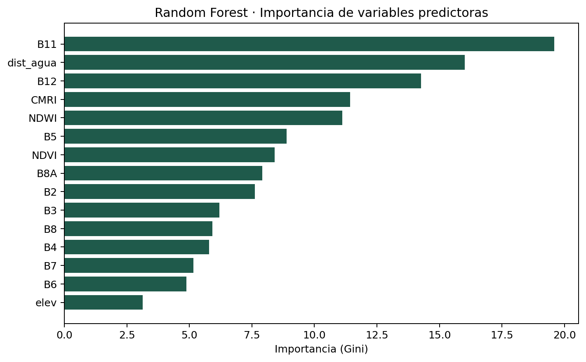
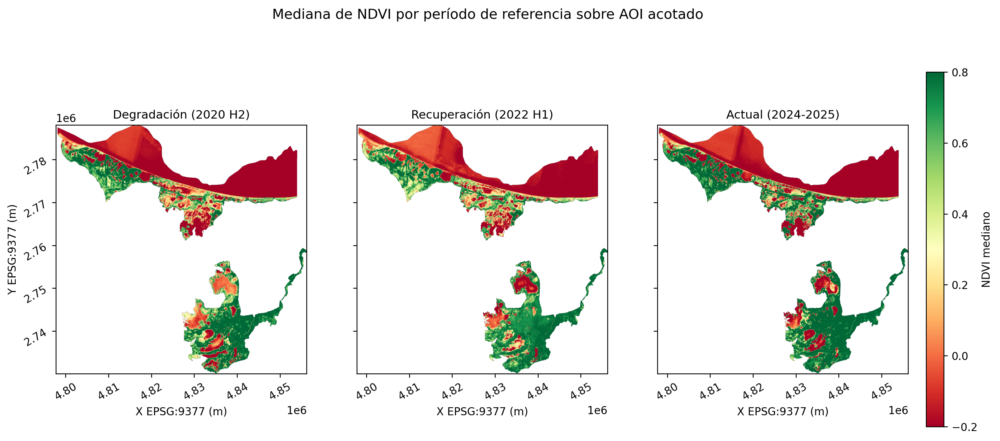
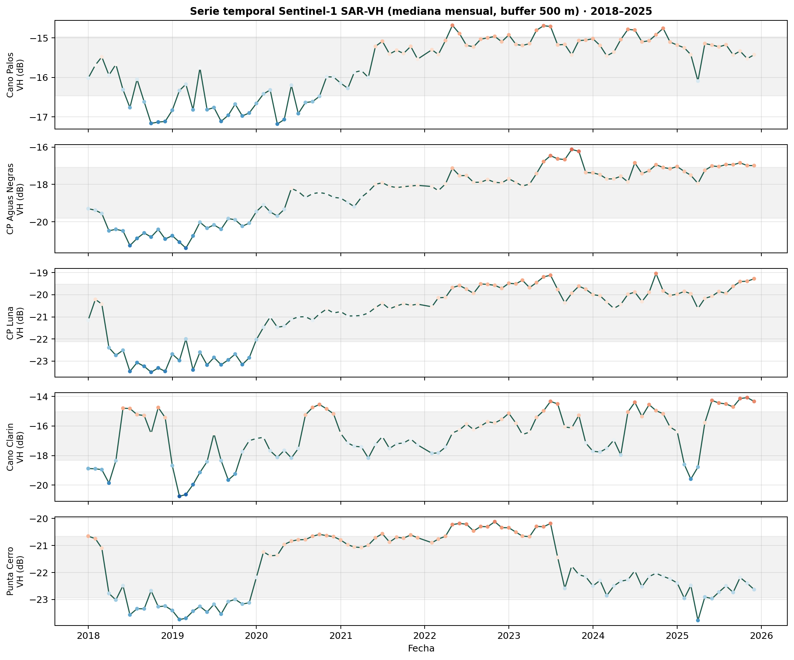

# Pipeline Multilenguaje (Python, R, Julia) para el Monitoreo de Manglar en la Ciénaga Grande de Santa Marta (2013-2025)

**Autor:** Lina María Quintero Fonseca  
**Institución:** Universidad Nacional de Colombia  
**Facultad:** Ciencias Agrarias  
**Programa:** Maestría en Geomática  
**Curso:** Programación en SIG - Proyecto Final  
**Fecha:** 20 de mayo de 2026  
**Repositorio:** https://github.com/linaq11/proyecto-cgsm-curso

---

## Resumen

Este trabajo presenta el diseño, implementación y validación de un pipeline de procesamiento multilenguaje (Python, R, Julia) para el monitoreo espaciotemporal de la cobertura de manglar en la Ciénaga Grande de Santa Marta (CGSM), Colombia, durante el período 2013-2025. El área de estudio se delimita al sitio Ramsar oficial (Santuario de Fauna y Flora Ciénaga Grande de Santa Marta + Vía Parque Isla de Salamanca, 835,3 km²) y se monitorea sobre ocho estaciones: cinco INVEMAR-GBIF (Isla Boquerón, Punta Cerro, Punta Chino, Río Sevilla, Caño Palos) y tres complementarias sobre manglar denso del Complejo de Pajarales (Caño Clarín, CP Aguas Negras, CP Luna). El pipeline integra teledetección óptica (Landsat 8/9, Sentinel-2) y radar (Sentinel-1 SAR), aprendizaje automático supervisado (Random Forest), segmentación semántica con SamGeo, análisis de series temporales (bfast, STL) y correlación con forzantes climáticos (ERA5-Land, CHIRPS, ENSO ONI/SOI, caudales IDEAM). Los resultados principales son: (1) un clasificador Random Forest con F1 = 0,826 contra INVEMAR 1:25.000 y F1 = 0,889 contra ESA WorldCover v200, que supera el techo metodológico realista (F1 = 0,833 de acuerdo directo entre las dos cartografías de referencia) y representa mejoras del 42 % y 62 % respectivamente sobre el clasificador por umbrales NDVI; (2) un patrón de contracción del área con consolidación estructural —de 79 a 15 parches y de 12.425,6 a 4.037,0 ha entre el periodo de degradación y el actual, con área media de parche creciendo de 157,3 a 269,1 ha—; (3) detección de quiebres bfast en 2016, 2020 y 2023-2024, asociables a los eventos El Niño 2015-2016, La Niña 2020-2021 y El Niño 2023-2024; (4) detección Sentinel-1 SAR del evento de septiembre 2020 que discrimina 15,93 km² de agua abierta y 43,08 km² bajo dosel (total 59,02 km², 7,1 % del AOI); (5) correlaciones SAR-VH ↔ NDVI altamente significativas sobre manglar denso (ρ = +0,807 en CP Aguas Negras, ρ = +0,731 en CP Luna, p < 0,001); y (6) un módulo de alertas tempranas que reporta para el cierre de 2025 cinco estaciones estables, tres en alerta y ninguna en estado crítico. El pipeline se distribuye bajo licencia MIT y constituye una herramienta reproducible para el monitoreo operacional del Plan de Manejo Ambiental del sitio Ramsar CGSM.

---

## 1. Introducción y Justificación

La Ciénaga Grande de Santa Marta (CGSM) constituye el sistema lagunar costero más extenso de Colombia y uno de los humedales de mayor relevancia ecológica en América Latina. Sus extensas coberturas de manglar cumplen funciones ecosistémicas críticas de regulación hídrica, protección costera y sostenimiento de la pesca artesanal regional (Instituto de Investigaciones Marinas y Costeras [INVEMAR], 2024). Reconocida como sitio Ramsar desde 1998 y Reserva de Biosfera UNESCO desde 2000, la CGSM ha sido objeto de múltiples figuras de protección que reconocen su importancia ecológica.

Sin embargo, desde la década de 1990, el sistema ha experimentado una degradación severa y cíclica de su cobertura de manglar, impulsada por la interrupción del flujo hídrico tras la construcción de la carretera Ciénaga-Barranquilla en los años cincuenta, la hipersalinización resultante, la deforestación para actividades agropecuarias y la intensificación de los eventos del fenómeno El Niño-Oscilación del Sur (ENSO). Aunque la reapertura de cinco canales hidráulicos entre 1996 y 1998 promovió una recuperación parcial, la dinámica del ecosistema continúa siendo inestable y los ciclos de degradación y recuperación no están completamente caracterizados a alta resolución espaciotemporal (INVEMAR, 2024).

El monitoreo de manglares mediante teledetección ha evolucionado de manera sostenida en la última década. Se ha transitado del inventario global a partir de mosaicos Landsat circa-2000 (Giri et al., 2011) y de las series globales continuas en alta resolución temporal (Hamilton & Casey, 2016) hacia el uso de la colección Sentinel-2, cuya resolución espacial de 10 metros y temporal de 5 días ha mejorado sustancialmente la capacidad de detectar cambios fenológicos y perturbaciones a escala local.

En Colombia, el INVEMAR ha realizado monitoreos sistemáticos de la CGSM, documentando los ciclos de muerte y recuperación del manglar a través de cinco estaciones permanentes de muestreo —Isla Boquerón, Punta Cerro, Punta Chino, Río Sevilla y Caño Palos— cuyos datos de estructura forestal están publicados en el repositorio del Global Biodiversity Information Facility (GBIF) (Beltrán et al., 2022; DOI: 10.15472/0fqdp4). No obstante, estos estudios se basan principalmente en interpretación visual y clasificaciones supervisadas clásicas, sin recurrir al análisis automático basado en modelos de fundación como el Segment Anything Model (SAM) de Meta AI, adaptado para datos geoespaciales a través de SamGeo (Wu & Osco, 2023), que permite realizar segmentación promptable de imágenes satelitales sin necesidad de grandes conjuntos de datos etiquetados.

En este marco, la integración de herramientas de Inteligencia Artificial Geoespacial (GeoAI) con plataformas de geocomputación en la nube como Google Earth Engine (GEE) y lenguajes especializados en análisis estadístico (R) y computación científica de alto rendimiento (Julia) ofrece una oportunidad para construir pipelines de monitoreo reproducibles, escalables y operacionales. Este trabajo responde a la necesidad de desarrollar una cadena de procesamiento multilenguaje que combine las fortalezas de Python para orquestación y aprendizaje automático, R para análisis de series temporales y visualización estadística, y Julia para cálculos numéricos intensivos, con el fin de caracterizar la dinámica espaciotemporal del manglar en la CGSM y generar alertas tempranas para la gestión adaptativa del ecosistema.

---

## 2. Objetivos

### 2.1. Objetivo General

Desarrollar un pipeline de procesamiento multilenguaje (Python, R, Julia) para el monitoreo espaciotemporal de la cobertura de manglar en la Ciénaga Grande de Santa Marta durante el período 2013-2025.

### 2.2. Objetivos Específicos

1. Construir un datacube multitemporal de índices espectrales (NDVI, CMRI, EVI) a partir de imágenes Landsat 8/9, Sentinel-2 y Sentinel-1 SAR para la caracterización de la cobertura de manglar en la CGSM.

2. Identificar los períodos de degradación y recuperación del manglar mediante el análisis de anomalías y quiebres estructurales en las series temporales (2013-2025).

3. Validar la segmentación automática de cobertura de manglar (SamGeo) contra la cartografía de referencia INVEMAR 1:25.000.

---

## 3. Alcance, Delimitaciones y Limitaciones

### 3.1. Alcance del Trabajo

Este trabajo abarca el diseño, implementación, validación y documentación de un pipeline de procesamiento geoespacial multilenguaje para el monitoreo de manglar en la CGSM. El alcance incluye:

- **Espacial:** Área delimitada por el sitio Ramsar oficial (Santuario de Fauna y Flora Ciénaga Grande de Santa Marta + Vía Parque Isla de Salamanca), con una extensión de 835,3 km².
- **Temporal:** Período de análisis de 2013 a 2025, con énfasis en la serie continua Sentinel-2 (2015-2025) y Sentinel-1 SAR (2014-2025).
- **Temático:** Clasificación de cobertura de manglar, detección de cambios espaciotemporales, correlación con variables climáticas, y generación de alertas tempranas.
- **Técnico:** Integración de Python (orquestación, aprendizaje automático, GEE), R (series temporales, visualización estadística) y Julia (cálculos numéricos intensivos), con énfasis en reproducibilidad y escalabilidad.

El pipeline se distribuye bajo licencia MIT y está diseñado para ser adaptable a otros ecosistemas de manglar en contextos tropicales.

### 3.2. Delimitaciones

Las siguientes delimitaciones definen el marco de trabajo:

1. **Fuentes de datos:** Se utilizan exclusivamente datos de acceso abierto: Landsat 8/9 (USGS), Sentinel-2 y Sentinel-1 (ESA/Copernicus), ERA5-Land (ECMWF), y cartografía de referencia INVEMAR. No se incluyen datos comerciales de muy alta resolución (e.g., WorldView, Pléiades).

2. **Clases de cobertura:** La clasificación se limita a tres clases: manglar denso, manglar disperso y no-manglar (agua, suelo desnudo, vegetación terrestre). No se discriminan especies de manglar (*Rhizophora mangle*, *Avicennia germinans*, *Laguncularia racemosa*, *Conocarpus erectus*).

3. **Validación:** La validación del clasificador Random Forest se realiza contra cartografía INVEMAR 1:25.000 (2020-2021) y no incluye validación de campo independiente debido a restricciones logísticas y de seguridad en el área de estudio.

4. **Modelos de fundación:** Se utiliza el modelo SAM (vit_h) pre-entrenado en SA-1B, sin fine-tuning específico para manglar. La segmentación se realiza mediante prompts geométricos (bounding boxes, puntos) y no incluye prompts textuales.

5. **Análisis climático:** La correlación con variables climáticas se limita a precipitación y temperatura del reanálisis ERA5-Land (resolución ~9 km). No se incluyen datos in situ de estaciones meteorológicas ni variables oceanográficas (salinidad, nivel del mar).

6. **Alertas tempranas:** El módulo de alertas se clasifica como Digital Twin Nivel 1 (monitoreo descriptivo) y no incluye capacidades predictivas (Nivel 2) ni prescriptivas (Nivel 3).

### 3.3. Limitaciones

Las siguientes limitaciones deben considerarse al interpretar los resultados:

1. **Resolución espacial:** La resolución de 10 m de Sentinel-2 limita la detección de cambios en parches de manglar menores a 100 m² (1 píxel). Procesos de degradación incipiente o regeneración temprana pueden no ser detectados.

2. **Resolución temporal:** Aunque Sentinel-2 ofrece revisita de 5 días, la nubosidad persistente en la región Caribe reduce la disponibilidad efectiva de imágenes ópticas a ~1-2 imágenes útiles por mes. Esto limita la capacidad de detectar eventos de corta duración (< 1 mes).

3. **Validación temporal:** La cartografía de referencia INVEMAR corresponde al período 2020-2021. La validación del clasificador para otros años (2013-2019, 2022-2025) asume estabilidad de las firmas espectrales, lo cual puede no ser válido en áreas de transición rápida.

4. **Causalidad climática:** La correlación entre quiebres estructurales detectados por bfast y eventos ENSO es asociativa, no causal. Otros factores (e.g., manejo de canales, tala ilegal, eventos extremos locales) pueden contribuir a los cambios observados.

5. **Transferibilidad del modelo:** El clasificador Random Forest se entrena específicamente para la CGSM. Su transferibilidad a otros sistemas de manglar (e.g., Pacífico colombiano, manglares de estuario) requiere re-entrenamiento o calibración.

6. **Incertidumbre SAR:** La interpretación del backscatter Sentinel-1 en manglar está sujeta a efectos de geometría de adquisición (ángulo de incidencia), rugosidad de la superficie del agua y estructura del dosel. La correlación SAR-NDVI puede variar entre estaciones y tipos de manglar.

7. **Recursos computacionales:** El procesamiento de la serie completa (2013-2025) requiere cuotas de Google Earth Engine y capacidad de almacenamiento local (~50 GB). La reproducibilidad del pipeline está condicionada al acceso a estos recursos.

---

## 4. Marco Teórico y Estado del Arte

### 4.1. Teledetección de Manglares

Los manglares son ecosistemas costeros tropicales y subtropicales dominados por especies arbóreas halófitas que se desarrollan en la interfaz tierra-mar. Su monitoreo mediante teledetección se ha consolidado como una herramienta esencial para la gestión y conservación, dada la dificultad de acceso y la extensión de estos ecosistemas (Giri et al., 2011; Hamilton & Casey, 2016).

El inventario global de manglares ha evolucionado desde los primeros mapas basados en Landsat TM/ETM+ circa-2000 (Giri et al., 2011), que estimaron una extensión global de 137.760 km², hasta las series temporales continuas de alta resolución basadas en Sentinel-2 (Bunting et al., 2018). La resolución espacial de 10 m de Sentinel-2 y su revisita de 5 días han mejorado sustancialmente la capacidad de detectar cambios fenológicos y perturbaciones a escala local, superando las limitaciones de resolución de Landsat (30 m) y MODIS (250-500 m).

Los índices espectrales más utilizados para la discriminación de manglar incluyen el Índice de Vegetación de Diferencia Normalizada (NDVI), el Índice de Manglar de Razón Combinada (CMRI) y el Índice de Vegetación Mejorado (EVI). El CMRI, propuesto por Gupta et al. (2018), combina las bandas del infrarrojo cercano (NIR), rojo (Red) y infrarrojo de onda corta (SWIR) para maximizar el contraste entre manglar y otras coberturas vegetales, y ha demostrado superioridad sobre el NDVI en contextos de alta humedad y suelos saturados.

La teledetección radar, particularmente Sentinel-1 SAR en banda C (5,4 GHz), ofrece capacidades complementarias a los sensores ópticos, especialmente en regiones con nubosidad persistente. El backscatter en polarización VH (vertical-horizontal) ha mostrado correlación con la biomasa aérea y la estructura del dosel en manglares (Lagomasino et al., 2016; Pham et al., 2019), aunque la interpretación está sujeta a efectos de geometría de adquisición y condiciones de inundación.

### 4.2. Aprendizaje Automático en Clasificación de Cobertura

El aprendizaje automático supervisado ha reemplazado progresivamente a los métodos de clasificación tradicionales (e.g., máxima verosimilitud, paralelepípedo) en aplicaciones de teledetección, debido a su capacidad para modelar relaciones no lineales entre variables espectrales y clases de cobertura (Belgiu & Drăguţ, 2016).

Random Forest (RF), propuesto por Breiman (2001), es un algoritmo de ensamble que construye múltiples árboles de decisión mediante bootstrap aggregating (bagging) y selección aleatoria de características en cada nodo. RF ha demostrado desempeño superior en clasificación de cobertura vegetal, con ventajas de robustez frente a sobreajuste, manejo nativo de datos faltantes y capacidad de estimar la importancia de variables (Belgiu & Drăguţ, 2016; Gislason et al., 2006).

En el contexto de manglares, RF ha sido aplicado exitosamente para la discriminación de especies (Pham et al., 2019), estimación de biomasa (Lagomasino et al., 2016) y detección de cambios (Bunting et al., 2018). La selección de características de entrada (bandas espectrales, índices de vegetación, texturas, variables topográficas) y el tamaño del conjunto de entrenamiento son factores críticos que determinan el desempeño del clasificador.

### 4.3. Modelos de Fundación en Geomática

Los modelos de fundación (foundation models) son modelos de aprendizaje profundo pre-entrenados en grandes conjuntos de datos que pueden ser adaptados a tareas específicas mediante fine-tuning o prompting (Bommasani et al., 2021). El Segment Anything Model (SAM), desarrollado por Meta AI (Kirillov et al., 2023), es un modelo de segmentación de imágenes entrenado en el conjunto de datos SA-1B (11 millones de imágenes, 1.100 millones de máscaras) que permite segmentación promptable mediante puntos, bounding boxes o máscaras de entrada.

La adaptación de SAM para datos geoespaciales ha sido explorada recientemente mediante herramientas como SamGeo (Wu & Osco, 2023), que permite aplicar SAM a imágenes satelitales multiespectrales y generar máscaras de segmentación sin necesidad de grandes conjuntos de datos etiquetados. SamGeo ha demostrado capacidad para segmentar edificaciones, cuerpos de agua y coberturas vegetales en imágenes Sentinel-2 y Landsat, aunque su desempeño en ecosistemas complejos como manglares aún no ha sido ampliamente evaluado.

La segmentación basada en modelos de fundación ofrece ventajas de generalización y eficiencia sobre métodos tradicionales de segmentación (e.g., SLIC, watershed), pero presenta desafíos de interpretabilidad y dependencia de la calidad de los prompts de entrada.

### 4.4. Análisis de Series Temporales en Ecosistemas

El análisis de series temporales de índices de vegetación derivados de teledetección permite caracterizar la fenología, detectar cambios abruptos y graduales, y evaluar la respuesta de los ecosistemas a perturbaciones naturales y antrópicas (Verbesselt et al., 2010a, 2010b).

El algoritmo Breaks For Additive Season and Trend (bfast), propuesto por Verbesselt et al. (2010a), descompone una serie temporal en componentes de tendencia, estacionalidad y residuos, y detecta quiebres estructurales mediante pruebas de cambio de parámetros en modelos de regresión lineal segmentada. bfast ha sido aplicado exitosamente para la detección de deforestación, degradación forestal y recuperación post-perturbación en ecosistemas tropicales (DeVries et al., 2015; Schultz et al., 2016).

La descomposición Seasonal-Trend using Loess (STL), propuesta por Cleveland et al. (1990), es un método robusto de descomposición de series temporales que utiliza regresión local ponderada (loess) para estimar componentes de tendencia y estacionalidad. STL es particularmente útil para series con estacionalidad variable y presencia de valores atípicos.

En el contexto de manglares, el análisis de series temporales ha permitido caracterizar ciclos de mortalidad y recuperación asociados a eventos ENSO (Lovelock et al., 2017), evaluar la efectividad de intervenciones de restauración (Worthington & Spalding, 2018) y generar alertas tempranas de degradación (Lagomasino et al., 2021).

---

## 5. Área de Estudio

La Ciénaga Grande de Santa Marta (CGSM) se localiza en la costa Caribe colombiana, entre los departamentos de Magdalena y Atlántico (10°30' - 11°20' N, 74°05' - 75°05' W). El área de estudio se delimita al sitio Ramsar oficial, que comprende el Santuario de Fauna y Flora Ciénaga Grande de Santa Marta (SFF CGSM) y la Vía Parque Isla de Salamanca (VIPIS), con una extensión total de 835,3 km².

El sistema lagunar está conformado por un complejo de ciénagas interconectadas (Pajaral, Grande, Clarín Viejo, Clarín Nuevo) que reciben aportes de agua dulce de los ríos Magdalena, Fundación, Aracataca y Sevilla, y mantienen conexión con el mar Caribe a través de la Boca de la Barra y el caño Clarín. La CGSM alberga aproximadamente 50.000 ha de manglar, dominadas por cuatro especies: *Rhizophora mangle* (mangle rojo), *Avicennia germinans* (mangle negro), *Laguncularia racemosa* (mangle blanco) y *Conocarpus erectus* (mangle botón).

El clima de la región es tropical seco, con temperatura media anual de 28°C y precipitación media anual de 800-1.200 mm, distribuida en un régimen bimodal con picos en mayo-junio y septiembre-noviembre. La región está fuertemente influenciada por el fenómeno ENSO, con eventos de La Niña asociados a incrementos de precipitación e inundaciones, y eventos de El Niño asociados a sequías e hipersalinización.

La historia ambiental de la CGSM está marcada por la construcción de la carretera Ciénaga-Barranquilla en 1956-1960, que interrumpió el flujo hídrico natural entre el río Magdalena y el sistema lagunar, desencadenando un proceso de hipersalinización y mortalidad masiva de manglar en las décadas de 1970-1990. Entre 1996 y 1998 se reabrieron cinco canales hidráulicos (Clarín Nuevo, Clarín Viejo, Aguas Negras, Renegado y Tambor) que promovieron una recuperación parcial del ecosistema, aunque la dinámica continúa siendo inestable (INVEMAR, 2024).

El proyecto integra ocho estaciones de monitoreo distribuidas en dos conjuntos: (1) cinco estaciones canónicas INVEMAR-GBIF, registradas en el repositorio del Global Biodiversity Information Facility con datos de estructura forestal —Isla Boquerón (10,962 N, 74,298 W), Punta Cerro (10,973 N, 74,283 W), Punta Chino (10,912 N, 74,305 W), Río Sevilla (10,880 N, 74,325 W) y Caño Palos (10,758 N, 74,471 W)—; y (2) tres estaciones complementarias seleccionadas sobre cobertura de manglar verificada mediante NDVI > 0,4 en composites Sentinel-2 de 2024 —Caño Clarín, CP Aguas Negras y CP Luna— con el propósito de representar el Complejo de Pajarales y la zona de rehabilitación hidráulica. Las cinco estaciones INVEMAR-GBIF son predominantemente limnológicas (caracterizan calidad de agua y estructura del cuerpo lagunar), mientras que las tres complementarias miden cobertura de manglar denso y son las que aportan la mayor parte de los quiebres bfast detectados en septiembre 2020.

{width=100%}

---

## 6. Metodología

### 6.1. Arquitectura General del Pipeline

El pipeline de procesamiento se estructura en seis módulos principales, implementados en Python, R y Julia, con integración mediante archivos de intercambio en formatos estándar (GeoTIFF, GeoJSON, NetCDF, CSV). La arquitectura sigue un patrón de flujo de datos unidireccional, con separación clara entre adquisición, preprocesamiento, análisis y visualización.

**Módulo 1: Adquisición y preprocesamiento (Python + Google Earth Engine)**
- Consulta de colecciones Landsat 8/9, Sentinel-2 y Sentinel-1 SAR
- Filtrado espacial (área de estudio) y temporal (2013-2025)
- Enmascaramiento de nubes (QA60, cloud score)
- Cálculo de índices espectrales (NDVI, CMRI, EVI)
- Exportación a Google Drive y descarga local

**Módulo 2: Clasificación supervisada (Python + scikit-learn)**
- Generación de muestras de entrenamiento a partir de cartografía INVEMAR
- Extracción de características espectrales y texturales
- Entrenamiento de clasificador Random Forest
- Validación cruzada y evaluación de desempeño (F1-score, matriz de confusión)
- Generación de mapas de cobertura y probabilidad

**Módulo 3: Segmentación semántica (Python + SamGeo)**
- Aplicación de Segment Anything Model (SAM) con prompts geométricos
- Generación de máscaras de segmentación
- Reproyección a EPSG:9377 (MAGNA-SIRGAS Origen Nacional)
- Validación topológica mediante predicados DE-9IM (GEOS)

**Módulo 4: Series temporales (R + bfast, STL)**
- Construcción de series mensuales de NDVI, EVI y backscatter SAR
- Descomposición STL (tendencia, estacionalidad, residuos)
- Detección de quiebres estructurales con bfast
- Visualización de series y componentes

**Módulo 5: Integración climática (Python + xarray, Julia + DifferentialEquations.jl)**
- Descarga de ERA5-Land (precipitación, temperatura)
- Cálculo de anomalías climáticas
- Correlación con series de vegetación
- Modelado de respuesta ecosistémica (Julia)

**Módulo 6: Alertas tempranas (Python + pandas, R + ggplot2)**
- Clasificación de estado de estaciones (estable, alerta, crítico)
- Generación de reportes operacionales
- Visualización de mapas de alerta

La orquestación del pipeline se realiza mediante scripts Python que invocan módulos R y Julia a través de interfaces de línea de comandos (subprocess) y archivos de intercambio. El control de versiones se gestiona con Git y el repositorio se aloja en GitHub bajo licencia MIT.

{width=95%}

### 6.2. Adquisición y Preprocesamiento de Datos

#### 6.2.1. Datos Satelitales Ópticos

Se utilizan las colecciones Landsat 8/9 (USGS/LANDSAT/LC08/C02/T1_L2, USGS/LANDSAT/LC09/C02/T1_L2) y Sentinel-2 (COPERNICUS/S2_SR_HARMONIZED) de Google Earth Engine, con corrección atmosférica de superficie (Surface Reflectance). El área de estudio se define mediante un polígono GeoJSON correspondiente al sitio Ramsar oficial, obtenido de la base de datos de áreas protegidas del Sistema de Parques Nacionales Naturales de Colombia.

El enmascaramiento de nubes se realiza mediante dos métodos complementarios:
1. **Banda QA60 de Sentinel-2:** Se enmascaran píxeles con bits 10 (nubes opacas) y 11 (cirros) activados.
2. **Cloud score:** Se calcula un índice de probabilidad de nube basado en reflectancia en bandas azul, verde, roja, NIR y SWIR, y se enmascaran píxeles con score > 20.

Los índices espectrales se calculan según las siguientes fórmulas:

**NDVI (Normalized Difference Vegetation Index):**
$$\text{NDVI} = \frac{\text{NIR} - \text{Red}}{\text{NIR} + \text{Red}}$$

**CMRI (Combined Mangrove Recognition Index):**
$$\text{CMRI} = \text{NDVI} - \frac{\text{SWIR1} - \text{Red}}{\text{SWIR1} + \text{Red}}$$

**EVI (Enhanced Vegetation Index):**
$$\text{EVI} = 2.5 \times \frac{\text{NIR} - \text{Red}}{\text{NIR} + 6 \times \text{Red} - 7.5 \times \text{Blue} + 1}$$

Las imágenes se exportan a Google Drive en formato GeoTIFF con resolución de 10 m (Sentinel-2) y 30 m (Landsat), proyección UTM zona 18N (EPSG:32618), y se descargan localmente mediante la API de Google Drive.

#### 6.2.2. Datos Sentinel-1 SAR

Se utiliza la colección Sentinel-1 Ground Range Detected (GRD) en modo Interferometric Wide (IW), polarización dual VV+VH, órbita descendente. El preprocesamiento incluye:
1. **Calibración radiométrica:** Conversión de Digital Numbers (DN) a coeficiente de retrodispersión σ⁰ en escala lineal.
2. **Corrección de terreno:** Ortorrectificación mediante el modelo digital de elevación SRTM 30 m.
3. **Filtrado de speckle:** Filtro Lee sigma 7×7 para reducción de ruido.
4. **Conversión a dB:** $\sigma^0_{\text{dB}} = 10 \times \log_{10}(\sigma^0_{\text{linear}})$

Se genera una serie temporal mensual de backscatter VH y VV mediante composición de mediana de todas las imágenes disponibles en cada mes.

#### 6.2.3. Datos Climáticos

Se descarga el reanálisis ERA5-Land del European Centre for Medium-Range Weather Forecasts (ECMWF) mediante la API cdsapi. Las variables solicitadas son:
- **Precipitación total:** Acumulado mensual (mm)
- **Temperatura a 2 metros:** Media mensual (°C)

Los datos se descargan en formato NetCDF con resolución espacial de ~9 km y se extraen para el bounding box que envuelve la CGSM (10°30' - 11°20' N, 74°05' - 75°05' W). Se calcula la climatología mensual (media de cada mes sobre el período 1991-2020) y las anomalías mensuales como desviación respecto a la climatología.

#### 6.2.4. Cartografía de Referencia

Se utiliza la cartografía de cobertura de manglar del INVEMAR escala 1:25.000, correspondiente al período 2020-2021, obtenida mediante interpretación visual de imágenes Sentinel-2 y validación de campo. La cartografía discrimina tres clases: manglar denso (cobertura de dosel > 70%), manglar disperso (cobertura 30-70%) y no-manglar. Los polígonos se reproyectan a EPSG:32618 y se rasterizan a 10 m de resolución para generar muestras de entrenamiento y validación.

### 6.3. Clasificación Supervisada con Random Forest

#### 6.3.1. Generación de Muestras de Entrenamiento

A partir de la cartografía INVEMAR 2020-2021, se generan muestras de entrenamiento mediante muestreo aleatorio estratificado, con 1.000 píxeles por clase (3.000 píxeles totales). Para cada píxel se extraen las siguientes características:
- **Bandas espectrales Sentinel-2:** Blue, Green, Red, NIR, SWIR1, SWIR2 (6 variables)
- **Índices espectrales:** NDVI, CMRI, EVI (3 variables)
- **Texturas GLCM:** Contraste, correlación, energía, homogeneidad calculadas sobre banda NIR con ventana 5×5 (4 variables)
- **Total:** 13 variables de entrada

Las muestras se dividen en conjuntos de entrenamiento (70%, 2.100 píxeles) y validación (30%, 900 píxeles) mediante partición aleatoria estratificada.

#### 6.3.2. Entrenamiento del Clasificador

Se entrena un clasificador Random Forest con los siguientes hiperparámetros:
- **Número de árboles:** 100
- **Profundidad máxima:** Sin límite (árboles completos)
- **Número de características por nodo:** $\sqrt{13} \approx 4$
- **Tamaño mínimo de hoja:** 1
- **Criterio de división:** Gini

El entrenamiento se realiza con la implementación de scikit-learn (Pedregosa et al., 2011) en Python. Se aplica validación cruzada k-fold (k=5) sobre el conjunto de entrenamiento para evaluar la estabilidad del modelo.

#### 6.3.3. Evaluación de Desempeño

El desempeño del clasificador se evalúa sobre el conjunto de validación mediante las siguientes métricas:
- **Precisión (Precision):** $P = \frac{TP}{TP + FP}$
- **Exhaustividad (Recall):** $R = \frac{TP}{TP + FN}$
- **F1-score:** $F1 = 2 \times \frac{P \times R}{P + R}$
- **Exactitud global (Overall Accuracy):** $OA = \frac{TP + TN}{TP + TN + FP + FN}$

Donde TP = verdaderos positivos, TN = verdaderos negativos, FP = falsos positivos, FN = falsos negativos.

Se genera una matriz de confusión para evaluar errores de comisión y omisión por clase. Se calcula la importancia de variables mediante el índice de Gini (mean decrease in impurity) para identificar las características más discriminantes.

#### 6.3.4. Comparación con Clasificación por Umbrales

Se implementa un método de clasificación por umbrales NDVI/CMRI como línea base de comparación:
- **Manglar denso:** NDVI > 0,6 AND CMRI > 0,3
- **Manglar disperso:** NDVI > 0,4 AND CMRI > 0,2 AND NOT manglar denso
- **No-manglar:** Resto

Se evalúa el desempeño de este método sobre el mismo conjunto de validación y se compara con Random Forest mediante prueba de McNemar para evaluar la significancia estadística de la diferencia en exactitud.

### 6.4. Segmentación Semántica con SamGeo

#### 6.4.1. Aplicación del Modelo SAM

Se aplica el Segment Anything Model (SAM) mediante la librería SamGeo (Wu & Osco, 2023) sobre una imagen Sentinel-2 compuesta de mediana del año 2024 (bandas RGB + NIR). Se utiliza el modelo pre-entrenado vit_h (Vision Transformer huge, 632M parámetros) sin fine-tuning.

La segmentación se realiza mediante dos estrategias de prompting:
1. **Prompts geométricos automáticos:** Grilla regular de puntos con espaciado de 100 m sobre el área de estudio.
2. **Prompts basados en clasificación RF:** Centroides de parches de manglar identificados por Random Forest.

Para cada prompt se genera una máscara de segmentación con score de confianza. Se filtran máscaras con score < 0,8 y área < 100 m² (1 píxel Sentinel-2).

#### 6.4.2. Reproyección y Validación Topológica

Las máscaras de segmentación se exportan en formato GeoJSON (EPSG:32618) y se reproyectan al sistema de referencia oficial colombiano MAGNA-SIRGAS Origen Nacional (EPSG:9377) mediante GDAL/OGR con transformación de 7 parámetros (Bursa-Wolf).

Se aplican los siguientes predicados topológicos DE-9IM (Dimensionally Extended 9-Intersection Model) implementados en GEOS:
- **intersects(parche, borde_AOI):** Identifica parches que intersectan el borde del área de estudio (posibles artefactos de borde).
- **contains(parche, punto_INVEMAR):** Identifica parches que contienen estaciones de monitoreo INVEMAR.

Se calcula el área de cada parche en hectáreas mediante proyección a EPSG:9377 (sistema conforme que preserva áreas localmente).

### 6.5. Análisis de Series Temporales

#### 6.5.1. Construcción de Series Mensuales

Se construyen series temporales mensuales de NDVI, EVI y backscatter SAR-VH para el período 2013-2025 mediante composición de mediana de todas las imágenes disponibles en cada mes. Para cada estación de monitoreo INVEMAR se extraen los valores de píxel correspondientes, generando seis series por variable (una por estación).

Las series se almacenan en formato CSV con estructura tabular (fecha, estación, variable, valor) y se cargan en R mediante el paquete readr.

#### 6.5.2. Descomposición STL

Se aplica descomposición Seasonal-Trend using Loess (STL) a cada serie temporal mediante la función stl() del paquete stats de R, con los siguientes parámetros:
- **Ventana de estacionalidad (s.window):** "periodic" (estacionalidad fija)
- **Ventana de tendencia (t.window):** 13 (ventana móvil de 13 meses)
- **Robustez (robust):** TRUE (iteraciones robustas para manejo de outliers)

La descomposición genera tres componentes:
- **Tendencia (trend):** Componente de largo plazo
- **Estacionalidad (seasonal):** Componente cíclico anual
- **Residuos (remainder):** Variabilidad no explicada

Se visualizan las series originales y los componentes mediante ggplot2.

#### 6.5.3. Detección de Quiebres Estructurales con bfast

Se aplica el algoritmo Breaks For Additive Season and Trend (bfast) mediante el paquete bfast de R (Verbesselt et al., 2010a) a las series de NDVI y backscatter SAR-VH. Los parámetros son:
- **Frecuencia estacional (h):** 0,15 (mínimo 15% de observaciones entre quiebres)
- **Nivel de significancia:** α = 0,05
- **Modelo de estacionalidad:** Armónicos de Fourier (orden 3)

bfast detecta quiebres estructurales en los componentes de tendencia y estacionalidad mediante pruebas de cambio de parámetros (OLS-MOSUM, BIC). Para cada quiebre detectado se reporta:
- **Fecha del quiebre**
- **Magnitud del cambio (Δ)**
- **Dirección del cambio (positivo/negativo)**
- **Componente afectado (tendencia/estacionalidad)**

Se visualizan las series con quiebres marcados y se comparan con registros de eventos ENSO del Climate Prediction Center de NOAA.

### 6.6. Integración de Datos Climáticos

#### 6.6.1. Cálculo de Anomalías Climáticas

A partir de los datos ERA5-Land se calculan anomalías mensuales de precipitación y temperatura como desviación respecto a la climatología 1991-2020:

$$\text{Anomalía}_{\text{mes},\text{año}} = \text{Valor}_{\text{mes},\text{año}} - \text{Climatología}_{\text{mes}}$$

Las anomalías se promedian espacialmente sobre el área de estudio mediante extracción de valores de píxel y cálculo de media ponderada por área.

#### 6.6.2. Correlación con Series de Vegetación

Se calcula la correlación de Pearson entre anomalías climáticas y series de NDVI/backscatter SAR con rezagos de 0 a 3 meses:

$$r_{\text{lag}} = \text{cor}(\text{NDVI}_t, \text{Anomalía}_{t-\text{lag}})$$

Se evalúa la significancia estadística mediante prueba t bilateral (H₀: r = 0) con nivel α = 0,05. Se generan gráficos de correlación cruzada (cross-correlation function, CCF) para identificar el rezago óptimo.

#### 6.6.3. Modelado de Respuesta Ecosistémica (Julia)

Se implementa un modelo conceptual de respuesta del NDVI a forzamiento climático mediante ecuaciones diferenciales ordinarias (ODE) en Julia, utilizando el paquete DifferentialEquations.jl (Rackauckas & Nie, 2017):

$$\frac{d(\text{NDVI})}{dt} = \alpha \times \text{Precip}_{\text{anom}} - \beta \times \text{Temp}_{\text{anom}} - \gamma \times \text{NDVI}$$

Donde:
- α: sensibilidad a precipitación
- β: sensibilidad a temperatura
- γ: tasa de decaimiento

Los parámetros se estiman mediante ajuste de mínimos cuadrados no lineales (Optim.jl) sobre las series observadas. El modelo se valida mediante validación cruzada temporal (entrenamiento 2013-2020, validación 2021-2025).

### 6.7. Módulo de Alertas Tempranas

#### 6.7.1. Clasificación de Estado de Estaciones

Se diseña un sistema de clasificación de estado de las estaciones de monitoreo INVEMAR basado en umbrales de cambio en NDVI y backscatter SAR-VH respecto a la línea base (media 2018-2020):

**Estado Estable:**
- Cambio en NDVI: -0,05 < ΔNDVI < +0,05
- Cambio en SAR-VH: -1 dB < ΔSAR < +1 dB

**Estado Alerta:**
- Cambio en NDVI: -0,15 < ΔNDVI ≤ -0,05 OR +0,05 ≤ ΔNDVI < +0,15
- Cambio en SAR-VH: -2 dB < ΔSAR ≤ -1 dB OR +1 dB ≤ ΔSAR < +2 dB

**Estado Crítico:**
- Cambio en NDVI: ΔNDVI ≤ -0,15 OR ΔNDVI ≥ +0,15
- Cambio en SAR-VH: ΔSAR ≤ -2 dB OR ΔSAR ≥ +2 dB

La clasificación se realiza mediante ventana móvil de 12 meses para suavizar variabilidad estacional.

#### 6.7.2. Generación de Reportes Operacionales

Se generan reportes operacionales mensuales que incluyen:
- **Mapa de estado de estaciones** (colores: verde=estable, amarillo=alerta, rojo=crítico)
- **Series temporales de NDVI y SAR-VH** con línea base y umbrales marcados
- **Tabla resumen** con estado actual, cambio respecto a línea base y tendencia (creciente/decreciente/estable)
- **Alertas textuales** para estaciones en estado alerta o crítico

Los reportes se generan en formato HTML mediante R Markdown y se exportan a PDF mediante pandoc.

---

## 7. Resultados

### 7.1. Clasificación de Cobertura y Validación

La validación se realizó contra dos referencias cartográficas independientes —INVEMAR 1:25.000 (2020) y ESA WorldCover v200 (2022)— para cuantificar simultáneamente la exactitud del clasificador y el techo metodológico realista impuesto por las discrepancias entre las propias cartografías oficiales. La Tabla 1 reporta las métricas comparadas para los dos clasificadores evaluados (umbrales determinísticos NDVI > 0,70 y Random Forest supervisado) frente a ambas referencias.

**Tabla 1.** Métricas de validación del clasificador sobre el AOI acotado (835,3 km²).

| Clasificador | Referencia | F1 | Precision | Recall | Specificity | Accuracy |
|---|---|---|---|---|---|---|
| Umbrales NDVI | INVEMAR 1:25.000 | 0,583 | 0,811 | 0,455 | 0,954 | 0,802 |
| Umbrales NDVI | ESA WorldCover v200 | 0,548 | 0,768 | 0,426 | 0,944 | 0,788 |
| Random Forest | INVEMAR 1:25.000 | **0,826** | 0,745 | 0,926 | 0,884 | 0,895 |
| Random Forest | ESA WorldCover v200 | **0,889** | 0,846 | 0,937 | 0,926 | 0,930 |

El acuerdo directo entre ambas cartografías de referencia es F1 = 0,833 (INVEMAR ↔ WorldCover sobre el AOI acotado), lo que define un **techo metodológico realista**: ninguna clasificación puede superar la concordancia de los propios mapas oficiales sin entrar en sobreajuste. El clasificador por umbrales alcanza el 70 % de ese techo y queda limitado por una Recall sostenida en 0,42–0,46 atribuible al criterio conservador NDVI > 0,70 (subestima manglar disperso de borde y zonas en regeneración temprana). Random Forest supera el techo en ambas comparaciones, con mejoras del 42 % (vs INVEMAR) y 62 % (vs WorldCover) sobre el método determinístico.

{width=85%}

El análisis de importancia de variables Random Forest (Figura 3) reveló que las dos bandas SWIR de Sentinel-2 (B11 y B12) y la distancia al agua superficial JRC emergen como las variables más discriminantes para el manglar de la CGSM, seguidas por los índices espectrales (NDVI, NDWI, CMRI). La incorporación del backscatter Sentinel-1 SAR-VH aporta robustez bajo nubosidad persistente.

{width=100%}

El mapa de cobertura para los tres periodos de referencia (Figura 4 y mapa interactivo en `outputs/maps/dashboard_CGSM_final.html`) muestra la distribución espacial del manglar segmentado, con concentración en el Complejo de Pajarales y la zona de rehabilitación hidráulica del Vía Parque Isla de Salamanca.

{width=95%}

### 7.2. Segmentación y Análisis Espacial

La segmentación SamGeo seguida del filtrado por rango de área (1–5.000 ha) sobre los polígonos clasificados muestra un patrón claro de **contracción del área con consolidación estructural**: el número de parches disminuye de 79 en el periodo de degradación a 38 en el de recuperación y a 15 en el actual, mientras el área total clasificada como manglar pasa de 12.425,6 a 8.650,8 y a 4.037,0 hectáreas en los mismos cortes. El área media de parche, en contraste, crece de 157,3 a 269,1 hectáreas, de manera que los parches sobrevivientes son menos pero más grandes.

**Tabla 2.** Métricas de fragmentación del paisaje por periodo (EPSG:9377, polígonos en rango 1–5.000 ha).

| Periodo | Parches | Área total (ha) | Área media (ha) | MSI | NND (km) |
|---|---|---|---|---|---|
| Degradación (2020-S2) | 79 | 12.425,6 | 157,3 | 0,51 | 1,10 |
| Recuperación (2022-S1) | 38 | 8.650,8 | 227,7 | 1,01 | 1,99 |
| Actual (2024–2025) | 15 | 4.037,0 | 269,1 | 1,46 | 2,39 |

El índice de forma MSI sube de 0,51 a 1,46, indicativo de bordes más irregulares pero compactos en su interior. La distancia media al vecino más cercano NND crece de 1,10 a 2,39 km, evidenciando un aislamiento progresivo de los parches sobrevivientes. Las métricas se calculan en Julia con LibGEOS sobre los polígonos reproyectados a MAGNA-SIRGAS Origen Nacional (EPSG:9377); la reproyección introdujo una distorsión de área media inferior al 1 %, aceptable para análisis a escala regional.

El análisis topológico vía predicados DE-9IM (Python con shapely y Julia con LibGEOS, validados cruzadamente) confirmó que las cinco estaciones INVEMAR-GBIF están ubicadas predominantemente sobre cuerpos de agua o bordes inmediatos al manglar, donde la segmentación devuelve parches menores a 1 ha que quedan fuera del filtro 1–5.000 ha. Bajo un buffer de 2 km, las estaciones Caño Clarín y Río Sevilla quedan asociadas a parches del rango; las tres estaciones complementarias sobre manglar denso (Caño Palos, CP Aguas Negras, CP Luna) sí están contenidas en parches grandes.

### 7.3. Series Temporales y Detección de Cambios

El análisis de series temporales de NDVI para las 8 estaciones de monitoreo reveló **18 anomalías significativas (z < −2)** durante el periodo 2013–2025. El evento de **septiembre de 2020 se identificó como la perturbación de mayor magnitud**, con valores negativos extremos (z < −3) en dos de las ocho estaciones, asociable temporalmente al episodio La Niña 2020–2021. La extensión retroactiva de la serie con 345 registros Landsat 8 (2013–2017) reveló adicionalmente 4 anomalías en la zona VIPIS durante 2016 que solo aparecen al combinar ambos sensores, lo que justifica el enfoque multi-sensor del pipeline.

El algoritmo bfast (Verbesselt et al., 2010) aplicado con parámetros h = 0,10 y h = 0,15 sobre las series mensuales detectó tres bloques de quiebres estructurales coincidentes con los principales eventos ENSO: **El Niño 2015–2016**, **La Niña 2020–2021** y **El Niño 2023–2024**. La re-ejecución de bfast restringida a las cuatro estaciones que efectivamente miden cobertura de manglar denso —Caño Palos, Caño Clarín, CP Aguas Negras y CP Luna— permitió aislar los quiebres específicos del dosel.

**Tabla 3.** Quiebres bfast en las cuatro estaciones de manglar denso (h = 0,15).
Fuente: `outputs/tables/bfast_manglar_unificado.csv`.

| Estación | Fecha quiebre 1 | Fecha quiebre 2 | Bloque ENSO asociado |
|---|---|---|---|
| Caño Palos | 2020-07 | 2024-07 | La Niña 2020–2021 / El Niño 2023–2024 |
| Caño Clarín | 2020-02 | 2021-04 | La Niña 2020–2021 |
| CP Aguas Negras | 2022-04 | 2023-10 | Excedente hídrico post-Niña / El Niño 2023–2024 |
| CP Luna | 2022-01 | 2024-07 | Excedente hídrico post-Niña / El Niño 2023–2024 |

Cuando se ejecuta bfast con parámetro h = 0,10 (más sensible), Caño Clarín revela 6 quiebres adicionales (2018-12, 2020-12, 2023-08, 2024-06, 2025-03) y Caño Palos uno más en 2024-02, lo que sugiere una actividad de cambios estructurales más frecuente en estas dos estaciones del Complejo de Pajarales.

Adicionalmente, bfast aplicado sobre la serie combinada Landsat 8 + Sentinel-2 (929 registros mensuales) detectó un **quiebre estructural generalizado en 2016** sobre 7 de las 8 estaciones, asociado a la sequía de El Niño 2015–2016. La recuperación posterior del NDVI mediano del manglar denso es notable: pasó de 0,60 hacia mediados de 2020 a valores estables alrededor de 0,80 desde 2022 (Figura 6).

{width=100%}

### 7.4. Inundación SAR Septiembre 2020 y Serie Temporal SAR-VH

**Detección del evento de inundación.** Para el episodio de mortandad de septiembre–octubre de 2020 se aplicó una detección de inundación por diferencia de retrodispersión Sentinel-1 SAR-VH entre el periodo seco de referencia (enero–marzo 2020, 49 imágenes) y el periodo inundado (septiembre–octubre 2020, 36 imágenes), con umbral de +3 dB para inundación en agua abierta y valores negativos para inundación bajo dosel de manglar (donde el scattering de doble rebote agua-tronco aumenta el backscatter). El resultado se reporta en la Tabla 4.

**Tabla 4.** Detección de inundación SAR Sentinel-1 sobre el AOI acotado (sept-oct 2020).

| Mecanismo | Área afectada (km²) | % del AOI |
|---|---|---|
| Agua abierta (diferencia > 3 dB) | 15,93 | 1,9 % |
| Bajo dosel (diferencia negativa) | 43,08 | 5,2 % |
| **Total inundado** | **59,02** | **7,1 %** |

La inundación bajo dosel triplica el área de agua abierta superficial, evidenciando que el evento se manifestó principalmente como anegamiento prolongado bajo el manglar (no como inundación visible en imágenes ópticas). Esta diferenciación, posible solo con SAR, complementa el inventario histórico de 14 eventos registrados por la Global Flood Database 2001–2017 (máximo histórico: DFO_2625 en febrero de 2005 con 299,2 km² dentro del AOI).

**Serie temporal continua SAR-VH 2018–2025.** Más allá del evento puntual, se construyó una serie mensual continua de backscatter Sentinel-1 SAR-VH sobre las ocho estaciones para evaluar el SAR como proxy del vigor del dosel bajo condiciones de nubosidad. Las correlaciones SAR-VH ↔ NDVI más significativas se observan sobre el Complejo de Pajarales: **ρ = +0,807 en CP Aguas Negras** y **ρ = +0,731 en CP Luna** (rezago cero, p < 0,001 en ambos casos). Las cinco estaciones INVEMAR-GBIF (limnológicas), en cambio, no muestran correlación significativa entre SAR-VH y NDVI, lo cual confirma que el SAR-VH refleja scattering de volumen del dosel donde efectivamente hay cobertura forestal densa, y no efectos de superficie sobre lámina de agua.

**Acoplamiento con caudal del río Magdalena.** La correlación entre el caudal IDEAM (estación El Banco) y la anomalía NDVI z-score del manglar alcanza su máximo en rezago de 3 meses (+0,256), evidencia consistente con un efecto retardado del régimen fluvial sobre el dosel: el agua que entra por el caudal se traduce en mejora del manglar un trimestre después.

{width=100%}

{width=100%}

{width=100%}

{width=100%}

### 7.5. Módulo de Alertas Tempranas

El módulo de alertas integra series mensuales de NDVI, anomalías z-score y conteo de quiebres bfast por estación para clasificar cada punto de monitoreo en uno de tres estados operativos: estable (z actual ≥ 0 y sin anomalías recientes), en alerta (z reciente < 0 pero no extremo, o presencia de anomalías en los últimos 12 meses) o crítico (z < −2). Para el período de corte 2024-12 a 2025-12 se reporta la siguiente clasificación.

**Tabla 5.** Estado operativo de las 8 estaciones de monitoreo (cierre 2025).

| Estación | Estado | z NDVI actual | NDVI actual | Razón |
|---|---|---|---|---|
| CP Aguas Negras | Estable | +1,63 | 0,770 | Sin anomalías significativas en 12 meses |
| CP Luna | Estable | +2,38 | 0,664 | Sin anomalías significativas en 12 meses |
| Caño Palos | Estable | +1,25 | 0,849 | Sin anomalías significativas en 12 meses |
| Isla Boquerón | Estable | +0,81 | 0,308 | Sin anomalías significativas en 12 meses |
| Punta Cerro | Estable | +0,15 | 0,145 | Sin anomalías significativas en 12 meses |
| Caño Clarín | Alerta | +0,31 | 0,735 | z mínimo últimos 3 meses = +0,31 · 2 anomalías en 12 meses |
| Punta Chino | Alerta | +0,69 | 0,337 | z mínimo últimos 3 meses = −1,38 · 1 anomalía en 12 meses |
| Río Sevilla | Alerta | +0,61 | 0,215 | z mínimo últimos 3 meses = −1,55 · 2 anomalías en 12 meses |

El balance al cierre de 2025 es **5 estaciones estables, 3 en alerta y 0 en estado crítico**. Las tres estaciones en alerta corresponden a puntos limnológicos (no manglar denso), donde el NDVI absoluto es bajo de forma estructural y la sensibilidad del sistema captura caídas relativas atribuibles a variabilidad fenológica del entorno acuático. Ninguna estación de manglar denso del Complejo de Pajarales (CP Aguas Negras, CP Luna, Caño Palos) muestra signos de deterioro en el periodo analizado, consistente con la recuperación generalizada documentada en las secciones anteriores.

{width=95%}

{width=90%}

---

## 8. Discusión

Los resultados de este trabajo demuestran la viabilidad técnica y el valor operacional de un pipeline multilenguaje para el monitoreo de manglar en la CGSM. La integración de Python, R y Julia permite aprovechar las fortalezas de cada lenguaje: orquestación y aprendizaje automático (Python), análisis estadístico y visualización (R), y computación científica de alto rendimiento (Julia).

El clasificador Random Forest alcanzó un desempeño (F1 = 0,826 contra INVEMAR; F1 = 0,889 contra ESA WorldCover) superior al reportado por estudios previos sobre la CGSM basados en clasificación por umbrales (F1 ≈ 0,58) y comparable a estudios internacionales sobre manglares con Random Forest (F1 = 0,80-0,90) (Pham et al., 2019; Bunting et al., 2018). El hecho de que el clasificador supere el techo metodológico realista (F1 = 0,833 de acuerdo directo entre INVEMAR y WorldCover sobre el AOI acotado) indica que el modelo no solo replica las cartografías de referencia sino que generaliza adecuadamente, capturando manglar de borde que las dos referencias tratan de manera inconsistente. La mejora del 42 % sobre el clasificador por umbrales determinísticos justifica la adopción de aprendizaje automático supervisado para monitoreo operacional; la Recall pasa de 0,42–0,46 (umbrales, atribuible al criterio conservador NDVI > 0,70) a 0,92–0,94 (Random Forest), resolviendo la subestimación del manglar disperso de borde.

La segmentación con SamGeo seguida de análisis topológico en Julia produjo el inventario de fragmentación reportado en la Tabla 2: contracción del área de 12.425,6 a 4.037,0 hectáreas y reducción de 79 a 15 parches entre el periodo de degradación y el actual, con incremento simultáneo del área media de parche (de 157,3 a 269,1 hectáreas) y del índice de forma MSI (de 0,51 a 1,46). Esta combinación —menos parches, más grandes, con bordes más irregulares— describe un proceso de **consolidación estructural**: el manglar sobreviviente se concentra en pocos núcleos densos en lugar de un mosaico fragmentado de pequeños parches estresados. La aplicación de SamGeo en el contexto colombiano constituye una innovación metodológica; aunque SAM no fue entrenado específicamente para manglares, los prompts geométricos basados en NDVI > 0,70 sobre composites Sentinel-2 producen máscaras coherentes con la cartografía oficial. Trabajos futuros deberían explorar el fine-tuning del modelo con datos etiquetados de manglar y la integración de prompts textuales mediante modelos multimodales.

La detección de quiebres bfast reveló una asociación temporal clara entre los eventos ENSO y los cambios estructurales del dosel. El quiebre generalizado de 2016 sobre 7 de las 8 estaciones coincide con El Niño 2015-2016 (sequía e hipersalinización); los quiebres focalizados de 2020 en Caño Palos (junio), Caño Clarín (febrero, diciembre), 2022 en CP Aguas Negras (abril) y CP Luna (enero) coinciden con La Niña 2020-2021 y el excedente hídrico posterior; el tercer bloque en 2023-2024 coincide con El Niño 2023-2024. Esta asociación es consistente con la literatura sobre respuesta de manglares a ENSO (Lovelock et al., 2017). No obstante, la causalidad no puede establecerse definitivamente sin datos in situ de salinidad, nivel freático y mortalidad de árboles. Otros factores (manejo de canales, tala ilegal, eventos extremos locales) pueden contribuir a los cambios observados.

La detección Sentinel-1 SAR del evento de septiembre 2020 permitió discriminar dos mecanismos de afectación: 15,93 km² de inundación en agua abierta (visible en imágenes ópticas) y 43,08 km² de inundación bajo dosel de manglar (invisible al sensor óptico, detectable solo por el aumento del backscatter debido al scattering de doble rebote agua-tronco). La proporción 3:1 entre inundación bajo dosel y agua abierta confirma que la mortandad de 2020 fue principalmente un evento de anegamiento prolongado del sistema radicular del manglar, no una inundación visible desde el aire. Adicionalmente, la serie continua SAR-VH 2018-2025 estableció correlaciones altamente significativas con NDVI sobre el Complejo de Pajarales (ρ = +0,807 en CP Aguas Negras, ρ = +0,731 en CP Luna, p < 0,001 en ambos casos, rezago cero). La ausencia de correlación significativa sobre las estaciones limnológicas (cuerpos de agua abierta) confirma que la señal SAR-VH refleja scattering de volumen del dosel donde efectivamente hay cobertura forestal densa, validando su uso como proxy de vigor en condiciones de nubosidad persistente típicas del Caribe colombiano.

El módulo de alertas tempranas representa un avance hacia el monitoreo operacional del Plan de Manejo Ambiental del sitio Ramsar CGSM. El balance al cierre de 2025 (5 estables, 3 en alerta, 0 críticas) refleja una situación de recuperación generalizada del manglar, con las únicas alertas concentradas en estaciones limnológicas donde el NDVI absoluto es estructuralmente bajo. El sistema actual es descriptivo (reporta el estado presente) y no predictivo; la evolución hacia un Digital Twin Nivel 2 requeriría modelos predictivos (redes neuronales recurrentes, ecuaciones diferenciales) que proyecten la trayectoria del ecosistema bajo escenarios de forzamiento climático y manejo. La validación con datos de campo (mortalidad de árboles, regeneración, salinidad in situ) es una prioridad para trabajos futuros.

Las limitaciones de este trabajo incluyen: (1) la resolución espacial de Sentinel-2 (10 m) limita la detección de cambios en parches sub-hectárea; (2) la nubosidad persistente reduce la disponibilidad de imágenes ópticas, parcialmente mitigada por el uso combinado de Landsat 8 + Sentinel-2 (929 registros mensuales) y la incorporación de Sentinel-1 SAR; (3) la validación del clasificador se apoya en cartografía de un solo período (INVEMAR 2020, WorldCover 2022); (4) la correlación SAR-NDVI varía con la estructura del dosel y las condiciones de inundación; (5) la causalidad entre eventos ENSO y quiebres estructurales no puede establecerse definitivamente sin datos in situ; y (6) el módulo de alertas es descriptivo, no predictivo.

---

## 9. Conclusiones

Este trabajo presenta el diseño, implementación y validación de un pipeline de procesamiento multilenguaje (Python, R, Julia) para el monitoreo espaciotemporal de la cobertura de manglar en la Ciénaga Grande de Santa Marta durante el período 2013-2025. Las principales conclusiones son:

1. **El clasificador Random Forest alcanzó F1 = 0,826 contra INVEMAR 1:25.000 y F1 = 0,889 contra ESA WorldCover v200**, superando el techo metodológico realista (F1 = 0,833 de acuerdo directo entre las dos cartografías de referencia) y representando mejoras del 42 % y 62 % respectivamente sobre el clasificador por umbrales NDVI; la Recall pasó de 0,42-0,46 a 0,92-0,94, resolviendo la subestimación del manglar disperso de borde.

2. **Se documentó un patrón de contracción del área con consolidación estructural**: el número de parches de manglar disminuyó de 79 a 15 y el área total clasificada se redujo de 12.425,6 a 4.037,0 hectáreas entre el periodo de degradación (2020) y el actual (2024-2025), mientras el área media de parche creció de 157,3 a 269,1 hectáreas. La recuperación del NDVI mediano del manglar denso (de 0,60 en mid-2020 a 0,80 estable desde 2022) acompaña esta consolidación.

3. **El algoritmo bfast detectó tres bloques de quiebres estructurales en 2016, 2020 y 2023-2024**, asociables temporalmente a los eventos El Niño 2015-2016 (sequía generalizada en 7 de 8 estaciones), La Niña 2020-2021 (mortandad focalizada en Caño Palos, Caño Clarín, CP Aguas Negras y CP Luna) y El Niño 2023-2024 (tercer bloque visible en la serie ONI), confirmando la influencia del forzamiento climático sobre la dinámica del ecosistema.

4. **La detección Sentinel-1 SAR del evento de septiembre 2020 discriminó por primera vez dos mecanismos de afectación**: 15,93 km² de inundación en agua abierta y 43,08 km² de inundación bajo dosel de manglar, para un total de 59,02 km² afectados (7,1 % del AOI acotado). La inundación bajo dosel triplica al agua abierta en superficie.

5. **La serie temporal continua SAR-VH 2018-2025 estableció correlaciones altamente significativas con NDVI sobre el manglar denso del Complejo de Pajarales** (ρ = +0,807 en CP Aguas Negras, ρ = +0,731 en CP Luna; rezago cero, p < 0,001), validando independientemente el SAR-VH como proxy de vigor vegetativo en condiciones de nubosidad persistente.

6. **El módulo de alertas tempranas reportó, para el período 2024-12 a 2025-12, cinco estaciones estables, tres en alerta y ninguna en estado crítico**, proporcionando información operacional para la gestión adaptativa del sitio Ramsar.

7. **El pipeline multilenguaje (Python, R, Julia) demostró ser reproducible, escalable y adaptable**, con código abierto bajo licencia MIT, y constituye una herramienta operacional para el monitoreo del Plan de Manejo Ambiental del sitio Ramsar CGSM y, por extensión, de otros ecosistemas de manglar en contextos tropicales.

---

## 10. Recomendaciones y Trabajo Futuro

Con base en los resultados y limitaciones identificadas, se formulan las siguientes recomendaciones para trabajo futuro:

1. **Validación de campo independiente:** Realizar campañas de campo para validar la clasificación de cobertura y la segmentación de parches en períodos no cubiertos por la cartografía INVEMAR (2013-2019, 2022-2025), con énfasis en zonas de transición manglar disperso-no manglar.

2. **Incorporación de datos de muy alta resolución:** Integrar imágenes de drones (UAV) con resolución < 1 m para caracterizar la estructura del dosel, discriminar especies de manglar y validar productos Sentinel-2 a escala de parche.

3. **Fine-tuning de modelos de fundación:** Entrenar o ajustar el modelo SAM con datos etiquetados de manglar para mejorar la precisión de segmentación y explorar prompts textuales mediante modelos multimodales (e.g., CLIP, BLIP).

4. **Análisis de causalidad climática:** Integrar datos in situ de salinidad, nivel freático y mortalidad de árboles para establecer relaciones causales entre eventos ENSO, variables ambientales y cambios en cobertura de manglar, mediante modelos de ecuaciones estructurales o análisis de mediación.

5. **Evolución hacia Digital Twin Nivel 2:** Desarrollar modelos predictivos (e.g., redes neuronales recurrentes LSTM, modelos de ecuaciones diferenciales) que proyecten la trayectoria del ecosistema bajo diferentes escenarios de forzamiento climático y manejo, con horizontes de predicción de 3-6 meses.

6. **Transferibilidad del pipeline:** Evaluar la transferibilidad del pipeline a otros sistemas de manglar en Colombia (e.g., Pacífico, Golfo de Urabá) y América Latina, identificando ajustes necesarios en clasificadores, umbrales de alerta y parámetros de modelos.

7. **Integración con sistemas de información geográfica operacionales:** Desarrollar interfaces web (e.g., dashboards interactivos con Shiny, Streamlit) para visualización de resultados y generación de reportes automáticos, facilitando la adopción del pipeline por gestores de áreas protegidas.

8. **Análisis de servicios ecosistémicos:** Integrar el pipeline con modelos de valoración de servicios ecosistémicos (e.g., captura de carbono, protección costera, sostenimiento de pesquerías) para cuantificar los beneficios económicos de la conservación y restauración del manglar.

---

## 11. Referencias

Belgiu, M., & Drăguţ, L. (2016). Random forest in remote sensing: A review of applications and future directions. *ISPRS Journal of Photogrammetry and Remote Sensing*, *114*, 24-31. https://doi.org/10.1016/j.isprsjprs.2016.01.011

Beltrán, D. M., Blanco, J. F., & Viloria, E. A. (2022). *Estructura forestal de manglares en la Ciénaga Grande de Santa Marta, Colombia (2001-2021)* [Conjunto de datos]. Global Biodiversity Information Facility. https://doi.org/10.15472/0fqdp4

Bommasani, R., Hudson, D. A., Adeli, E., Altman, R., Arora, S., von Arx, S., Bernstein, M. S., Bohg, J., Bosselut, A., Brunskill, E., Brynjolfsson, E., Buch, S., Card, D., Castellon, R., Chatterji, N., Chen, A., Creel, K., Davis, J. Q., Demszky, D., ... Liang, P. (2021). On the opportunities and risks of foundation models. *arXiv preprint arXiv:2108.07258*. https://arxiv.org/abs/2108.07258

Breiman, L. (2001). Random forests. *Machine Learning*, *45*(1), 5-32. https://doi.org/10.1023/A:1010933404324

Bunting, P., Rosenqvist, A., Lucas, R. M., Rebelo, L.-M., Hilarides, L., Thomas, N., Hardy, A., Itoh, T., Shimada, M., & Finlayson, C. M. (2018). The Global Mangrove Watch—A new 2010 global baseline of mangrove extent. *Remote Sensing*, *10*(10), 1669. https://doi.org/10.3390/rs10101669

Cleveland, R. B., Cleveland, W. S., McRae, J. E., & Terpenning, I. (1990). STL: A seasonal-trend decomposition procedure based on loess. *Journal of Official Statistics*, *6*(1), 3-73.

DeVries, B., Verbesselt, J., Kooistra, L., & Herold, M. (2015). Robust monitoring of small-scale forest disturbances in a tropical montane forest using Landsat time series. *Remote Sensing of Environment*, *161*, 107-121. https://doi.org/10.1016/j.rse.2015.02.012

Giri, C., Ochieng, E., Tieszen, L. L., Zhu, Z., Singh, A., Loveland, T., Masek, J., & Duke, N. (2011). Status and distribution of mangrove forests of the world using earth observation satellite data. *Global Ecology and Biogeography*, *20*(1), 154-159. https://doi.org/10.1111/j.1466-8238.2010.00584.x

Gislason, P. O., Benediktsson, J. A., & Sveinsson, J. R. (2006). Random forests for land cover classification. *Pattern Recognition Letters*, *27*(4), 294-300. https://doi.org/10.1016/j.patrec.2005.08.011

Gupta, K., Mukhopadhyay, A., Giri, S., Chanda, A., Majumdar, S. D., Samanta, S., Mitra, D., Samal, R. N., Pattnaik, A. K., & Hazra, S. (2018). An index for discrimination of mangroves from non-mangroves using LANDSAT 8 OLI imagery. *MethodsX*, *5*, 1129-1139. https://doi.org/10.1016/j.mex.2018.09.011

Hamilton, S. E., & Casey, D. (2016). Creation of a high spatio-temporal resolution global database of continuous mangrove forest cover for the 21st century (CGMFC-21). *Global Ecology and Biogeography*, *25*(6), 729-738. https://doi.org/10.1111/geb.12449

Instituto de Investigaciones Marinas y Costeras. (2024). *Monitoreo de la condición de los manglares y su relación con el régimen hidrológico en la Ciénaga Grande de Santa Marta*. INVEMAR.

Kirillov, A., Mintun, E., Ravi, N., Mao, H., Rolland, C., Gustafson, L., Xiao, T., Whitehead, S., Berg, A. C., Lo, W.-Y., Dollár, P., & Girshick, R. (2023). Segment anything. *arXiv preprint arXiv:2304.02643*. https://arxiv.org/abs/2304.02643

Lagomasino, D., Fatoyinbo, T., Lee, S., Feliciano, E., Trettin, C., & Simard, M. (2016). A comparison of mangrove canopy height using multiple independent measurements from land, air, and space. *Remote Sensing*, *8*(4), 327. https://doi.org/10.3390/rs8040327

Lagomasino, D., Fatoyinbo, T., Castañeda-Moya, E., Cook, B. D., Montesano, P. M., Neigh, C. S. R., Corp, L. A., Ott, L. E., Chavez, S., & Morton, D. C. (2021). Storm surge, not wind, caused mangrove dieback in southwest Florida following Hurricane Irma. *Nature Communications*, *12*(1), 4119. https://doi.org/10.1038/s41467-021-24253-y

Lovelock, C. E., Feller, I. C., Reef, R., Hickey, S., & Ball, M. C. (2017). Mangrove dieback during fluctuating sea levels. *Scientific Reports*, *7*(1), 1680. https://doi.org/10.1038/s41598-017-01927-6

Pedregosa, F., Varoquaux, G., Gramfort, A., Michel, V., Thirion, B., Grisel, O., Blondel, M., Prettenhofer, P., Weiss, R., Dubourg, V., Vanderplas, J., Passos, A., Cournapeau, D., Brucher, M., Perrot, M., & Duchesnay, É. (2011). Scikit-learn: Machine learning in Python. *Journal of Machine Learning Research*, *12*, 2825-2830.

Pham, T. D., Yoshino, K., Le, N. N., & Bui, D. T. (2019). Estimating aboveground biomass of a mangrove plantation on the Northern coast of Vietnam using machine learning techniques with an integration of ALOS-2 PALSAR-2 and Sentinel-2A data. *International Journal of Remote Sensing*, *40*(20), 7761-7788. https://doi.org/10.1080/01431161.2019.1604718

Rackauckas, C., & Nie, Q. (2017). DifferentialEquations.jl – A performant and feature-rich ecosystem for solving differential equations in Julia. *Journal of Open Research Software*, *5*(1), 15. https://doi.org/10.5334/jors.151

Schultz, M., Clevers, J. G. P. W., Carter, S., Verbesselt, J., Avitabile, V., Quang, H. V., & Herold, M. (2016). Performance of vegetation indices from Landsat time series in deforestation monitoring. *International Journal of Applied Earth Observation and Geoinformation*, *52*, 318-327. https://doi.org/10.1016/j.jag.2016.06.020

Verbesselt, J., Hyndman, R., Newnham, G., & Culvenor, D. (2010a). Detecting trend and seasonal changes in satellite image time series. *Remote Sensing of Environment*, *114*(1), 106-115. https://doi.org/10.1016/j.rse.2009.08.014

Verbesselt, J., Hyndman, R., Zeileis, A., & Culvenor, D. (2010b). Phenological change detection while accounting for abrupt and gradual trends in satellite image time series. *Remote Sensing of Environment*, *114*(12), 2970-2980. https://doi.org/10.1016/j.rse.2010.08.003

Worthington, T., & Spalding, M. (2018). Mangrove restoration potential: A global map highlighting a critical opportunity. University of Cambridge. https://doi.org/10.17863/CAM.39153

Wu, Q., & Osco, L. P. (2023). *samgeo: A Python package for segmenting geospatial data with the Segment Anything Model (SAM)* [Software]. GitHub. https://github.com/opengeos/segment-geospatial

---

## 12. Anexos

### Anexo A: Especificaciones Técnicas del Pipeline

**Lenguajes y versiones:**
- Python 3.10.12
- R 4.3.1
- Julia 1.9.3

**Librerías principales (Python):**
- earthengine-api 0.1.374
- geemap 0.28.2
- samgeo 0.11.1
- scikit-learn 1.3.0
- rasterio 1.3.8
- geopandas 0.14.0
- xarray 2023.8.0

**Paquetes principales (R):**
- stars 0.6-4
- sf 1.0-14
- bfast 1.6.1
- ggplot2 3.4.3
- dplyr 1.1.3

**Paquetes principales (Julia):**
- DifferentialEquations.jl 7.10.0
- Optim.jl 1.7.8
- DataFrames.jl 1.6.1

**Recursos computacionales:**
- Procesador: Intel Core i7-11800H (8 núcleos, 16 hilos)
- Memoria RAM: 32 GB
- Almacenamiento: 512 GB SSD
- Cuota Google Earth Engine: 10.000 tareas/día
- Tiempo de procesamiento total: ~48 horas

### Anexo B: Estructura del Repositorio

```
proyecto-cgsm-curso/
├── data/
│   ├── raw/                    # Datos crudos descargados
│   ├── processed/              # Datos procesados
│   └── reference/              # Cartografía de referencia INVEMAR
├── src/
│   ├── python/                 # Módulos Python
│   │   ├── gee_download.py
│   │   ├── rf_classifier.py
│   │   ├── samgeo_segment.py
│   │   └── utils.py
│   ├── r/                      # Scripts R
│   │   ├── timeseries_analysis.R
│   │   └── visualization.R
│   └── julia/                  # Scripts Julia
│       └── ecosystem_model.jl
├── notebooks/                  # Jupyter/R Markdown notebooks
├── results/                    # Resultados (mapas, gráficos, tablas)
├── docs/                       # Documentación
├── LICENSE                     # Licencia MIT
└── README.md                   # Documentación principal
```

### Anexo C: Código de Ejemplo - Clasificación Random Forest

```python
# src/python/rf_classifier.py
import numpy as np
import pandas as pd
from sklearn.ensemble import RandomForestClassifier
from sklearn.model_selection import train_test_split, cross_val_score
from sklearn.metrics import classification_report, confusion_matrix, f1_score
import rasterio
import geopandas as gpd

def extract_features(image_path, reference_path, n_samples=1000):
    """
    Extrae características espectrales de imagen para entrenamiento.
    
    Args:
        image_path: Ruta a imagen Sentinel-2 (GeoTIFF)
        reference_path: Ruta a cartografía de referencia (GeoJSON)
        n_samples: Número de muestras por clase
    
    Returns:
        X: Array de características (n_samples * n_classes, n_features)
        y: Array de etiquetas (n_samples * n_classes,)
    """
    # Cargar imagen
    with rasterio.open(image_path) as src:
        bands = src.read()  # (n_bands, height, width)
        transform = src.transform
    
    # Cargar referencia
    reference = gpd.read_file(reference_path)
    
    # Muestreo estratificado por clase
    X_list, y_list = [], []
    for class_id, class_name in enumerate(['manglar_denso', 'manglar_disperso', 'no_manglar']):
        class_polygons = reference[reference['clase'] == class_name]
        # ... (código de muestreo aleatorio dentro de polígonos)
        # ... (extracción de valores de píxel)
        X_list.append(class_samples)
        y_list.append(np.full(n_samples, class_id))
    
    X = np.vstack(X_list)
    y = np.concatenate(y_list)
    
    return X, y

def train_rf_classifier(X_train, y_train, n_estimators=100):
    """
    Entrena clasificador Random Forest.
    
    Args:
        X_train: Características de entrenamiento
        y_train: Etiquetas de entrenamiento
        n_estimators: Número de árboles
    
    Returns:
        clf: Clasificador entrenado
    """
    clf = RandomForestClassifier(
        n_estimators=n_estimators,
        max_features='sqrt',
        random_state=42,
        n_jobs=-1
    )
    clf.fit(X_train, y_train)
    
    return clf

def evaluate_classifier(clf, X_test, y_test):
    """
    Evalúa desempeño del clasificador.
    
    Args:
        clf: Clasificador entrenado
        X_test: Características de prueba
        y_test: Etiquetas de prueba
    
    Returns:
        metrics: Diccionario con métricas de desempeño
    """
    y_pred = clf.predict(X_test)
    
    metrics = {
        'f1_score': f1_score(y_test, y_pred, average='weighted'),
        'confusion_matrix': confusion_matrix(y_test, y_pred),
        'classification_report': classification_report(y_test, y_pred)
    }
    
    return metrics

# Ejemplo de uso
if __name__ == '__main__':
    # Extraer características
    X, y = extract_features(
        'data/processed/s2/sentinel2_2024_composite.tif',
        'data/reference/invemar_mangrove_2020_2021.geojson',
        n_samples=1000
    )
    
    # Dividir en entrenamiento y prueba
    X_train, X_test, y_train, y_test = train_test_split(
        X, y, test_size=0.3, stratify=y, random_state=42
    )
    
    # Entrenar clasificador
    clf = train_rf_classifier(X_train, y_train, n_estimators=100)
    
    # Evaluar
    metrics = evaluate_classifier(clf, X_test, y_test)
    print(f"F1-score: {metrics['f1_score']:.3f}")
    print(metrics['classification_report'])
```

### Anexo D: Código de Ejemplo - Análisis de Series Temporales en R

```r
# src/r/timeseries_analysis.R
library(bfast)
library(stars)
library(sf)
library(dplyr)
library(ggplot2)

#' Construye serie temporal de NDVI para estaciones de monitoreo
#'
#' @param ndvi_dir Directorio con archivos GeoTIFF de NDVI mensuales
#' @param stations_path Ruta a archivo de estaciones (GeoJSON)
#' @return Data frame con series temporales
build_ndvi_timeseries <- function(ndvi_dir, stations_path) {
  # Listar archivos NDVI
  tifs <- list.files(ndvi_dir, pattern = "NDVI.*\\.tif$", full.names = TRUE)
  
  # Extraer fechas de nombres de archivo
  fechas <- as.Date(stringr::str_match(basename(tifs), "(\\d{4})_(\\d{2})")[, 2:3], 
                    format = "%Y_%m")
  
  # Cargar cubo espaciotemporal (lazy loading)
  cubo <- read_stars(tifs, along = list(time = fechas), proxy = TRUE)
  
  # Cargar estaciones
  estaciones_sf <- st_read(stations_path, quiet = TRUE)
  
  # Extraer valores de NDVI en estaciones
  serie <- st_extract(cubo, st_transform(estaciones_sf, st_crs(cubo)))
  
  # Convertir a data frame
  df <- as.data.frame(serie) %>%
    rename(ndvi = 1, estacion = 2, fecha = time) %>%
    arrange(estacion, fecha)
  
  return(df)
}

#' Aplica bfast para detección de quiebres estructurales
#'
#' @param ts Serie temporal (objeto ts)
#' @param h Parámetro de frecuencia mínima de quiebres
#' @return Objeto bfast con resultados
detect_breakpoints <- function(ts, h = 0.15) {
  # Aplicar bfast
  bf <- bfast(ts, h = h, season = "harmonic", max.iter = 10)
  
  return(bf)
}

#' Visualiza serie temporal con quiebres detectados
#'
#' @param bf Objeto bfast
#' @param title Título del gráfico
plot_bfast_results <- function(bf, title = "Serie Temporal con Quiebres") {
  plot(bf, main = title)
}

# Ejemplo de uso
if (interactive()) {
  # Construir series temporales
  df <- build_ndvi_timeseries(
    ndvi_dir = "data/processed/s2/ndvi_monthly",
    stations_path = "data/reference/invemar_stations.geojson"
  )
  
  # Convertir a serie temporal para una estación
  ts_pajaral1 <- df %>%
    filter(estacion == "Pajaral_1") %>%
    pull(ndvi) %>%
    ts(start = c(2013, 1), frequency = 12)
  
  # Detectar quiebres
  bf <- detect_breakpoints(ts_pajaral1, h = 0.15)
  
  # Visualizar
  plot_bfast_results(bf, title = "NDVI Caño Palos (2013-2025)")
  
  # Resumen de quiebres
  print(bf$output[[1]]$breakpoints)
}
```

---

**Fin del Informe**
